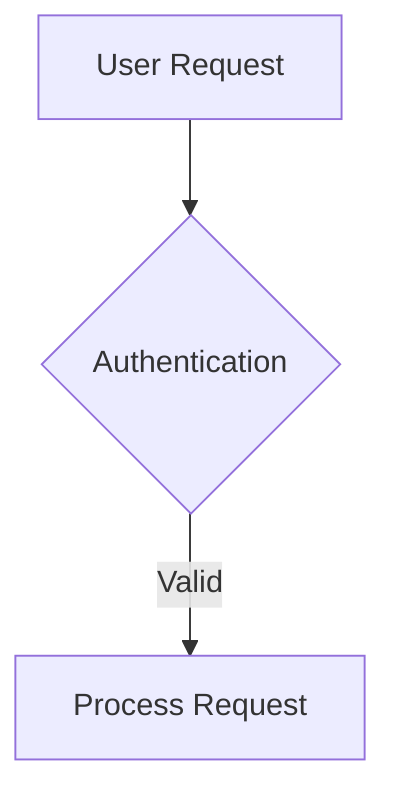

# ReadMe → Documentation.AI component conversion plan

How every ReadMe construct becomes a Documentation.AI construct, with the syntax on both
sides and the failure mode each rule prevents.

## How to read this

Every mapping cites the reference file it came from:

| Citation | File |
|---|---|
| `[RM §n]` | `readme-components-info.md`, section *n* |
| `[DAI §n]` | `documentationai-components-information.md`, section *n* |
| `[PIT Phase n]` | `migration-pitfalls.md`, phase *n* |
| `[TBL]` | `table-spacing-information.md` |
| `[LIVE-DAI …]` | Fetched from the live `documentation.ai` docs, 2026-08-17 — path given |
| `[LIVE-RM …]` | Fetched from the live `docs.readme.com` docs, 2026-08-17 — path given |

`NEEDS VERIFICATION` marks anything the reference files do not settle. Those are open
questions, not defaults — do not implement them from guesswork. Where a live fetch has since
settled one, the entry reads **RESOLVED** and carries a `[LIVE-…]` citation.

**Where a live source contradicts a local reference file, the live source wins** and the
conflict is called out inline.

Three global rules that apply to every section:

- **No raw HTML in the MDX output.** Components only. This is a project rule, and it overrides
  anything in the reference files that offers an HTML route:
  - `<Columns>` takes `<Card>` children — **never `<div>`**, even though `[DAI §13]` permits it
    (§2.3).
  - `<details>` / `<summary>` → `<Expandable>` (§3.3).
  - A raw `<table>` → a GFM pipe table; if it cannot be expressed as one, restructure the
    content (§3.4).
  - `<span style>`, `<div style>`, `<p>` spacers, `<style>`, `<script>`, `` → dropped or
    replaced by the equivalent component (§3.3, §3.6).
  - `<br />` → dropped **everywhere, including inside table cells**. There is no exception.
    See `TableConversion.md` §3: a table cell renders at `white-space: normal`, so the `&#xA;`
    entity `[TBL trap 4]` offers as an alternative collapses to a space and is not a line break
    either. Multi-value cells become a `•`-separated line or separate rows.
  
  This is stricter than the platform requires — Documentation.AI does accept custom HTML
  `[LIVE-DAI /write-and-publish/web-editor]` and ships an HTML Block component. The reason to
  hold the line anyway: HTML is opaque to search, to the AI assistant and to the visual editor,
  and `[PIT Phase 6]` documents the editor mutating saved markup. Where HTML is genuinely
  unavoidable, escalate it rather than emitting it (§4.4).

- **Attributes are kebab-case on Documentation.AI** (`param-type`, `default-open`,
  `show-lines`) where ReadMe uses camelCase (`typeOfEmbed`, `iconColor`) `[DAI header rule]`.
  Exceptions, which stay camelCase: `contentTypes`, `defaultType` `[DAI §23]`,
  `defaultScheme` `[DAI §24]`, `fetchPriority`, `className` `[DAI §16–18]`.
- **Icons change vocabulary.** ReadMe accepts emoji or Font Awesome classes
  (`icon="fa-info-circle"`) `[RM §4.18]`; Documentation.AI takes **Lucide** names
  (`icon="rocket"`) `[DAI §12, §9, §10]`. Every icon value must be re-mapped by name, and
  there is no mechanical FA → Lucide table in either reference — `NEEDS VERIFICATION` per
  icon, or drop the icon (all `icon` attributes are optional on the target).
- **Inline `style` is a plain CSS *string* on Documentation.AI**, not the JSX object MDX
  normally requires: `style="width: 400px; height: auto; margin: 0 auto;"`
  `[LIVE-DAI /components/images]` `[LIVE-DAI /components/videos-and-iframes]`. ReadMe requires
  the object form `style={{ marginLeft: 'auto' }}` `[LIVE-RM /docs/mdx]`. Every migrated
  `style` must be rewritten from object to string. This **contradicts** `[DAI §16]`, which
  types it `CSSProperties | string` — the live docs use the string form throughout.

---

## Master conversion table

Every ReadMe construct with its Documentation.AI target, at a glance. `→` rows are detailed in
the section named in the last column.

| # | ReadMe | Documentation.AI | Kind | Detail |
|---|---|---|---|---|
| 1 | `<Callout icon theme>` / `> 📘 Title` | `<Callout kind>` | rename + value map | §1.1 |
| 2 | ` ```json Sample response ` | ` ```json title="Sample response" ` | rename | §1.2 |
| 3 | Consecutive fences (`CodeTabs`) | `<CodeGroup tabs="…">` | wrap | §1.3 |
| 4 | `<Tabs>` / `<Tab title icon>` | `<Tabs>` / `<Tab title icon>` | direct (icon vocab) | §1.4 |
| 5 | GFM pipe table | GFM pipe table | direct | §1.5 |
| 6 | ` ```mermaid ` | ` ```mermaid ` | direct | §1.6 |
| 7 | `<Anchor href label target>` / `doc:` `ref:` | `[text](/path)` | unwrap + protocol rewrite | §1.7 |
| 8 | Lists | Lists | direct | §1.8 |
| 9 | `##`–`######` | `##`–`######` | direct (H1 is the exception) | §1.9 |
| 10 | `<Accordion title icon>` | `<Expandable title default-open>` in `<ExpandableGroup>` | rebuild | §2.1 |
| 11 | `<Cards columns>` / `<Card>` | `<Columns cols>` / `<Card title href>` | rebuild | §2.2 |
| 12 | `<Columns layout>` / `<Column>` | `<Columns cols>` / `<Card title href>` — **never `<div>`** | rebuild | §2.3 |
| 13 | `<Embed>` (video) | `<Video src>` | route | §2.4 |
| 14 | `<Embed>` (iframe/pdf/jsfiddle) | `<Iframe src>` | route | §2.4 |
| 15 | `<Embed>` (link card) | `<Card href>` or a link | degrade | §2.4 |
| 16 | `<Table align={[…]}>` JSX | GFM pipe table | rebuild | §2.5 |
| 17 | `<Glossary>` / `<<glossary:term>>` | plain text | unwrap (lossy) | §2.6 |
| 18 | `[block:…]` magic blocks | the modern component, then its own rule | resolve first | §2.7 |
| 19 | Ordered list, one line per step | **ordered list, unchanged** | direct | §2.8 |
| 19a | Ordered list where each step has a body beneath it | `<Steps>` / `<Step title>` | optional upgrade | §2.8 |
| 20 | `<Image src align border width className>` | `<Image src alt />` | strip presentation | §3.5 |
| 21 | `` | `<Image src alt />` | promote | §3.5 |
| 22 | `<br />` between blocks | *(nothing)* | strip | §3.6 |
| 23 | `<br />` inside a table cell | *(nothing)* | **strip** — `•` separator or split rows | §3.6 |
| 24 | `<details>` / `<details open>` | `<Expandable default-open>` | rebuild | §3.3 |
| 25 | `<span style={{…}}>` | plain text | strip | §3.3 |
| 26 | `<HTMLBlock>{\`…\`}</HTMLBlock>` | split by content — `<Iframe>`, `<Video>`, `<Columns>`+`<Card>`, pipe table; site CSS / Custom Scripts for `<style>` / `<script>` | route | §4.3 |
| 27 | `<Recipe>` / `<TutorialTile>` | `<Steps>`, rebuilt by hand — **content is not in the source file** | blocker | §4.2 |
| 28 | `<PostmanRunButton>` | `<Card href>` or a link | degrade | §4.2 |
| 29 | `<MCPIntro />` | *(drop)* | drop | §4.2 |
| 30 | `<<name>>` / `{user.name}` | `{user.firstname}` / `{user.company}` / `{user.accessRoles}` | rename, claim-dependent | §4.2 |
| 31 | Reusable Content block | inline the content on every page | duplicate | §4.2 |
| 32 | Marketplace components (24) | built-ins, per the table | rebuild / degrade | §4.2 |
| 33 | Parameter tables | `<ParamField>` | rebuild | §5.3 |
| 34 | Response-field tables | `<ResponseField>` | rebuild | §5.4 |
| 35 | `curl` request fences | `<Request tabs>` | wrap + move to sidebar | §5.5 |
| 36 | Status-code response fences | `<Response tabs dropdown>` | wrap + move to sidebar | §5.5 |
| 37 | ReadMe's generated endpoint chrome | `openapi` on the page or group in `documentation.json` | config | §5.2 |

**Components on each side with no counterpart on the other:**

| Only on ReadMe | Only on Documentation.AI |
|---|---|
| `Glossary` (tooltip terms), `Recipe`, `MCPIntro`, `PostmanRunButton`, Reusable Content, the Marketplace | `Board` / `BoardColumn` / `BoardCard`, `Update`, `CollectionList`, `CollectionContent`, `BodyParams` / `ContentType`, `AuthParams` / `AuthType`, `Steps`, interactive API playground |

Nothing in the right-hand column is produced by a conversion — they are additions a human
chooses after the content is across.

---

## Section 1 — One-to-one mappings

These keep their tag (or their markdown form) and lose no content. Only attribute names and
values change.

### 1.1 Callout → Callout

Same tag name. `theme` + `icon` collapse into a single `kind`.

**Source** `[RM §4.1]` — JSX form, and the markdown blockquote form:

```jsx
<Callout icon="📘" theme="info">
  Before you begin

  You need an API key with the `loyalty:write` scope.
</Callout>
```

```markdown
> 📘 Before you begin
>
> You need an API key with the `loyalty:write` scope.
```

**Target** `[DAI §4]`:

```jsx
<Callout kind="info">
  **Before you begin**

  You need an API key with the `loyalty:write` scope.
</Callout>
```

**Attribute mapping**

| ReadMe | Documentation.AI | Notes |
|---|---|---|
| `theme="info"` | `kind="info"` | |
| `theme="warn"` / `theme="warning"` | `kind="alert"` | Both spellings are valid aliases on ReadMe `[RM §4.1, §10.3]` |
| `theme="ok"` / `okay` / `success` | `kind="success"` | |
| `theme="err"` / `error` | `kind="danger"` | |
| `theme="default"` | `kind="info"` | ReadMe's grey neutral has no grey target; `info` is the neutral kind `[DAI §4]` |
| `icon="📘"` (no theme) | `kind="info"` | Resolve via ReadMe's emoji map first `[RM §4.1]` |
| `icon` (emoji) | *drop* | Documentation.AI draws its own icon from `kind` `[DAI §4]` |
| `icon="fa-…"` | `icon="<lucide-name>"` or drop | `NEEDS VERIFICATION` per icon |
| `empty`, `attributes` | *drop* | Internal to ReadMe `[RM §4.1]` |

**Emoji → kind**, when `theme` is absent `[RM §4.1 emoji map]`:

| Emoji | ReadMe theme | `kind` |
|---|---|---|
| 📘 ℹ️ | `info` | `info` |
| 🚧 ⚠️ ⚠ | `warn` | `alert` |
| 👍 ✅ | `okay` | `success` |
| ❗️ ❗ 🛑 ⁉️ ‼️ | `error` | `danger` |
| any other emoji | `default` | `info` |

**Resolution order is `theme` first, then the emoji** — `theme` wins over `icon`
(`<Callout icon="👍" theme="error">` is red) `[RM §4.1]`. Converting in the other order
silently recolours 20+ callouts on the Capillary corpus, where 📘 is paired with
`theme="warning"` twice `[RM §10.3]`.

Two things to know:

- **The heading has no slot on the target.** ReadMe treats a callout's **first child as its
  heading** `[RM §4.1]`; `<Callout>` on Documentation.AI has no `title` attribute `[DAI §4]`.
  Keep the text as the first body line in bold — never drop it `[PIT Phase 2: content loss
  is invisible to a compile]`.
- **`kind="tip"` is never produced automatically.** It exists on the target `[DAI §4]` but
  has no ReadMe source theme. Only a human should introduce it.
- **Five kinds are confirmed live** — `info` (default), `tip`, `success`, `alert`, `danger`
  `[LIVE-DAI /components/callout]`. The live attribute list documents **only `kind`**; the
  `custom` kind with `icon` and `color` appears in `[DAI §4]` but not in the live docs, and
  `collapsed="false"` is used throughout live examples without being listed. Emit only the five
  documented kinds — a conversion never needs the rest.

### 1.2 Fenced code block → fenced code block

The fence *title* moves from free text into a named attribute.

**Source** `[RM §4.8]` — the infostring is `language` + space + free-text title:

````markdown
```json Sample response
{ "status": "success" }
```
````

**Target** `[DAI §5]`:

````markdown
```json title="Sample response"
{ "status": "success" }
```
````

| ReadMe | Documentation.AI |
|---|---|
| ` ```json Sample response ` | ` ```json title="Sample response" ` |
| ` ```Zed ` (title only, no language) | ` ```text title="Zed" ` |
| — | `show-lines`, `highlight="1-2,5"`, `focus`, `wrap` are target-only additions `[DAI §5]` |

**`curl` needs no rewrite.** It is a non-standard highlighter language `[RM §12 gotcha 11]`,
but Documentation.AI aliases `curl` → `bash` natively `[DAI §5 aliases]`, as it does
`node`/`nodejs` → `javascript`. The 266 `curl` fences in the Capillary corpus `[RM §10.7]`
can be carried across unchanged.

### 1.3 CodeTabs → CodeGroup

**Source** `[RM §4.9]` — there is no tag to match. Consecutive fences with **no blank line
between them** are the switcher:

````markdown
```js JavaScript
fetch('/api');
```
```python Python
requests.get('/api')
```
````

**Target** `[DAI §6]`:

````jsx
<CodeGroup tabs="JavaScript,Python">
  ```js title="JavaScript"
  fetch('/api');
  ```

  ```python title="Python"
  requests.get('/api')
  ```
</CodeGroup>
````

Rules:

- **A blank line between fences means they are NOT a group** `[RM §4.9]` — that is ReadMe's
  documented opt-out. Detect the run on adjacency, not on similarity.
- **Tab labels** come from each fence's title; with no title, ReadMe uses the uppercased
  language, or `Text` `[RM §4.9]`. Emit those same labels in `tabs`.
- **A run of one is not a group.** Emit a plain fence instead — `tabs` on a single-child
  `CodeGroup` is pointless chrome.
- Capillary uses fence titles as **response-scenario labels** (`json 200 OK`,
  `json Invalid payment mode`) specifically to produce a switcher `[RM §10.7]`. On the target
  these become `tabs="200 OK,Invalid payment mode"`, and the `"CODE - Variant"` label form
  (`"200 - Success"`) unlocks `dropdown="true"` grouping `[DAI §6]`.
- One `mermaid` block alone in a run renders bare on ReadMe, with no tab chrome `[RM §4.9]`
  — emit it as a plain mermaid fence, not a `CodeGroup`.

### 1.4 Tabs / Tab → Tabs / Tab

Identical tags and identical `title` semantics.

**Source** `[RM §4.10]`:

```jsx
<Tabs>
  <Tab title="macOS" icon="fa-apple" iconColor="blue-500">
    brew install foo
  </Tab>
</Tabs>
```

**Target** `[DAI §10]`:

```jsx
<Tabs>
  <Tab title="macOS" icon="apple">
    brew install foo
  </Tab>
</Tabs>
```

| ReadMe | Documentation.AI |
|---|---|
| `title` | `title` — required on both `[RM §4.10]` `[DAI §10]` |
| `icon="fa-apple"` | `icon="apple"` — Lucide name; `NEEDS VERIFICATION` per icon |
| `iconColor` | *drop* — no equivalent on `<Tab>` `[DAI §10]` |

First tab is active by default on both `[RM §4.10]` `[DAI §10]`.

### 1.5 GFM pipe table → GFM pipe table

Unchanged syntax `[RM §4.3]` `[DAI §3]`. Alignment rows (`:---`, `:---:`, `---:`) carry
across as-is.

```markdown
| Parameter | Type   | Description                 |
|:----------|:-------|:----------------------------|
| `api_key` | string | Your API authentication key |
```

Carrying a table across is only *syntactically* trivial — the content rules are the single
richest source of loss in a migration `[PIT Phase 3]`. See §3.4 and the checklist in §6.
The JSX `<Table>` form is **not** a one-to-one mapping; it is in §2.5.

### 1.6 Mermaid → Mermaid

Native on both platforms, identical fence `[RM §5]` `[DAI §25]`. Copy verbatim.

````markdown

````

Both support flowcharts, sequence, state, class and Gantt diagrams `[RM §5]` `[DAI §25]`.

### 1.7 Anchor / markdown link → markdown link

Every ReadMe link is an `Anchor` `[RM §4.4]`, but the JSX form only exists to carry
`target`/`title`/`download`. Markdown links convert unchanged; JSX ones collapse to markdown
unless an attribute demands otherwise.

**Source** `[RM §4.4]`:

```jsx
<Anchor label="Super Admins" target="_blank" href="https://docs.capillarytech.com/docs/new-user-management-overview">Super Admins</Anchor>

[Activate Promotion](ref:put_api-gateway-v1-promotions-id-activate)
[Overview](doc:new-user-management-overview)
```

**Target**:

```markdown
[Super Admins](/docs/new-user-management-overview)

[Activate Promotion](/reference/put_api-gateway-v1-promotions-id-activate)
[Overview](/docs/new-user-management-overview)
```

**Protocol rewriting** `[RM §4.4 getHref]`:

| ReadMe | Resolves to | Emit |
|---|---|---|
| `doc:page-slug` | `/docs/page-slug` | the migrated path for that slug |
| `ref:endpoint-slug` | `/reference-link/endpoint-slug` | the migrated path for that endpoint |
| `changelog:slug` (legacy `blog:slug`) | `/changelog/slug` | the migrated path |
| `page:slug` | `/page/slug` | the migrated path |

Hash fragments must survive: `doc:my-page#section` → `…/my-page#section` `[RM §4.4]`.

| ReadMe attribute | Documentation.AI |
|---|---|
| `href` | the link target |
| `label` | *drop* — the component never reads it; it duplicates the link text in 318/318 corpus uses `[RM §4.4, §10.4]` |
| `target="_blank"` | *drop* for internal links; see note |
| `title` | keep only if a tooltip is wanted, as `[text](url "title")` |
| `download` | `NEEDS VERIFICATION` — no documented target equivalent |

Three traps:

- **100% of Capillary's 361 `<Anchor>`s set `target="_blank"`** `[RM §10.4]`, including links
  to their own docs. Carrying that across makes every internal link open a new tab. Drop it
  for internal targets.
- **Capillary writes absolute `https://docs.capillarytech.com/docs/…` URLs, not `doc:`
  shorthand** `[RM §10.4]`. Those are internal links wearing an external costume — rewrite
  them to site-relative paths, or the migrated site keeps pointing at the old one.
- **Fix the link policy once, in writing, before touching files** `[PIT Phase 4]`, and verify
  a rewritten link lands on the *same* page `[PIT Phase 4]`.

### 1.8 Lists → lists

Unchanged `[RM §5]` `[DAI §3]`. Three rules from the live docs
`[LIVE-DAI /components/lists-and-tables]`:

- **Normalise every bullet marker to `-`.** Mixing `-`, `*` and `+` inside one list *"can cause
  inconsistent rendering"* — this is stated behaviour on the target, not a style preference.
- **Indent nested items with spaces, never tabs.**
- **Ordered lists stay ordered lists.** The live docs suggest `<Steps>` for extensive
  procedures, deep hierarchies for `<Expandable>`, and API-shaped tables for `<ParamField>` /
  `<ResponseField>` — but a numbered list is only promoted to `<Steps>` when **each step has
  explanatory content beneath it** (§2.8). A bare one-line-per-step list is copied verbatim.

GFM checklists (`- [x]`) are supported on ReadMe `[RM §5]` and remain `NEEDS VERIFICATION` on
the target — neither `[DAI §3]` nor `[LIVE-DAI /components/lists-and-tables]` mentions them.

### 1.9 Headings H2–H6 → headings H2–H6

`##` through `######` carry across unchanged `[RM §5]` `[DAI §2]`.

**H1 is the exception and is not one-to-one.** Documentation.AI generates the H1 from
frontmatter `title` `[DAI §1, §2]`, while Capillary pages open at `#` and use H1 for in-page
sections `[RM §10.8, §12 gotcha 12]`. Handling:

- A body `# Title` that duplicates the frontmatter title → **drop it** `[PIT Phase 4]`.
- Remaining H1s used as section headings → do **not** silently blanket-demote. `[PIT Phase 4]`
  requires reproducing source levels and flagging inconsistent hierarchy to the user instead
  of "fixing" it. Decide once, record the decision, apply it uniformly.

---

## Section 2 — Near matches (one-to-many / many-to-one)

These have no direct equivalent. Each must be rebuilt from a different component, or from
several.

### 2.1 Accordion → Expandable (+ ExpandableGroup)

**What breaks if converted naively.** A one-for-one tag swap loses two things. ReadMe has **no
wrapping group component — you stack `<Accordion>`s directly** `[RM §4.11]`, so a run of five
FAQ entries arrives as five siblings; emitted as five bare `<Expandable>`s they render as five
unrelated boxes instead of one group `[DAI §11]`. And `icon`/`iconColor`, which 
ReadMe accepts `[RM §4.11]`, do not exist on `<Expandable>` `[DAI §11]` — left in place they
are unknown attributes.

**Recommended substitute.** Collapse each *run of adjacent siblings* into one
`<ExpandableGroup>`; a run of one stays a bare `<Expandable>`.

**Before** `[RM §4.11]`:

```jsx
<Accordion title="Troubleshooting connection issues" icon="fa-info-circle" iconColor="purple">
  Ensure your API key is valid and not expired.
</Accordion>

<Accordion title="Advanced configuration">
  Set `retryAttempts` in your config.
</Accordion>
```

**After** `[DAI §11]`:

```jsx
<ExpandableGroup>
  <Expandable title="Troubleshooting connection issues" default-open="false">
    Ensure your API key is valid and not expired.
  </Expandable>

  <Expandable title="Advanced configuration" default-open="false">
    Set `retryAttempts` in your config.
  </Expandable>
</ExpandableGroup>
```

| ReadMe | Documentation.AI | Notes |
|---|---|---|
| `title` (required) | `title` | Optional on target, defaults to `"Click to expand"` `[DAI §11]` |
| — | `default-open="false"` | Matches ReadMe's behaviour: the built-in Accordion **starts closed and has no open prop** `[RM §4.11, §12 gotcha 13]` |
| `icon`, `iconColor` | *drop* | No equivalent `[DAI §11]` |

**The `<details open>` case.** Because ReadMe's Accordion cannot start open, authors reach for
raw `<details open>` instead `[RM §12 gotcha 13]`. That one maps to `default-open="true"`.
See §3.3 for `<details>` generally.

### 2.2 Cards / Card → Columns + Card

**What breaks if converted naively.** Documentation.AI has **no `<Cards>` container** — the
grid is `<Columns>`, and `<Card>` goes directly inside it `[DAI §12, §13]`. Worse, the target
`<Card>` requires **`title`, `href` *and* children** `[DAI §12]`, while every one of those is
optional on ReadMe `[RM §4.12]`. A ReadMe card with an icon and a body but no `href` is a
valid source card and an invalid target card.

**Recommended substitute.** `<Cards columns={n}>` → `<Columns cols="n">`, children unchanged
in order.

**Before** `[RM §4.12]`:

```jsx
<Cards columns={3}>
  <Card title="First Card" href="https://readme.com" icon="fa-home" target="_blank" badge="New">
    Neque porro quisquam est qui dolorem ipsum quia
  </Card>
  <Card title="Second Card" icon="fa-user">
    *Lorem ipsum dolor sit amet*
  </Card>
</Cards>
```

**After** `[DAI §12, §13]`:

```jsx
<Columns cols="3">
  <Card title="First Card" href="https://readme.com" icon="home" target="_blank">
    Neque porro quisquam est qui dolorem ipsum quia
  </Card>

  <Card title="Second Card" href="/docs/second-card" icon="user">
    *Lorem ipsum dolor sit amet*
  </Card>
</Columns>
```

| ReadMe | Documentation.AI | Notes |
|---|---|---|
| `<Cards columns={4}>` | `<Columns cols="4">` | Target range is `1`–`5` `[DAI §13]`; ReadMe's default is `'auto-fit'` `[RM §4.12]`, so derive from child count and cap at 5 |
| `<Cards cardWidth="200px">` | *drop* | No equivalent `[DAI §13]` |
| `Card href` (optional) | `href` (**required**) | A card with no href must get one, or become plain content. Do not invent a destination — flag it |
| `Card` with no children | children (**required**) | Supply the body from the source, or flag it |
| `Card icon="fa-home"` | `icon="home"` | Lucide name; `NEEDS VERIFICATION` per icon |
| `Card iconColor`, `badge`, `kind="tile"` | *drop* | No equivalents `[DAI §12]` |
| `Card target` | `target` | Same semantics, default `_self` on both `[RM §4.12]` `[DAI §12]` |
| — | `image`, `cta`, `horizontal` | Target-only additions `[DAI §12]` |

Note the direction of the container rule: on ReadMe, `Cards` has its own grid and **cards do
not need to be inside `Columns`** `[RM §4.13]`. On Documentation.AI they do.

### 2.3 Columns / Column → Columns + Card

> **`<Columns>` takes `<Card>` children. Never `<div>`.** `[DAI §13]` offers a `<div>` wrapper
> for plain content, but this project **does not allow raw HTML in MDX** (see the global rules
> at the top). Every column becomes a `<Card>`, or the content does not go in `<Columns>` at
> all.

**What breaks if converted naively.** Two ways. Dropping `<Column>` and keeping its children
makes every child collapse into a single column. Replacing `<Column>` with `<div>` produces
raw HTML in the output, which is not allowed here. Column count is also expressed differently:
ReadMe **derives it from the number of children and has no `cols` prop** `[RM §4.13]`, the
target requires `cols` `[DAI §13]`.

**Recommended substitute.** Count the `<Column>` children, emit that as `cols`, and turn each
`<Column>` into a `<Card>`. `<Card>` requires `title` and `href` `[DAI §12]`, so each column
needs a heading and a destination — take the title from the column's own leading heading or
bold lead-in, and the `href` from the link the column already points at.

**Before** `[RM §4.13]`:

```jsx
<Columns layout="fixed">
  <Column>
    ### Sending a message

    Use the `POST /messages` endpoint. [Read the reference](doc:messages-api)
  </Column>

  <Column>
    ### Receiving a webhook

    Register a callback URL. [Read the reference](doc:webhooks)
  </Column>
</Columns>
```

**After** `[DAI §12, §13]`:

```jsx
<Columns cols="2">
  <Card title="Sending a message" href="/docs/messages-api" icon="send">
    Use the `POST /messages` endpoint.
  </Card>

  <Card title="Receiving a webhook" href="/docs/webhooks" icon="webhook">
    Register a callback URL.
  </Card>
</Columns>
```

| ReadMe | Documentation.AI | Notes |
|---|---|---|
| child count | `cols="n"` | Cap at 5 `[DAI §13]` |
| `layout="fixed"` / `"1fr"` | *(no attribute)* | Equal widths — what `cols` already gives |
| `layout="auto"` | *(no attribute)* | Content-sized columns have **no target equivalent** `[DAI §13]`; the migrated layout becomes uniform |
| `<Column>` | `<Card title href>` | Never `<div>` — no raw HTML |

**When a column is not card-shaped, do not use `<Columns>`.** A column holding a table, a code
block, a long procedure or several paragraphs does not belong in a card — cards are short
link-bearing summaries `[DAI §12]`. In that case drop the two-column layout and emit the
content as consecutive sections with headings. Losing a side-by-side layout is acceptable;
inventing an `href` to satisfy `<Card>` is not, and neither is smuggling in a `<div>`.

Anything other than `fixed`/`1fr` silently becomes `auto` on ReadMe `[RM §4.13, §12 gotcha 14]`
— so read the source value literally rather than trusting it to be meaningful.

### 2.4 Embed → Video *or* Iframe

**What breaks if converted naively.** One source component becomes one of two targets, and
picking wrong is visible. Everything to `<Iframe>` loses the player affordances for
YouTube/Vimeo/Loom `[DAI §17]`; everything to `<Video>` breaks non-video embeds — the Capillary
corpus has 8 `typeOfEmbed="iframe"` (Vimeo player URLs and Clueso walkthroughs) against 1
`youtube` `[RM §10.6]`. `<Video>` also returns `null` outright if `src` is missing `[DAI §17]`.

**Recommended substitute.** Route on host first, `typeOfEmbed` second:

| Source | Target |
|---|---|
| `youtube`, `vimeo`, a Loom or Wistia URL | `<Video src=… />` `[DAI §17]` `[LIVE-DAI /components/videos-and-iframes]` |
| An MP4 / WebM / OGG file | `<Video render-type="video" …>` `[LIVE-DAI /components/videos-and-iframes]` |
| `iframe`, `jsfiddle`, `pdf`, forms, dashboards, anything else | `<Iframe src=… />` `[DAI §18]` |

**Give `<Video>` the platform's embed URL, not the watch URL** — the live example is
`https://www.youtube.com/embed/Reu01KxMSF0` `[LIVE-DAI /components/videos-and-iframes]`.
ReadMe normalises YouTube URLs to their `/embed/` form internally `[RM §4.6]`, so a source
`watch?v=` URL must be rewritten during conversion rather than copied.

**Before** `[RM §4.6]`:

```jsx
<Embed
  typeOfEmbed="iframe"
  url="https://player.vimeo.com/video/1071296714?h=6bfcb643fa"
  href="https://player.vimeo.com/video/1071296714?h=6bfcb643fa"
  html="false"
  iframe="true"
  width="100%"
  height="370px"
/>
```

**After** `[DAI §17]` — a Vimeo player URL is a video regardless of `typeOfEmbed="iframe"`:

```jsx
<Video src="https://player.vimeo.com/video/1071296714?h=6bfcb643fa" width="100%" height="370" />
```

And the markdown shorthand `[RM §4.6]`:

```markdown
[Embed Title](https://youtu.be/example "@embed")
```

becomes:

```jsx
<Video src="https://youtu.be/example" />
```

| ReadMe | Documentation.AI | Notes |
|---|---|---|
| `url` | `src` | Required on both targets `[DAI §17, §18]` |
| `href` | *drop* | Duplicates `url` in 9/9 corpus uses `[RM §10.6]` |
| `title` | `title` | The literal `"@embed"` means "no title" — drop it `[RM §4.6]` |
| `typeOfEmbed` | routing decision only | Not an attribute on either target |
| `iframe="true"` | routing decision only | |
| `html="…"` | *drop* | oEmbed player markup; the literal string `"false"` already means absent `[RM §4.6, §10.6]` |
| `width` (default `100%`) | `width` | **Pixels** on `<Video>`; `<Iframe>` accepts pixels *or* percentages `[LIVE-DAI /components/videos-and-iframes]` |
| `height` (default `480px`) | `height` | Same rule |
| `iframe`-derived fullscreen | `allow-full-screen="true"` | Defaults to `true` on both targets `[LIVE-DAI /components/videos-and-iframes]` |
| `image` | `poster` on `<Video render-type="video">` only `[DAI §17]` | **RESOLVED for iframe mode: no equivalent.** The live prop list for iframe-mode `<Video>` has no `poster` `[LIVE-DAI /components/videos-and-iframes]` — the provider supplies the thumbnail. Drop it |
| `provider`, `providerName`, `providerUrl`, `favicon` | *drop* | The link-card layout has no target equivalent |
| `lazy` | `loading="lazy"` on `<Iframe>` (already the default) `[DAI §18]` | |

**The link-card case has no equivalent.** When an Embed has no iframe and no `html`, ReadMe
renders a rich link card `[RM §4.6 precedence]`. Documentation.AI has no such component —
convert it to a `<Card>` with the URL as `href`, or a plain markdown link.

### 2.5 `<Table>` JSX → GFM pipe table

**What breaks if converted naively.** ReadMe emits the JSX `<Table>` form *specifically* when a
cell contains flow content GFM cannot represent — `blockquote`, `code`, `heading`, `html`,
`list`, `table`, `thematicBreak` `[RM §4.3]`. So every `<Table>` in the source is a signal
that a naive pipe-table conversion will lose something. The corpus confirms it: cells contain
`<br/>` 305×, `<Anchor>` 44×, `<ul>` 2×, `<Glossary>` 2×, `<code>` 2× `[RM §10.5]`. This is
the single richest source of loss in a migration `[PIT Phase 3]`.

**Recommended substitute.** Pipe table by default; escalate only when a cell genuinely needs
block content.

**Before** `[RM §4.3]`:

```jsx
<Table align={["left","left"]}>
  <thead>
    <tr><th>Request Type</th><th>GET</th></tr>
  </thead>
  <tbody>
    <tr>
      <td>Headers</td>
      <td>
        Content-Type: application/json\
        X-CAP-API-AUTH-ORG-ID: \{\{orgId}}
      </td>
    </tr>
  </tbody>
</Table>
```

**After** `[DAI §3]`:

```markdown
| Request Type | GET |
|:-------------|:----|
| Headers | Content-Type: application/json<br>X-CAP-API-AUTH-ORG-ID: `{{orgId}}` |
```

**`align` array → alignment row** `[RM §4.3, §10.5]`:

| `align` entry | Delimiter |
|---|---|
| `"left"` | `:---` |
| `"center"` | `:---:` |
| `"right"` | `---:` |
| `null` | `---` |

`null` is a legal per-column value meaning "no explicit alignment" `[RM §10.5]` — 
`[null,"left",null]` appears 6× in the corpus, so do not coerce it to left.

Non-negotiable rules from `[PIT Phase 3]` and `[TBL]`:

- **Reconstruct structurally, never by visual position.**
- **Never empty a first-column parameter name.** Source `**\`name\`**` must keep its
  identifier — the Capillary defect shipped 40 nameless parameter rows across 4 pages.
- **Never put a literal newline in a cell.** And neither `<br>` nor `&#xA;` is the fix here:
  the project bans `<br>`, and the entity collapses to a space (`TableConversion.md` §3). Use a
  `•` separator or split the row.
- **A ReadMe trailing backslash is a hard line break** inside a cell `[RM §4.3]` → convert to a
  single space, or split the row.
- **Keep `\{\{orgId}}` escaped or wrap it in backticks** — bare `{{…}}` is an MDX expression
  and will be evaluated `[RM §4.3, §12 gotcha 15]` `[PIT Phase 5]`.
- **Escape pipes in cell content** as `\|` `[RM §4.3]`.
- **An empty header row `| | |` is a user decision** — here it means promoting row 1, since the
  header-less `<table><tbody>` route is closed by the no-HTML rule; GFM always styles row 1 as
  the header `[PIT Phase 3]`. See §3.4.
- **Nested parameters need em-space (U+2003) + glyph in the first cell**, never ASCII spaces,
  which GFM strips `[TBL]`. See §6.

**When a cell truly needs block content** (a real list, a fenced block, a heading), a pipe
table cannot carry it. Options, in order of preference: flatten to inline equivalents
(a `•`-separated line, inline code); or lift the content out of the table into prose
beneath it. Falling back to a raw HTML `<table>` is **not** available here — see §3.4.

### 2.6 Glossary → plain text (lossy)

**What breaks if converted naively.** Leaving `<Glossary>` in the output is an unknown
component and a build failure `[PIT Phase 5]`. Documentation.AI has no glossary or tooltip
component — it is absent from the reference entirely `[DAI]`.

**Recommended substitute.** Unwrap to the term text. This mirrors what ReadMe itself does when
a term is missing from the project glossary: it **fails soft and renders a plain `<span>`**
`[RM §4.5]`. Where the definition matters to the sentence, inline it once, or add a terms
table to the page.

**Before** `[RM §4.5]`:

```jsx
<Glossary>Block</Glossary> is the smallest unit of a campaign.
<Glossary term="MLP" />

**<<glossary:exogenous>>** and **<<glossary:endogenous>>**
```

**After**:

```markdown
Block is the smallest unit of a campaign.
MLP

**exogenous** and **endogenous**
```

Both the JSX form and the `<<glossary:term>>` shorthand must be unwrapped — the shorthand left
literal renders as visible `<<glossary:…>>` text. 57 usages in the corpus, top term `Block`
(24×) `[RM §4.5, §10.1]`.

### 2.7 Legacy magic blocks → modern components

**What breaks if converted naively.** `[block:…]` fences are JSON in a code fence
`[RM §6]`. A converter that treats them as code emits the JSON verbatim into the page. They
are **many-to-one**: each block type resolves to a component that then follows that
component's own rule above.

| Magic block | ReadMe component | Documentation.AI target | Rule |
|---|---|---|---|
| `[block:api-header]` | `Heading` | markdown heading | §1.9 |
| `[block:callout]` | `Callout` | `<Callout kind>` | §1.1 |
| `[block:code]` | `Code` / `CodeTabs` | fence / `<CodeGroup>` | §1.2, §1.3 |
| `[block:embed]` | `Embed` | `<Video>` / `<Iframe>` | §2.4 |
| `[block:image]` | `Image` | `<Image>` | §3.5 |
| `[block:parameters]` (alias `[block:table]`) | `Table` | pipe table | §2.5 |
| `[block:html]` | `HTMLBlock` | **no equivalent** | §4.3 |
| `[block:tutorial-tile]` (alias `[block:recipe]`) | `Recipe` | `<Steps>`, by hand | §4.2 |

JSON field shapes are documented in `[RM §6]` — e.g. `code` carries
`codes: [{ code, language, name? }]`, `callout` carries `type`/`title`/`body`/`icon`,
`parameters` carries `cols`/`rows`/`data`/`align`.

**Zero magic blocks remain in the Capillary corpus** — it is fully migrated to MDX
`[RM §6, §10.1]`. They **do** appear on other ReadMe sites, so the converter still needs
these paths.

### 2.8 Numbered list → numbered list (Steps only when each step has a body)

> **A numbered list stays a numbered list.** Do not convert ordered lists to `<Steps>` by
> default. Reach for `<Steps>` **only when each step carries explanatory content beneath it** —
> a paragraph, a code block, an image, a callout, a table.

ReadMe has no built-in Steps component (only a Marketplace one `[RM §9]`), so every procedure
in the source is an ordered list. Documentation.AI recommends `<Steps>` for sequential
procedures `[DAI §9, quick-reference]`, but that recommendation is about *procedures with
substance*, not about every `1.` in the corpus.

**The test.** Look at one step. Does it have content of its own below the instruction line?

| Source shape | Target |
|---|---|
| One line per step, nothing beneath it | **Keep the ordered list, verbatim** |
| Each step followed by a paragraph, code block, image or callout | `<Steps>` / `<Step>` |
| Mixed — some steps have bodies, some do not | Keep the list, unless the bodies dominate. Do not split one procedure across both forms |

**Stays a list** — copy it across unchanged:

```markdown
1. Install the dependencies.
2. Configure your environment.
3. Start the development server.
```

**Becomes Steps** — each step has a body:

````markdown
1. Install the dependencies.

   ```bash
   npm install documentation-ai
   ```

2. Configure your environment.

   Create a `documentation.json` file at the project root with your site name and
   `initialRoute`.
````

**After** `[DAI §9]`:

````jsx
<Steps>
  <Step title="Install the dependencies" icon="download">
    ```bash
    npm install documentation-ai
    ```
  </Step>

  <Step title="Configure your environment" icon="settings">
    Create a `documentation.json` file at the project root with your site name and
    `initialRoute`.
  </Step>
</Steps>
````

Notes when you do use it:

- **`title-type` is opt-in.** It defaults to `"p"` `[DAI §9]`; `"h2"`/`"h3"` add the step to the
  page's heading structure and TOC, which changes the page outline — a deliberate choice, not a
  default. Emit `title-type`, not the deprecated camelCase `titleType` `[DAI §9]`.
- The step's instruction line becomes `title`; everything beneath it becomes the body. Never
  drop the body to fit the title `[PIT Phase 2]`.
- This is a **human decision, not an automatic transform.** A converter should leave ordered
  lists alone and flag candidates.

---

## Section 3 — Raw / custom HTML

### 3.1 What actually appears in the source

Counts are from the Capillary corpus `[RM §10.8, §10.1, §10.5, §11]`:

| Construct | Count | Where |
|---|---|---|
| `<br />` | 1,958 | between blocks and inside table cells |
| `<br/>` | 305 | all inside `<Table>` cells `[RM §10.5]` |
| `<br>` (unclosed) | ~15 | invalid MDX per ReadMe's own rules `[RM §12 gotcha 2]` |
| `\<br>` (escaped) | ~75 | renders as literal text — a migration artefact `[RM §12 gotcha 1]` |
| `<details>` / `<summary>` | 8 blocks, 3 pages | used because Accordion cannot start open `[RM §10.1, §12 gotcha 13]` |
| Raw `<table>` with string `style="…"` | 1 page | a KPI strip in `api-reference-guide.md` `[RM §11.3]` |
| `<span style={{…}}>` | ~22 | correct MDX object form `[RM §10.8]` |
| `<ul>` / `<code>` inside table cells | 2 / 2 | `[RM §10.5]` |
| `<HTMLBlock>` with `<style>` / `<iframe>` | 3 | `[RM §4.7, §10.1]` |
| Escapes: `\{\{…}}` · `\<` · `\|` | 54 · 157 · 29 | MDX hazard protection `[RM §10.8]` |
| Tag-shaped placeholder prose: `<String>`, `<YOUR_ACCOUNT_ID>`, `<Map>` | ~25 distinct | **not components** `[RM §11.1]` |

### 3.2 What Documentation.AI renders as-is

The Documentation.AI reference documents components only — it **does not state a general
raw-HTML policy** `[DAI]`. So this table is built from what the pitfalls and table references
require, and everything else is marked unverified.

| Construct | Renders as-is? | Evidence |
|---|---|---|
| `<br>` inside a table cell | Platform: `<br />` compiles as JSX. **This project: no** — stripped everywhere (`TableConversion.md` §3) | `[APP MDXRemoteServer.tsx:123-127]` |
| Raw `<table><tbody>` | Platform: **yes**, offered as the fix for a header-less table. **This project: no** — see §3.4 | `[PIT Phase 3]` |
| Raw HTML generally | Platform: **yes** — "add custom HTML when needed for advanced layouts" `[LIVE-DAI /write-and-publish/web-editor]`, plus an HTML Block component `[LIVE-DAI /docs/changelog]`. **This project: no** — components only, per the global rule | `[PIT Phase 5]` |
| Block-level JSX | Yes, but it **must stay on one line** or it is re-parsed as markdown | `[PIT Phase 5]` |
| Inline `style` | Yes, as a **CSS string** (`style="width: 400px; height: auto;"`) `[LIVE-DAI /components/images]` — not the JSX object form. But **the platform editor strips inline styles** on save | `[PIT Phase 6]` |
| `<details>` / `<summary>` | `NEEDS VERIFICATION` — not documented anywhere. Use `<Expandable>` | not in `[DAI]`, not in `[LIVE-DAI /components/expandables]` |
| `<style>` blocks in page content | **No** — site CSS goes in Custom CSS, which exposes `dai-*` class hooks `[LIVE-DAI /docs/customize/custom-css]`; `@import` from a stylesheet is explicitly wrong | `[PIT Phase 9]` |
| `<script>` in page content | **No — but there is a site-level equivalent.** Custom Scripts inject JS into the published site `[LIVE-DAI /docs/customize/custom-scripts]` | ReadMe itself strips page scripts unless `runScripts` `[RM §4.7]` |

### 3.3 What must become a component

| Source HTML | Convert to | Why |
|---|---|---|
| `<details><summary>Q</summary>A</details>` | `<Expandable title="Q">A</Expandable>` `[DAI §11]` | Target support for `<details>` is unverified; `<Expandable>` is the documented equivalent |
| `<details open>` | `<Expandable title="…" default-open="true">` `[DAI §11]` | The only reason authors used raw `<details>` was to start open `[RM §12 gotcha 13]` |
| `<span style={{color:…}}>` | **plain text**, or a `<Callout>` if it is carrying emphasis | No raw HTML (global rule); inline styles do not survive the editor `[PIT Phase 6]`, and hard-coded colours break dark mode `[PIT Phase 6]` |
| Raw `<table>` used as a card/KPI layout `[RM §11.3]` | `<Columns>` + `<Card>` `[DAI §12, §13]` | It is a layout, not tabular data; the source is not even valid strict MDX `[RM §11.3]` |
| `<style>` / `<script>` / `<HTMLBlock>` | see §4.3 | No target equivalent |
| `<iframe>` (raw, or inside `HTMLBlock`) | `<Iframe src=… />` `[DAI §18]` | Documented component; gets sandboxing and lazy loading for free |
| `` | `<Image src alt />` `[DAI §16]` | See §3.5 |
| `<ul>` inside a table cell | one line of `•`-separated items | GFM cells cannot hold a list `[RM §4.3]` `[PIT Phase 3]` |

**Tag-shaped prose is not HTML at all.** `<String>`, `<YOUR_ACCOUNT_ID>`, `<Map>`,
`<HydraNotification>` in prose or table cells are placeholders `[RM §11.1]`. Unescaped they
parse as unknown JSX components and break the build `[PIT Phase 5]`. Wrap them in backticks or
escape as `\<` — the corpus does this 157 times but **not consistently** `[RM §11.1]`. Anything
inside a fenced code block is already safe and must be left alone `[RM §11.2]`.

### 3.4 Raw tables: not an option here

**Every table becomes a GFM pipe table** (§2.5). The no-raw-HTML rule removes the `<table>`
escape hatch that `[PIT Phase 3]` offers, so the three cases that would have used it need a
different answer:

| Case | What `[PIT Phase 3]` allows | What to do here |
|---|---|---|
| **Empty header row** (`\| \| \|`) | Header-less `<table><tbody>`, or promote row 1 | **Promote row 1 to the header** — GFM styles row 1 as the header regardless `[PIT Phase 3]`. If row 1 is real data that must not be styled as a header, escalate to the user; do not emit HTML |
| **`colspan` / `rowspan`** | Raw `<table>` | Flatten: repeat the spanned value in each cell it covers, or split into two tables under separate headings. Never drop a spanned cell |
| **A cell needing block content** | Raw `<table>`, or flatten | Flatten to one line — `•`-separated items, inline code — or lift the content out of the table into prose beneath it `[RM §4.3]` |

A table that resists all three of those is a **stop condition**, not a licence to emit HTML.
Record it and ask.

**No HTML token survives inside a table, including `<br>`.** A literal newline still breaks the
row, so multi-value cells become a `•`-separated line or separate rows (`TableConversion.md` §7.1).

### 3.5 The rule for images

**External images take `src` and `alt` only. No `width`, no `height`.**

```jsx
<Image src="https://files.readme.io/f1f2d3a-password_validate.jpg" alt="Flow chart illustrating the steps" />
```

`alt` is **required** on the target `[DAI §16]` — where the source has no `alt`, fall back to
the ReadMe `caption`, then to the surrounding sentence. Do not ship an empty `alt`.

**Every ReadMe presentation attribute is dropped**:

| ReadMe attribute | Corpus count | Action | Why |
|---|---|---|---|
| `src` | 3,060 | **keep** | `[DAI §16]` |
| `alt` | 241 | **keep** (required) | `[DAI §16]` |
| `caption` | 94 | **keep** | Exists on the target, falls back to `alt` `[DAI §16]` |
| `width="80% "`, `"70% "`, … | ~1,050 | **drop** | Target `width` is **pixels** `[DAI §16]`; a percentage is not a valid value |
| `width="smart"` | 275 | **drop** | Not a CSS length — a legacy RDMD `sizing` value `[RM §10.2, §12 gotcha 5]` |
| `width="600px"` | 34 | **drop** for external images | Per the rule above |
| `border={true}` | 2,719 | **drop** | No `border` attribute `[DAI §16]` |
| `className="border"` | 2,468 | **drop** | Redundant legacy RDMD marker even on ReadMe `[RM §10.2, §12 gotcha 3]` |
| `align="center"` | 2,769 | **drop** | No `align` attribute `[DAI §16]` |
| `framed`, `wrap`, `lazy`, `title`, `sizing`, `style` | 1 / 0 / — / 35 / — / — | **drop** | No equivalents, or presentation-only `[DAI §16]` |
| `height` | 0 | n/a | Never used in the corpus `[RM §10.2]` |

So the canonical Capillary image `[RM §10.2]`:

```jsx
<Image align="center" border={true} width="80% " src="https://files.readme.io/<hash>-image.png" className="border" />
```

becomes:

```jsx
<Image src="https://files.readme.io/<hash>-image.png" alt="<from caption or context>" />
```

And the markdown shorthand `[RM §4.2]`:

```markdown

```

becomes:

```jsx
<Image src="https://files.readme.io/f1f2d3a-password_validate.jpg" alt="Password validation flow" />
```

> ⚠️ **Conflict, now resolved.** `[PIT Phase 4]` says *"Images: set explicit width, preserve
> aspect ratio"*, which pulls against the no-dimensions rule above. The live docs settle the
> mechanics: `src` and `alt` are the only **required** props; `width` and `height` are
> optional, are **pixel values**, and exist to reserve space and prevent layout shift
> `[LIVE-DAI /components/images]`. So:
>
> - **A ReadMe percentage width is never portable** — `width="80% "` has no valid target form.
>   Drop it.
> - **Omitting both is valid**, and is the rule for external images whose real pixel size you
>   do not know. Inventing a pair distorts the aspect ratio, which is worse.
> - **When the true pixel dimensions are known, set both** — that is what `[PIT Phase 4]` and
>   `[PIT Phase 9]` are asking for, and it is the only way to avoid layout shift.
> - Alignment and sizing beyond that go in the `style` **string**, e.g.
>   `style="width: 400px; height: auto; margin: 0 auto;"` `[LIVE-DAI /components/images]` —
>   though `[PIT Phase 6]` warns the editor strips inline styles on save.

> 📌 **Re-host the images.** External images are **not optimised by Documentation.AI's CDN**;
> the live docs recommend uploading through the Web Editor and reusing the CDN URL
> `[LIVE-DAI /components/images]`. A migrated corpus that keeps pointing at
> `files.readme.io` stays dependent on the platform being left behind — and 3,055 images
> `[RM §10.2]` is a real payload. Treat re-hosting as a planned follow-up, not an optional one,
> and pair it with the dimension/format audit `[PIT Phase 9]`.

Two more image facts worth carrying into the converter:

- **`className="emoji"` is special-cased on ReadMe** — a bare inline `` with no lightbox
  `[RM §4.2]`. Those are inline icons, not figures; keep them inline rather than promoting them
  to `<Image>` blocks.
- **Block-level images must be emitted as blocks**, not inline `[PIT Phase 4]`.

### 3.6 `<br />` is stripped everywhere

**No `<br>` in the output, in any position, inside tables or out.** Every form goes: `<br>`,
`<br/>`, `<br />`, and the escaped `\<br>`.

| Position | Action | What replaces it |
|---|---|---|
| Between block elements (paragraphs, lists, headings, images) | **STRIP** | Nothing — the renderer spaces blocks |
| Runs of two or more consecutive | **STRIP** all | Nothing — it is vertical padding |
| Trailing, at the end of a paragraph or cell | **STRIP** | Nothing |
| **Inside a table cell** | **STRIP** | A `•`-separated line, or split into rows (`TableConversion.md` §7.1) |
| Inside a paragraph, as a deliberate break | **STRIP** | A new paragraph, or a list if it is really a list |

Why the table-cell case has no exception, verified in the platform source:

- **`&#xA;` / `&#10;` is not an alternative.** Cells carry no `white-space` override
  `[APP editor.css:150-157]`, so a decoded newline collapses to a single space. The entity
  `[TBL trap 4]` offers renders as a space, not a break.
- **Cells wrap by themselves** — `max-width: 250px; word-break: break-word`
  `[APP editor.css:150-157]`. A manual break was never needed for readability, only for meaning,
  and meaning is better carried by a `•` separator or a separate row.
- **An unclosed `<br>` is a build failure.** The pipeline has no `rehypeRaw`
  `[APP MDXRemoteServer.tsx:123-127]`, so HTML is parsed as JSX and `<br>` fails to close.

**[CORPUS]** in the downloaded Capillary pages: 1,943 `<br>` total, **922 of them inside tables**
(660 across 337 GFM rows, 262 across 37 `<Table>` blocks), and **95 unclosed**. All 1,943 go.

Repairs to make while you are there:

- `\<br>` escaped renders as visible literal text `[RM §12 gotcha 1]` → strip it too.
- ReadMe's **trailing backslash** hard-break inside a cell `[RM §4.3]` → a single space, or split
  the row.

Other manual spacing hacks to strip:

| Hack | Action |
|---|---|
| `&nbsp;` used for indentation or padding | Strip — except see below |
| Empty paragraphs / `<p></p>` spacers | Strip |
| `<div style="margin-top: 20px">` wrappers | Strip the wrapper, keep the content |
| Leading ASCII spaces used to indent a table cell | Strip — GFM discards them anyway `[TBL]` |
| Em-space (U+2003) + `•`/`◦`/`▪` in a table's **first** cell | **KEEP / ADD** — this is the *only* way nested-parameter indentation survives `[TBL]` |

The last two are the crux of `[TBL]`: ASCII spaces are trimmed by GFM and vanish, so they are
worthless as indentation; em-spaces are content and survive. Indent characters in **any column
other than the first are content corruption** `[TBL rule 6]`. And when re-editing a file you
already indented, strip only ASCII (`.strip(" \t")`) so you do not eat the em-spaces you added
`[TBL trap 3]` `[PIT Phase 3]`.

---

## Section 4 — Custom components

### 4.1 What custom surfaces exist in ReadMe

ReadMe has **four** extension surfaces beyond its built-ins, and they need different treatment:

| Surface | What it is | In the Capillary corpus |
|---|---|---|
| **Project custom components** `[RM §8]` | Authored in *Settings → Custom Components* as `export const X = props => …`, inserted from the `<` menu | **None** `[RM §10.1]` |
| **Marketplace components** `[RM §9]` | 24 ReadMe-reviewed community components, installed per project | **None** `[RM §10.1]` |
| **Reusable Content blocks** `[RM §7]` | One Markdown block embedded across many pages (Pro/Enterprise) | Not observed |
| **`HTMLBlock`** `[RM §4.7]` | The raw HTML/CSS/JS escape hatch | **3 usages** `[RM §10.1]` |

Plus five built-ins that are ReadMe-platform features rather than content, and therefore have
no target equivalent: `Recipe` / `TutorialTile`, `PostmanRunButton`, `MCPIntro`, `Variable`,
`Glossary` (handled in §2.6). **None of the first four appear in the Capillary corpus**
`[RM §10.1]`, but a converter meeting other ReadMe sites will hit them.

Ignore ReadMe's internal components entirely — `Icon`, `Heading`, `TableOfContents`,
`TailwindRoot`, `TailwindStyle` are engine infrastructure and **cannot be written by an author**
(`Icon` is not even exported) `[RM §4.18]`.

### 4.2 How Documentation.AI expects these to be expressed

**There is no custom-component authoring surface on Documentation.AI.** The live component
index is a closed set — Headings and Text, Lists and Tables, Code and Groups, Card, Columns,
CollectionList, CollectionContent, Images, Videos and Iframes, Mermaid, Callout, Expandables,
Steps, Tabs, Board, Update, ParamField, ResponseField, API components
`[LIVE-DAI /components/components]` — with no `export const` mechanism and no Marketplace.
**Everything must be rebuilt from the built-in set.**

Three escape hatches exist on the platform instead of custom components
`[LIVE-DAI /docs/changelog]` `[LIVE-DAI /docs/customize/custom-scripts]`
`[LIVE-DAI /docs/customize/custom-css]`. **Only two of them are available to a conversion
here**, because the third is raw HTML:

| Escape hatch | What it is | Status in this project |
|---|---|---|
| **Custom Scripts / Custom CSS** | Site-level JS injection and site-level CSS with documented `dai-*` class hooks (`dai-article`, `dai-content-area`, …) | ✅ **Use for behaviour and styling.** Never page-embedded `<script>` or `<style>` `[PIT Phase 9]` |
| **SVG** | SVG embed with interactivity preserved, rendered in a shadow DOM — `/svg` | ✅ Use for interactive or hover-state diagrams |
| **HTML Block** | Raw HTML in a page — `/html`, and a JSX component in markdown mode | ⛔ **Not a conversion target.** The no-raw-HTML rule applies. If a block genuinely needs it, escalate to the user (§4.4 step 5) rather than emitting it |

The reasoning behind the ⛔: an HTML Block is opaque to search, to the AI assistant and to the
visual editor, and `[PIT Phase 6]` documents the editor mutating saved markup. It is the
platform's escape hatch, not this migration's.

| ReadMe | Documentation.AI | Notes |
|---|---|---|
| `<Recipe slug="…" title="…" />` | `<Steps>` / `<Step>` `[DAI §9]`, rebuilt by hand | See the warning below |
| `<TutorialTile />` | same as `Recipe` | Deprecated alias `[RM §4.14]` |
| `<PostmanRunButton collectionId=… />` | `<Card title="Run in Postman" href="…">` `[DAI §12]`, or a plain link | Loses the fork button; the target has no script-injecting component `[RM §4.15]` |
| `<MCPIntro />` | **drop** | ReadMe-generated page furniture with no props `[RM §4.16]` |
| `<<name>>` / `{user.name}` | `{user.firstname}` / `{user.company}` / `{user.accessRoles}` | **RESOLVED** — Documentation.AI has per-user MDX variables under JWT/OAuth 2.0 access control `[LIVE-DAI /docs/customize/access-control/overview]`. Only those three claims are documented, so a ReadMe variable outside that set has no target — substitute a literal. Anonymous readers see blank values, so never let a sentence depend on one |
| `<HTMLBlock>` | see §4.3 | |
| Reusable Content block | **inline the content** into every page that used it | `[DAI]` has no snippet/include feature. `CollectionList` / `CollectionContent` are *navigation*-driven, not content reuse `[DAI §21, §22]` |

> ⚠️ **A `<Recipe>` tag does not contain its content.** Recipes are authored in the ReadMe
> dashboard — three panes of highlighted steps, code and responses — **not in MDX**
> `[RM §4.14]`. The page only carries `<Recipe slug="…" title="…" />`, and `@readme/markdown`
> itself renders a skeleton placeholder for it. So the steps are **not in your downloaded
> `.md` at all**: converting a Recipe means fetching it from the source site separately, or
> recording the page as incomplete. This is exactly the class of gap `[PIT Phase 0]` says to
> treat as a **blocker, not a note**.

**Marketplace cominponents**, if a source project has them installed `[RM §9]`, map like this —
the first five are the ones with real equivalents:

| Marketplace | Documentation.AI |
|---|---|
| `Accordion` | `<Expandable>` / `<ExpandableGroup>` `[DAI §11]` |
| `Cards` / `Card` | `<Columns>` + `<Card>` `[DAI §12, §13]` |
| `Columns` / `Column` | `<Columns>` + `<Card>` `[DAI §12, §13]` — never `<div>` (§2.3) |
| `Tabs` / `Tab` | `<Tabs>` / `<Tab>` `[DAI §10]` |
| `Steps` / `SimpleStepper` | `<Steps>` / `<Step>` `[DAI §9]` |
| `ToggleList` / `ToggleListItem` | `<ExpandableGroup>` / `<Expandable>` `[DAI §11]` |
| `Banner` | `<Callout>` `[DAI §4]` |
| `Compatibility` | markdown table `[DAI §3]` |
| `AdvancedTable` | markdown table — **loses filtering, sorting, pagination, CSV export** `[DAI §3]` |
| `Terminal` | a `bash` fence `[DAI §5]` |
| `DownloadOasButton` | a link, or `<Card>` `[DAI §12]` |
| `GitHubBadge`, `StatusPage`, `PostList` | `<Iframe>` if the provider offers an embed, else drop `[DAI §18]` |
| `QuizGame`, `KeyPress`, `Spoiler`, `SnapSlider`, `Windows`, `ContentModal`, `Latex`, `Grid` | **no equivalent** — see §4.4 |

**Check which version is installed before mapping.** `Accordion`, `Cards`, `Columns`, `Tabs`
and `PostmanRunButton` exist in **both** the built-in set and the Marketplace **with different
prop sets** — installing the Marketplace version overrides the built-in `[RM §9, §12 gotcha 17]`.
Notably Marketplace `Cards` uses `columns` as a plain number and Marketplace `Columns`
documents `fixed`/`auto` explicitly.

### 4.3 `HTMLBlock` — split it by what is inside

`<HTMLBlock>` has no single target. Its content decides:

**Before** `[RM §4.7]` — an embedded walkthrough:

```jsx
<HTMLBlock>{`
  <div style="position: relative; padding-bottom: 55%; height: 0;">
    <iframe src="https://capillary.clueso.io/embed/6ad96931" frameborder="0"
      allowfullscreen style="position:absolute; top:0; left:0; width:100%; height:100%;">
    </iframe>
  </div>
`}</HTMLBlock>
```

**After** `[DAI §18]`:

```jsx
<Iframe src="https://capillary.clueso.io/embed/6ad96931" width="100%" height="500px" allow-full-screen={true} />
```

| Content inside `HTMLBlock` | Target |
|---|---|
| An `<iframe>` | `<Iframe src … />` `[DAI §18]` — the aspect-ratio `<div>` wrapper is no longer needed |
| A video player URL | `<Video src … />` `[DAI §17]` |
| A card / KPI / tile layout | `<Columns>` + `<Card>` `[DAI §12, §13]` |
| A `<table>` | pipe table (§2.5) — raw `<table>` is not available (§3.4) |
| A `<style>` block | **Move to site CSS registered in `documentation.json`** — never `@import` from a stylesheet, and prefer merging page-scoped sheets `[PIT Phase 9]`. Tokenise any colour you introduce `[PIT Phase 6]` |
| A `<script>` | **Drop.** ReadMe strips scripts unless `runScripts` is set, and then only via `window.eval` `[RM §4.7]`; assume no target equivalent |

Remember the source syntax quirk: the `{\`…\`}` template-literal wrapper is **mandatory** on
ReadMe, and inside an `HTMLBlock` you write **plain HTML** — `class=` and string `style="…"`
are correct *there* `[RM §4.7]`. That means content lifted out of an `HTMLBlock` into the page
body must be rewritten to `className` and JSX styles, or it will not compile
`[PIT Phase 5]` `[RM §2]`.

### 4.4 Fallback strategy when there is no equivalent

Applied in order. The governing rule is `[PIT Phase 2]`: **content loss is invisible to a
compile** — a page can build cleanly and read as complete with a whole block missing.

1. **Rebuild from built-ins if the *intent* survives.** A `Spoiler` becomes an `<Expandable>`;
   a `Windows` frame becomes a plain code fence; a `Grid` becomes `<Columns>`. Losing the
   animation is acceptable; losing the words is not.
2. **Degrade to content, not to nothing.** `QuizGame` → the questions and answers as a list.
   `AdvancedTable` → a plain table. `KeyPress` → the hidden content, shown unconditionally.
   `StatusPage` → a link to the status page.
3. **Keep the source verbatim in the file, marked for a human.** Emit the original block inside
   an MDX comment so nothing is destroyed while the page still compiles:

   ```mdx
   {/* MANUAL: ReadMe <QuizGame> had no Documentation.AI equivalent. Original source: */}
   {/* <QuizGame question="…" options={[…]} /> */}
   ```

   These markers are **review scaffolding and must not ship**. `[PIT Phase 2]` is explicit that
   internal markers must be stripped from published output — the Capillary migration published
   16 pages carrying visible scraper markers. So: allowed during review, removed before publish,
   and the checklist in §6 verifies it.
4. **Record it in a report**, keyed by `slug#blockIndex`, with the component name and a count —
   the same shape the download stage's inventory already produces. Every unmapped construct is
   a queue item, never a silent drop.
5. **Escalate anything that changes scope** — a `<Recipe>` whose content lives outside the
   source file, or a Reusable Content block used on 40 pages — as a **blocker**, not a note
   `[PIT Phase 0]`.

What **not** to do: leave an unknown tag in the output. `<QuizGame>` or `<Glossary>` left in
place is an unknown JSX component and breaks the MDX build `[PIT Phase 5]`, which converts a
content problem into a deployment problem.

---

## Section 5 — API reference

### 5.1 How the two platforms structure a reference

| | ReadMe | Documentation.AI |
|---|---|---|
| Where endpoints come from | Generated by the platform from an uploaded OpenAPI spec; pages live under `reference/<slug>` `[RM §10.4, §10 header]` | An `openapi` path declared on a navigation **group** `[DAI §26]` |
| Page count in the corpus | 560 `.md` API Reference files `[RM §10 header]` | — |
| Internal link form | `ref:endpoint-slug` → `/reference-link/endpoint-slug` `[RM §4.4]` | a normal path link (§1.7) |
| Method badge | Rendered by the platform on the sidebar link | `"method": "POST"` on the page item `[DAI §26]` |
| Parameters | Prose + tables (legacy `[block:parameters]` `[RM §6]`) | `<ParamField>` `[DAI §14]` |
| Response fields | Prose + tables | `<ResponseField>` `[DAI §15]` |
| Request examples | Consecutive titled fences → `CodeTabs` `[RM §4.9, §10.7]` | `<Request>` in the right sidebar `[DAI §7]` |
| Response examples | Same, titled by status code `[RM §10.7]` | `<Response>` in the right sidebar `[DAI §8]` |

**The structural difference that matters:** on ReadMe the endpoint page *is* generated
chrome — parameters, try-it panel and schema pickers are platform UI, and the authored `.md`
holds only the prose and the examples around them. On Documentation.AI the equivalent is either
a wired-up OpenAPI file **or** hand-written `ParamField`/`ResponseField` components in the MDX.
You must choose one per group, and that choice is the single biggest decision in an API-reference
migration.

> **Operational note (not from the reference files).** This repo's discovery stage deliberately
> skips sidebar links carrying ReadMe's method chip (`span.rm-APIMethod`), because those pages
> are spec-generated. On `developer.flutterwave.com` that is 39 of 58 API-reference pages —
> `llms.txt` lists 58, the sidebar walk yields 19. Decide before converting whether those
> endpoint pages are in scope; if they are, the page list must come from `llms.txt`, not the
> sidebar `[PIT Phase 0: the nav/TOC is a lower bound, not the page list]`.

### 5.2 Where the OpenAPI YAML is required, and how it is wired

The reference documents **one `openapi` path per navigation group** `[DAI §26]`:

```json
{
  "tab": "API Reference",
  "icon": "code-2",
  "groups": [
    {
      "group": "Users",
      "icon": "users",
      "expandable": true,
      "openapi": "docs/api-reference/openapi/users.yaml",
      "pages": [
        { "title": "Create User", "path": "docs/api-reference/users/post-users", "method": "POST" },
        { "title": "List Users",  "path": "docs/api-reference/users/get-users",  "method": "GET"  }
      ]
    }
  ]
}
```

So the wiring has three parts, all in `documentation.json`:

1. `openapi` on the **group** — the path to the YAML file `[DAI §26 group properties]`.
2. `path` on each **page** — the `.mdx` file, without the extension `[DAI §26 page item properties]`.
3. `method` on each **page** — the HTTP badge: `GET`, `POST`, `PUT`, `PATCH`, `DELETE`
   `[DAI §26]`.

**RESOLVED — there are two wiring levels, and the per-endpoint one is the page level.**
`[DAI §26]` documents only the group level; the live docs document both
`[LIVE-DAI /docs/api-documentation-and-playground/openapi-import]`
`[LIVE-DAI /docs/customize/site-configuration]`.

**Group level — generate every endpoint page from one spec:**

```json
{
  "group": "API Reference",
  "openapi": "api-reference/openapi.yaml",
  "hidden-apis": ["DELETE /users/{id}", "GET /internal/health"],
  "pages": []
}
```

- `openapi` — path to an **OpenAPI 3.0+** spec inside the project; `.json`, `.yaml` and `.yml`
  are all accepted `[LIVE-DAI /docs/customize/site-configuration]`.
- `hidden-apis` — endpoints to exclude, each as `"METHOD /path"` with an **uppercase** method
  and a single space. `"get /users/{id}"` and `"GET/users/{id}"` do not match and silently fail
  `[LIVE-DAI /docs/customize/site-configuration]`.
- The generator writes one MDX file per endpoint, named from the path
  (`/users/{id}` → `users-id.mdx`), and emits `ParamField` / `ResponseField` components,
  request/response examples and the playground
  `[LIVE-DAI /docs/api-documentation-and-playground/openapi-import]`.

**Page level — bind one endpoint to one hand-written MDX page.** This is the "per-endpoint"
wiring, and it is an `openapi` **string on the page item**, not a separate YAML file per
endpoint:

```json
{
  "group": "Custom API Docs",
  "pages": [
    {
      "title": "Get User Details",
      "path": "api-reference/users/get-user",
      "openapi": "api-reference/openapi.yaml GET /users/{id}",
      "openapi-mode": "custom"
    }
  ]
}
```

| Page key | Value | Notes |
|---|---|---|
| `openapi` | `"filepath METHOD /endpoint"` | The method must be **uppercase**; the path must match the spec exactly `[LIVE-DAI …/openapi-import]` |
| `openapi-mode` | `"auto"` (default) | Injects full documentation — parameters, descriptions, playground |
| `openapi-mode` | `"custom"` | Injects **only** the playground, request examples and response examples, preserving your own page content |

**So a per-endpoint YAML file is never required.** One spec file serves many pages; splitting
into several specs (per service or per version) is a layout convention, not a requirement
`[LIVE-DAI …/openapi-import]`. The recommended home for spec files is an `api-reference/`
folder in the project.

**Which mode a migration should use.** For a ReadMe migration, `openapi-mode: "custom"` on a
page-level connection is the right default: the ReadMe `.md` carries real hand-written prose
that must survive `[PIT Phase 2]`, while the parameters and playground come from the spec.
`"auto"` is for pages with no authored content of their own.

Playground troubleshooting, straight from the live docs — the playground fails to appear when
the spec is not referenced in `documentation.json`, the file path is unreachable, the spec is
invalid, or **endpoints lack `operationId` values**
`[LIVE-DAI /docs/api-documentation-and-playground/interactive-playground-setup]`.

Two supporting rules apply regardless: every nav `path` must map to a real file and appear
exactly once `[PIT Phase 7]`, and **every config key must be confirmed against the published
schema before you rely on it** — writing to an ignored key is a documented failure
`[PIT Phase 7]`.

### 5.3 `ParamField` — parameters

One component per parameter, with the location as the attribute name `[DAI §14]`:

```jsx
<ParamField path="doc_id" param-type="string" required="true">
  Unique identifier for the documentation page. Must be a valid slug format.
</ParamField>

<ParamField query="version" param-type="string" required="false">
  API version. Defaults to the latest stable version if not specified.
</ParamField>

<ParamField header="X-CAP-API-AUTH-ORG-ID" param-type="string" required="true">
  Your organisation ID.
</ParamField>

<ParamField body="status" param-type="string" required="false" enum="draft,published,archived">
  Page publication status.
</ParamField>
```

| Attribute | Notes |
|---|---|
| `path` / `query` / `header` / `body` | The name *is* the location. Precedence if several are set: `path` > `query` > `header` > `body`, defaulting to `path` `[DAI §14]` |
| `param-type` | Type label — `"string"`, `"integer"`, `"boolean"` `[DAI §14]` |
| `required` / `deprecated` | **String-compared against `"true"`** — `required={true}` will not register `[DAI §14]` |
| `show-location` | Defaults to `"true"`; set `"false"` to hide the badge `[DAI §14]` |
| `enum` | Comma-separated allowed values, rendered as an "Allowed values" list `[DAI §14]` |
| `examples-b64` | Base64-encoded JSON array of examples `[DAI §14]` |

Anchor IDs are generated as `location-paramName` (e.g. `path-doc_id`) `[DAI §14]`. That matters
for migration: in-page anchors from the old site must be checked against this scheme, and the
platform slugs headings **from text** `[PIT Phase 4]`.

**Converting a ReadMe parameter table into `ParamField`s is where the worst documented defect
happened.** `[PIT Phase 2]` — *"Never unwrap a first-column parameter name to nothing"*: source
`` **`name`** `` (bold + backtick) must keep its identifier. The Capillary migration shipped
**40 parameter rows with no name across 4 pages**. If a parameter table is instead kept as a
table, the nested-parameter indentation rules in `[TBL]` apply (em-space + glyph, first column
only).

### 5.4 `ResponseField` — response fields

Simpler than `ParamField`: no location badge and no examples `[DAI §15]`. Nesting is done with
`<Expandable>`:

```jsx
<ResponseField name="doc_id" field-type="string" required="true">
  Unique identifier assigned to the newly created page.
</ResponseField>

<ResponseField name="metadata" field-type="object" required="false">
  Additional metadata associated with the page.

  <Expandable title="Metadata properties" default-open="false">
    <ResponseField name="author" field-type="string" required="false">
      Username or email of the page author.
    </ResponseField>

    <ResponseField name="tags" field-type="array" required="false">
      Array of tag strings for categorisation.
    </ResponseField>
  </Expandable>
</ResponseField>
```

Note `field-type` here versus `param-type` on `ParamField` — they are different attribute names
`[DAI §14, §15]`. `name` defaults to `"response"` if omitted `[DAI §15]`.

### 5.5 `Request` / `Response` — the sidebar examples

Both are thin wrappers around `CodeGroup` that render in the **right sidebar** of an API page
`[DAI §7, §8]`. This is the natural target for Capillary's fence-title convention.

**Before** `[RM §4.9, §10.7]` — consecutive fences, titled by scenario, which ReadMe renders as
a `CodeTabs` switcher:

````markdown
```curl Sample request
curl --location 'https://eu.api.capillarytech.com/v1.1/customer/add'
```
```json Sample response
{ "status": "success" }
```
```json 200 OK
{ "status": "success" }
```
```json Invalid payment mode
{ "error": "INVALID_PAYMENT_MODE" }
```
````

**After** `[DAI §7, §8]` — split the request examples from the response examples:

````jsx
<Request tabs="cURL">
  ```bash
  curl --location 'https://eu.api.capillarytech.com/v1.1/customer/add'
  ```
</Request>

<Response tabs="200 - OK,400 - Invalid payment mode" dropdown="true">
  ```json
  { "status": "success" }
  ```

  ```json
  { "error": "INVALID_PAYMENT_MODE" }
  ```
</Response>
````

| Point | Detail |
|---|---|
| Which is which | Request examples (the call) → `<Request>`; response payloads → `<Response>` `[DAI §7, §8]` |
| `Response tabs` | HTTP status codes as labels — `"200,400,500"` `[DAI §8]` |
| `"CODE - Variant"` | Both `Response` and `CodeGroup` support this label form for grouping by status code `[DAI §6, §8]` |
| `dropdown="true"` | Switches from tabs to a dropdown selector grouped by status code `[DAI §6, §8]` — the right choice when a Capillary endpoint documents many scenarios |
| `show-lines` | `Request` shows line numbers by default, `Response` hides them `[LIVE-DAI /components/api-components]`. `[DAI §7]` says `Request` **forces** `"true"` — either way, do not count on suppressing them on `Request` |
| `default-tab` | A **1-based numeric index** of the tab to open `[LIVE-DAI /components/api-components]`. This **contradicts** `[DAI §7, §8]`, which calls it declared-but-unused — the live docs win, but verify before relying on it |
| `curl` fences | Need no rewrite: `curl` aliases to `bash` `[DAI §5]`. The 266 `curl` fences `[RM §10.7]` carry across |

For endpoints with several request body formats, `<BodyParams>` / `<ContentType>` wraps the
`ParamField`s per content type — and note these two use **camelCase** `contentTypes` and
`defaultType`, against the general kebab-case rule `[DAI §23]`. Auth schemes use
`<AuthParams>` / `<AuthType>`, where **all schemes render simultaneously** rather than as tabs
`[DAI §24]`.

### 5.6 Hand-authored vs generated

| Item | Source | Confidence |
|---|---|---|
| Page prose, overview, guidance | **Hand-authored** — migrated from the ReadMe `.md` | Certain |
| Request / response examples | **Hand-authored** as `<Request>` / `<Response>`, migrated from the fence runs `[DAI §7, §8]` `[RM §10.7]` | Certain |
| `ParamField` / `ResponseField` blocks | **Generated** from the spec — the importer emits both `[LIVE-DAI …/openapi-import]`. Hand-author them only for pages with no spec behind them | Certain |
| Interactive playground | **Generated** — appears automatically wherever a spec is wired, in the right sidebar next to `Request`/`Response` `[LIVE-DAI …/interactive-playground-setup]` | Certain |
| The endpoint's method badge | **Config** — `"method"` on the page item `[DAI §26]` | Certain |
| OpenAPI YAML | **Copied from the source spec.** ReadMe's own reference pages are spec-generated, so the original spec is the highest-fidelity input — migrate the spec, not the rendered page | Certain |

**The consequence for scope.** Because the importer generates the parameters, examples and
playground, the 560 ReadMe API-reference pages `[RM §10 header]` are **not 560 pages of
conversion work** — they are one spec import plus whatever hand-written prose each page
carries. Convert the prose with `openapi-mode: "custom"`; do not retype parameter tables that
the spec already describes.

Two things that must **not** end up in a migrated API page:

- **A raw OpenAPI definition dumped into the body.** `[PIT Phase 2]` names
  `# OpenAPI definition` dumps explicitly among the internal markers that must be stripped —
  they shipped visibly on 16 pages.
- **ReadMe's injected llms.txt preamble.** Every scraped `.md` opens with a blockquote pointing
  at `https://docs.capillarytech.com/llms.txt` — an export artefact, not authored content
  `[RM §10.8]` `[PIT Phase 2]`.

---

## Section 6 — Conversion checklist

One pass per page, in this order. Each line names the failure it prevents.

### Before you convert

1. **Convert from the raw `.md`, never from a pre-digested intermediate** `[PIT Phase 1]`.
   Cache it to disk so the page can be re-converted without re-fetching `[PIT Phase 1]`.
2. **Confirm the page is real.** A 200 response with a "Not found" body, or a ~220 KB HTML body
   that is actually a rate-limit page, must not be treated as content — confirm absence by HTTP
   status, not by body `[PIT Phase 1]`.
3. **Strip the export artefacts:** ReadMe's injected llms.txt preamble `[RM §10.8]`, any
   `# OpenAPI definition` dump, any scraper scaffolding `[PIT Phase 2]`.

### Frontmatter and headings

4. **Write frontmatter** — `title` is required, `description` recommended `[DAI §1]`.
5. **Drop the body `# Title` that duplicates the frontmatter title** `[PIT Phase 4]`; H1 is
   auto-generated `[DAI §2]`.
6. **Reproduce remaining source heading levels.** Do not blanket-promote or demote, and do not
   turn bold paragraphs into headings — flag inconsistent hierarchy instead of silently fixing
   it `[PIT Phase 4]`.

### Body

7. **Map components** per §1–§4. Anything with no equivalent goes to the manual queue with a
   `slug#block` reference — never a silent drop `[PIT Phase 2]`.
8. **Keep the opening description sentence.** The lead paragraph often carries the only
   statement of a precondition `[PIT Phase 2]`.
9. **Copy facts exactly.** Never truncate, reorder, tidy, edit or invent a value — not in prose,
   not in a cell, not in a code sample `[PIT Phase 2]`.
10. **Strip every `<br />`, including inside table cells** (§3.6). Escaped `\<br>` and unclosed
    `<br>` go too — an unclosed one is an MDX parse error on the target `[RM §12 gotchas 1–2]`
    `[APP MDXRemoteServer.tsx:123-127]`.

### Tables

11. **Reconstruct structurally, never by visual position**, and rejoin values broken by a
    line wrap before building rows `[PIT Phase 3]`.
12. **Never empty a first-column parameter name** — `` **`name`** `` keeps its identifier
    `[PIT Phase 2]`.
13. **Indent nested params with em-space (U+2003) + glyph (`•` `◦` `▪`) in the first column
    only.** ASCII spaces are stripped by GFM and the indentation vanishes `[TBL]`.
14. **In a cell:** `\*` stays literal (keep the backslash); a leading `* child` is a nesting
    marker → `•`, not `-`; escape pipes as `\|`; no literal newline `[TBL]` `[PIT Phase 3]`.
15. **An empty header row (`| | |`) means promoting row 1** — the header-less `<table><tbody>`
    route `[PIT Phase 3]` is closed by the no-HTML rule. If row 1 is data that must not be
    styled as a header, escalate (§3.4).
16. **Tables inside numbered steps stay tables** `[PIT Phase 3]`.

### Links and images

17. **Rewrite `doc:` / `ref:` / `changelog:` / `page:` and absolute self-links to migrated
    paths**, preserving hash fragments (§1.7) `[RM §4.4]`. Verify each rewritten link lands on
    the **same** page `[PIT Phase 4]`, and drop `target="_blank"` on internal links `[RM §10.4]`.
18. **Carry in-page anchor IDs across** — the platform slugs headings from **text**
    `[PIT Phase 4]`.
19. **Images: `src` + `alt` only for external images** (§3.5). Strip `align`, `border`,
    `className`, `framed`, `width="smart"` and percentage widths `[RM §10.2, §12 gotchas 3–5]`.
    Keep block images as blocks `[PIT Phase 4]`.

### Compile

20. **Escape MDX hazards:** bare `{token}` and `{{orgId}}`, `<letter` placeholders like
    `<String>`, unknown tags, bold inside inline code `[PIT Phase 5]` `[RM §11.1, §12 gotcha 15]`.
21. **Block JSX on one line** — verify with the loader, not by eye `[PIT Phase 5]` `[RM §2]`.
21a. **No raw HTML in the output.** Grep the finished page for `<div`, `<span`, `<table`,
    `<details`, `<summary`, `<p>`, ``
    contains `<Card>` children and nothing else (§2.3).
21b. **Confirm ordered lists were left alone.** `<Steps>` is correct only where each step has a
    body beneath it (§2.8); a one-line-per-step list that became `<Steps>` is a defect.
22. **MDX-compile the page. Zero errors** `[PIT Phase 5]`.
23. **Remove every `{/* MANUAL: … */}` marker before publish** `[PIT Phase 2]`.

### Wire it up

24. **Add the page to `documentation.json`** — every nav `path` maps to a real file, appears
    once, and sits under the right audience `[PIT Phase 7]`. Pages that failed to fetch must be
    removed from the nav, not left pointing at nothing.
25. **Edit the config surgically** (targeted text edits); use `json.loads()` only to validate,
    never to rewrite it `[PIT Phase 7]`.
26. **Confirm any config key you rely on exists in the published schema** `[PIT Phase 7]`.
26a. **For an API-endpoint page, wire the spec instead of retyping it** — page-level
    `"openapi": "<spec> METHOD /path"` with `"openapi-mode": "custom"` so your migrated prose
    survives while parameters, examples and the playground come from the spec (§5.2). Check the
    method is uppercase and every operation has an `operationId`, or the playground silently
    does not appear `[LIVE-DAI …/interactive-playground-setup]`.

### Verify (assume loss until proven otherwise)

27. **Compile + link-check + read-through does not prove completeness** `[PIT Phase 8]`. Extract
    from the raw source and confirm each appears in the output: every heading, every **table
    row**, every code block, every error code, every param name, every link, every image
    `[PIT Phase 8]`.
28. **Cross-check by content, not position**, combining structural counts *and* token comparison
    — neither alone is enough `[PIT Phase 8]`.
29. **Use Unicode-safe tooling.** Count in Python with explicit charsets (`.strip(" \t\r\n")`);
    never `grep -P '\xc2\xa0'` `[PIT Phase 8]` `[TBL traps 1–2]`.
30. **Apply the same verification depth to every page** `[PIT Phase 8]`.
31. **Check one nested table on the live preview** before trusting the em-space scheme across the
    corpus — the final render is the platform's renderer, not your local one `[TBL]`.
32. **Re-fetch before declaring anything broken**, and re-read the file before trusting on-disk
    content — the platform editor mutates saved files (injects `<p>`, flips heading levels,
    strips inline styles and fence attributes) `[PIT Phase 6, Phase 10]`.

### Stop conditions

Treat these as blockers, not notes `[PIT Phase 0]`:

- a `<Recipe>` / `<TutorialTile>` whose content is not in the source file (§4.2);
- a Reusable Content block used across many pages (§4.2);
- an empty-header table awaiting a decision (§2.5);
- a table needing `colspan` / `rowspan`, or a cell needing block content that will not flatten —
  raw HTML is not an option, so the restructure is a decision (§3.4);
- a `<Column>` whose content is not card-shaped and has no natural `href` (§2.3);
- any block whose only faithful rendering would be raw HTML (§4.2);
- a page whose H1 usage cannot be resolved without the user's heading policy (§1.9);
- any `NEEDS VERIFICATION` item in §5.2 that the page depends on.

---

## Open questions (`NEEDS VERIFICATION`)

Collected from the sections above. None of these should be implemented from guesswork.

Live fetches on 2026-08-17 closed seven of the original twelve.

### Resolved

| # | Question | Answer | Section |
|---|---|---|---|
| 4 | Is `<script>` supported in page content? | **No — but Custom Scripts inject site-level JS**, and Custom CSS exposes `dai-*` hooks `[LIVE-DAI /docs/customize/custom-scripts]` `[LIVE-DAI /docs/customize/custom-css]` | §3.2, §4.2 |
| 5 | How is a remote image sized when `width`/`height` are omitted? | Both are **optional**; only `src` and `alt` are required. They are pixel values that reserve space against layout shift `[LIVE-DAI /components/images]` | §3.5 |
| 6 | Is there a custom-component authoring surface? | **No.** Closed component set, no `export const`, no marketplace. HTML Block / SVG / Custom Scripts are the escape hatches `[LIVE-DAI /components/components]` `[LIVE-DAI /docs/changelog]` | §4.2 |
| 7 | Per-endpoint OpenAPI YAML, or only group-level? | **Neither — per-endpoint binding is a page-level `openapi` string**, `"filepath METHOD /endpoint"`, against a shared spec. Separate YAML files are a layout convention `[LIVE-DAI …/openapi-import]` | §5.2 |
| 8 | What does a wired `openapi` render? | `ParamField`s, `ResponseField`s, request/response examples and the interactive playground. `openapi-mode: "auto"` injects all of it, `"custom"` injects only playground + examples `[LIVE-DAI …/openapi-import]` | §5.2, §5.6 |
| 9 | How is a page bound to one operation? | By the `openapi` string on the page item — uppercase method, exact spec path `[LIVE-DAI …/openapi-import]` | §5.2 |
| 12 | `Embed image` (thumbnail) for iframe-mode video | **No equivalent** — iframe-mode `<Video>` has no `poster`; the provider supplies the thumbnail `[LIVE-DAI /components/videos-and-iframes]` | §2.4 |

### Still open

| # | Question | Status | Section |
|---|---|---|---|
| 1 | Font Awesome → Lucide icon name mapping | No table exists in any source. Map per icon, or drop — every `icon` is optional | §1.1, §1.4, §2.1, §2.2 |
| 2 | Are GFM checklists (`- [x]`) supported? | Not mentioned in `[DAI §3]` or `[LIVE-DAI /components/lists-and-tables]` | §1.8 |
| 3 | Does `<details>` / `<summary>` render as-is? | Undocumented — and **moot**: raw HTML is not emitted here, so `<Expandable>` is the answer either way | §3.2, §3.3 |
| 10 | A content-reuse / snippet feature? | None surfaced in a live search. Inline the content per page | §4.2 |
| 11 | `Anchor download` equivalent | Undocumented | §1.7 |
| 13 | Exact JSX tag name of the HTML Block component | The component exists (`/html`, "JSX components in markdown mode") but the tag is not named `[LIVE-DAI /docs/changelog]`. **Moot for conversion** — the HTML Block is not a target here; relevant only if the user later lifts the no-HTML rule | §4.2 |

### Live-vs-local contradictions

| Point | Local reference | Live docs | Use |
|---|---|---|---|
| Inline `style` | `CSSProperties \| string` `[DAI §16]` | A **CSS string** throughout `[LIVE-DAI /components/images]` | The string form |
| `default-tab` on `Request`/`Response` | "Declared but currently unused" `[DAI §7, §8]` | A 1-based tab index `[LIVE-DAI /components/api-components]` | Live, but verify before relying |
| `Callout kind="custom"` + `icon`/`color` | Documented `[DAI §4]` | Not in the live attribute list `[LIVE-DAI /components/callout]` | Emit only the five documented kinds |
