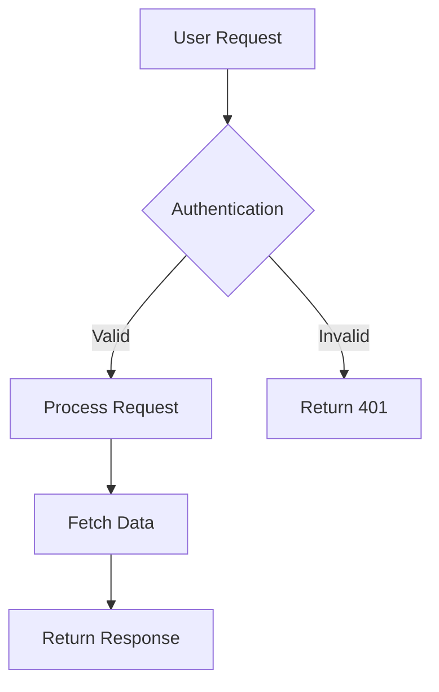
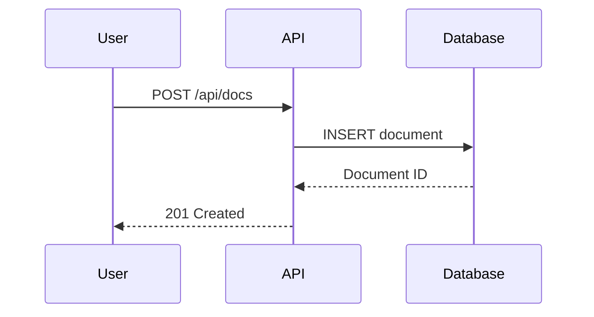

# Documentation.AI — Complete Component Reference

Every MDX component available in Documentation.AI, with all attributes, types, default values, and usage examples.

> **Syntax rule:** All multi-word attributes use **kebab-case** (e.g. `param-type`, `default-open`, `show-lines`). Boolean attributes accept strings: `required="true"`, `collapsed="false"`, or JSX expressions: `horizontal={true}`.

---

## Table of Contents

1. [Frontmatter](#1-frontmatter)
2. [Headings & Text](#2-headings--text)
3. [Lists & Tables](#3-lists--tables)
4. [Callout](#4-callout)
5. [Code Block](#5-code-block)
6. [CodeGroup](#6-codegroup)
7. [Request](#7-request)
8. [Response](#8-response)
9. [Steps / Step](#9-steps--step)
10. [Tabs / Tab](#10-tabs--tab)
11. [Expandable / ExpandableGroup](#11-expandable--expandablegroup)
12. [Card](#12-card)
13. [Columns](#13-columns)
14. [ParamField](#14-paramfield)
15. [ResponseField](#15-responsefield)
16. [Image](#16-image)
17. [Video](#17-video)
18. [Iframe](#18-iframe)
19. [Update](#19-update)
20. [Board / BoardColumn / BoardCard](#20-board--boardcolumn--boardcard)
21. [CollectionList](#21-collectionlist)
22. [CollectionContent](#22-collectioncontent)
23. [BodyParams / ContentType](#23-bodyparams--contenttype)
24. [AuthParams / AuthType](#24-authparams--authtype)
25. [Mermaid Diagrams](#25-mermaid-diagrams)
26. [documentation.json Configuration](#26-documentationjson-configuration)

---

## 1. Frontmatter

Every MDX page **must** start with YAML frontmatter. H1 is auto-generated from `title`.

| Field | Type | Required | Notes |
|-------|------|----------|-------|
| `title` | string | **Yes** | Page title. Appears in browser tab, sidebar, and as the H1 |
| `description` | string | Recommended | Page description for SEO and search |
| `type` | string | No | Page type hint (e.g. `"reference"`, `"guide"`, `"tutorial"`) |

```yaml
---
title: "Clear, specific, keyword-rich title"
description: "Concise description explaining page purpose and value"
---
```

---

## 2. Headings & Text

Standard markdown. Start page content with H2 (`##`) — H1 is auto-generated from frontmatter `title`.

```markdown
## Main section heading        <!-- H2 — main sections -->
### Subsection heading         <!-- H3 — subsections -->
#### Detailed subsection       <!-- H4 — deeper detail -->

Use **bold** for emphasis, `inline code` for technical terms.
Create [descriptive links](https://example.com) — never "click here".
Use *italic* sparingly.
```

**Heading component internals:** Each heading gets an auto-generated anchor `id` via `github-slugger` for deep-linking.

---

## 3. Lists & Tables

Standard markdown syntax.

### Unordered lists

```markdown
- First item
- Second item
  - Nested item
- Third item
```

### Ordered lists

```markdown
1. First step
2. Second step
   1. Nested step
3. Third step
```

### Tables

```markdown
| Parameter | Type   | Description              |
|-----------|--------|--------------------------|
| api_key   | string | Your API authentication key |
| timeout   | integer| Request timeout in seconds  |
```

**Table component internals:** The `<Table>` component wraps `<table>` in a horizontally-scrollable container. No extra attributes — all formatting comes from standard markdown.

---

## 4. Callout

Highlighted message boxes for tips, warnings, and important information.

### Attributes

| Attribute | Type | Default | Required | Description |
|-----------|------|---------|----------|-------------|
| `kind` | `"info"` \| `"tip"` \| `"alert"` \| `"danger"` \| `"success"` \| `"custom"` | `"info"` | No | Drives icon and background color |
| `collapsed` | `string` (`"true"` / `"false"`) | `undefined` (not collapsed) | No | Makes the callout collapsible |
| `icon` | `string` | Auto from `kind` | No | Lucide icon name (overrides the default icon for the `kind`) |
| `color` | `string` | Auto from `kind` | No | Custom CSS color value; overrides background/icon color |

### Kinds

| Kind | Use case |
|------|----------|
| `info` | Neutral contextual information |
| `tip` | Best practices and recommendations |
| `alert` | Important cautions and breaking changes |
| `danger` | Destructive actions, data loss, irreversible operations |
| `success` | Positive confirmations and achievements |
| `custom` | Custom icon and color |

### Examples

```jsx
<Callout kind="info">
  Supplementary information that supports the main content.
</Callout>

<Callout kind="tip">
  Expert advice or best practices.
</Callout>

<Callout kind="alert">
  Critical information about potential issues.
</Callout>

<Callout kind="danger">
  Warning about destructive or irreversible actions.
</Callout>

<Callout kind="success">
  Positive confirmation of a completed action.
</Callout>

<Callout kind="custom" icon="sparkles" color="#8b5cf6">
  Custom styled callout with a specific icon and color.
</Callout>

<Callout kind="alert" collapsed="true">
  This callout is collapsed by default. Click to expand.
</Callout>
```

---

## 5. Code Block

Single fenced code block with syntax highlighting via Shiki.

### Attributes (on the opening fence)

| Attribute | Type | Default | Required | Description |
|-----------|------|---------|----------|-------------|
| Language identifier | string | — | Yes | After the triple backticks (e.g. ` ```javascript `) |
| `title` | string | — | No | Filename or label shown above the code block |
| `show-lines` | `boolean` \| `string` | `false` | No | Show line numbers |
| `highlight` | string | — | No | Highlight specific lines (e.g. `"1-2,5"`) |
| `focus` | string | — | No | Focus specific lines, dimming the rest (e.g. `"2,4-5"`) |
| `wrap` | `boolean` \| `string` | `false` | No | Enable word wrap instead of horizontal scroll |

### Supported language aliases

| Alias | Resolves to |
|-------|-------------|
| `node`, `nodejs` | `javascript` |
| `curl` | `bash` |

### Example

````markdown
```javascript title="config.js" show-lines="true" highlight="2-4"
const apiConfig = {
  baseURL: 'https://api.documentation.ai',
  timeout: 5000,
  headers: {
    'Authorization': `Bearer ${process.env.API_TOKEN}`
  }
};
```
````

---

## 6. CodeGroup

Tabbed code block container showing the same concept in multiple languages or variants.

### Attributes

| Attribute | Type | Default | Required | Description |
|-----------|------|---------|----------|-------------|
| `tabs` | `string` \| `string[]` | Auto-detected from child languages | No | Comma-separated tab labels (e.g. `"JavaScript,Python,Bash"`) |
| `show-lines` | `string` (`"true"` / `"false"`) | `undefined` | No | Propagated to all child code blocks |
| `dropdown` | `string` (`"true"`) | `undefined` | No | Switches to dropdown-selector mode; groups tabs by status code |

### Notes

- Supports `"CODE - Variant"` tab label format for dropdown grouping (e.g. `"200 - Success"`, `"400 - Error"`)
- Includes copy-to-clipboard on each tab
- First tab is active by default

### Example

```jsx
<CodeGroup show-lines="true" tabs="JavaScript,Python,Bash">
  ```javascript
  const response = await fetch('/api/endpoint', {
    headers: { Authorization: `Bearer ${apiKey}` }
  });
  const data = await response.json();
  ```

  ```python
  import requests
  response = requests.get('/api/endpoint',
    headers={'Authorization': f'Bearer {api_key}'})
  data = response.json()
  ```

  ```bash
  curl -X GET '/api/endpoint' \
    -H 'Authorization: Bearer YOUR_API_KEY'
  ```
</CodeGroup>
```

---

## 7. Request

API request code examples — renders in the right sidebar on API pages. Thin wrapper around `CodeGroup`.

### Attributes

| Attribute | Type | Default | Required | Description |
|-----------|------|---------|----------|-------------|
| `tabs` | `string` | — | No | Comma-separated language names (e.g. `"cURL,JavaScript,Python"`) |
| `show-lines` | `string` | **Always forced to `"true"`** | No | Line numbers are always enabled regardless of what you pass |
| `default-tab` | `string` | `undefined` | No | Declared but currently unused in implementation |

### Example

```jsx
<Request show-lines="true" tabs="JavaScript,Python">
  ```javascript
  const response = await fetch('https://api.example.com/docs', {
    method: 'POST',
    headers: {
      'Content-Type': 'application/json',
      'Authorization': 'Bearer TOKEN'
    },
    body: JSON.stringify({
      title: "Getting Started",
      content: "Welcome to our API"
    })
  });
  ```

  ```python
  import requests
  response = requests.post(
    'https://api.example.com/docs',
    headers={'Authorization': 'Bearer TOKEN'},
    json={'title': 'Getting Started', 'content': 'Welcome to our API'}
  )
  ```
</Request>
```

---

## 8. Response

API response examples — renders in the right sidebar on API pages. Thin wrapper around `CodeGroup`.

### Attributes

| Attribute | Type | Default | Required | Description |
|-----------|------|---------|----------|-------------|
| `tabs` | `string` \| `string[]` | — | No | HTTP status codes as tab labels (e.g. `"200,400,500"`) |
| `show-lines` | `string` | `undefined` | No | Passed through to internal `CodeGroup` (not forced like `Request`) |
| `dropdown` | `string` (`"true"`) | `undefined` | No | Enables dropdown mode for grouping by status code |
| `default-tab` | `string` | `undefined` | No | Declared but currently unused |

### Tab label format

Supports `"CODE - Variant"` grouping: `"200 - Success"`, `"400 - Validation Error"`.

### Example

```jsx
<Response show-lines="true" tabs="200,500">
  ```json
  {
    "id": "doc_123",
    "title": "Getting Started",
    "status": "published",
    "created_at": "2024-01-15T10:30:00Z"
  }
  ```

  ```json
  {
    "error": "Document not found",
    "code": "DOC_NOT_FOUND",
    "message": "The requested document does not exist"
  }
  ```
</Response>
```

---

## 9. Steps / Step

Sequential, numbered step-by-step procedures with icons and optional heading semantics.

### `<Steps>` Attributes

| Attribute | Type | Default | Required | Description |
|-----------|------|---------|----------|-------------|
| `children` | `ReactNode` | — | Yes | One or more `<Step>` children |

### `<Step>` Attributes

| Attribute | Type | Default | Required | Description |
|-----------|------|---------|----------|-------------|
| `title` | `string` | — | **Yes** | Step heading text |
| `icon` | `string` | Step number | No | Lucide icon name; falls back to numeric step indicator |
| `title-type` | `"p"` \| `"h2"` \| `"h3"` \| `"h4"` \| `"h5"` \| `"h6"` | `"p"` | No | Semantic heading level. Use `"h2"` or `"h3"` for TOC integration |
| `titleType` | same | `"p"` | No | **Deprecated** camelCase alias (use `title-type` instead) |

### Notes

- Heading `id` is auto-generated via `github-slugger` only when `titleType !== "p"`
- Steps auto-number from 1

### Example

```jsx
<Steps>
  <Step title="Install dependencies" icon="download" title-type="h3">
    Run the installation command:

    ```bash
    npm install documentation-ai
    ```

    <Callout kind="success">
      Verify installation by running `npm list documentation-ai`.
    </Callout>
  </Step>

  <Step title="Configure environment" icon="settings" title-type="h3">
    Create a `documentation.json` file:

    ```json
    {
      "name": "Your Documentation",
      "initialRoute": "getting-started/introduction"
    }
    ```
  </Step>

  <Step title="Start development server" icon="play" title-type="h3">
    ```bash
    npm run dev
    ```
  </Step>
</Steps>
```

---

## 10. Tabs / Tab

Tabbed content panels for alternative approaches, platform-specific content, etc.

### `<Tabs>` Attributes

| Attribute | Type | Default | Required | Description |
|-----------|------|---------|----------|-------------|
| `children` | `ReactNode` | — | Yes | One or more `<Tab>` children |

### `<Tab>` Attributes

| Attribute | Type | Default | Required | Description |
|-----------|------|---------|----------|-------------|
| `title` | `string` | — | **Yes** | Tab label text |
| `icon` | `string` | `undefined` | No | Lucide icon name |
| `children` | `ReactNode` | — | Yes | Tab panel content |

### Notes

- First tab is active by default (uncontrolled, always starts at index 0)
- Uses animated underline indicator

### Example

```jsx
<Tabs>
  <Tab title="macOS" icon="apple">
    ```bash
    brew install documentation-ai
    ```
  </Tab>

  <Tab title="Windows" icon="monitor">
    ```powershell
    winget install documentation-ai
    ```
  </Tab>

  <Tab title="Linux" icon="terminal">
    ```bash
    sudo apt install documentation-ai
    ```
  </Tab>
</Tabs>
```

---

## 11. Expandable / ExpandableGroup

Collapsible content sections for progressive disclosure, FAQs, and optional details.

### `<Expandable>` Attributes

| Attribute | Type | Default | Required | Description |
|-----------|------|---------|----------|-------------|
| `title` | `string` | `"Click to expand"` | No | Clickable header text |
| `default-open` | `string` (`"true"` / `"false"`) | `"false"` | No | Whether it starts expanded |

### `<ExpandableGroup>` Attributes

| Attribute | Type | Default | Required | Description |
|-----------|------|---------|----------|-------------|
| `children` | `ReactNode` | — | Yes | Multiple `<Expandable>` children |

### Notes

- Multiple expandables within a group can be open simultaneously (no accordion behavior — all are independent)
- Content is only mounted in the DOM when open (conditionally rendered)

### Example

```jsx
<ExpandableGroup>
  <Expandable title="Troubleshooting connection issues" default-open="false">
    - Ensure your API key is valid and not expired
    - Check firewall settings allow outbound connections
    - Verify you're using the correct API endpoint
  </Expandable>

  <Expandable title="Advanced configuration options" default-open="false">
    ```javascript
    const advancedConfig = {
      retryAttempts: 3,
      caching: { enabled: true, ttl: 3600 },
      logging: { level: 'debug', format: 'json' }
    };
    ```
  </Expandable>
</ExpandableGroup>
```

---

## 12. Card

Navigation cards linking to other pages, with optional icons and images.

### Attributes

| Attribute | Type | Default | Required | Description |
|-----------|------|---------|----------|-------------|
| `title` | `string` | — | **Yes** | Card heading |
| `href` | `string` | — | **Yes** | Link destination (internal path or external URL) |
| `icon` | `string` | — | No | Lucide icon name |
| `image` | `string` | — | No | Image URL for the card |
| `horizontal` | `boolean` \| `string` | `false` | No | `false` = stacked layout, `true` = side-by-side layout |
| `cta` | `string` | — | No | Call-to-action button text (renders with arrow icon) |
| `target` | `string` | `"_self"` | No | Link target (`"_blank"` for new tab) |
| `children` | `ReactNode` | — | Yes | Card description content |

### Examples

```jsx
<!-- Single card -->
<Card title="Getting started guide" href="/getting-started/quickstart" icon="rocket">
  Complete walkthrough from installation to deployment in under 10 minutes.
</Card>

<!-- Cards in a grid -->
<Columns cols="2">
  <Card title="Components" href="/components" icon="component">
    Learn about all available Documentation.AI components.
  </Card>

  <Card title="API Reference" href="/api-reference" icon="code">
    Import and organize your API documentation.
  </Card>
</Columns>

<!-- Horizontal card with CTA -->
<Card title="View on GitHub" href="https://github.com/example" icon="github" horizontal={true} cta="Open repository" target="_blank">
  Browse the source code and contribute.
</Card>
```

---

## 13. Columns

Grid layout container for side-by-side content.

### Attributes

| Attribute | Type | Default | Required | Description |
|-----------|------|---------|----------|-------------|
| `cols` | `number` | `1` | No | Number of columns: `1`, `2`, `3`, `4`, or `5` |

### Layout patterns

- **Columns with Cards:** Place `<Card>` components directly inside `<Columns>`
- **Columns with plain content:** Wrap content in `<div>` tags inside `<Columns>`

### Examples

```jsx
<!-- Cards in columns -->
<Columns cols="3">
  <Card title="Fast Setup" href="#" icon="zap">
    Get started in minutes.
  </Card>
  <Card title="Full Control" href="#" icon="settings">
    Customize every aspect.
  </Card>
  <Card title="Team Ready" href="#" icon="users">
    Built for collaboration.
  </Card>
</Columns>

<!-- Plain content in columns -->
<Columns cols="2">
  <div>
    ### Before
    Old approach with manual configuration.
  </div>
  <div>
    ### After
    New approach with auto-detection.
  </div>
</Columns>
```

---

## 14. ParamField

API parameter documentation with location badge, type, and validation info.

### Attributes

| Attribute | Type | Default | Required | Description |
|-----------|------|---------|----------|-------------|
| `path` | `string` | — | One of `path` / `query` / `header` / `body` | Path parameter name (shows "path" location badge) |
| `query` | `string` | — | " | Query parameter name |
| `header` | `string` | — | " | Header parameter name |
| `body` | `string` | — | " | Body parameter name |
| `param-type` | `string` | — | No | Type label (e.g. `"string"`, `"integer"`, `"boolean"`) |
| `required` | `string` (`"true"` / `"false"`) | `undefined` | No | Shows "Required" badge |
| `deprecated` | `string` (`"true"` / `"false"`) | `undefined` | No | Shows "Deprecated" badge |
| `show-location` | `string` (`"true"` / `"false"`) | `"true"` | No | Whether to show the location badge (path/query/header/body) |
| `enum` | `string` | — | No | Comma-separated allowed values; renders "Allowed values" list |
| `examples-b64` | `string` | — | No | Base64-encoded JSON array of example values |

### Notes

- Location precedence: `path` > `query` > `header` > `body` (default: `"path"`)
- Anchor ID is generated as `location-paramName` (e.g. `path-doc_id`)
- The `required` and `deprecated` props are string-compared (`=== "true"`), not boolean

### Examples

```jsx
<ParamField path="doc_id" param-type="string" required="true">
  Unique identifier for the documentation page. Must be a valid slug format.
</ParamField>

<ParamField query="version" param-type="string" required="false">
  API version. Defaults to the latest stable version if not specified.
</ParamField>

<ParamField header="Authorization" param-type="string" required="true">
  Bearer token for API authentication. Format: `Bearer YOUR_API_KEY`
</ParamField>

<ParamField body="status" param-type="string" required="false" enum="draft,published,archived">
  Page publication status.
</ParamField>
```

---

## 15. ResponseField

API response field documentation with type and nested field support.

### Attributes

| Attribute | Type | Default | Required | Description |
|-----------|------|---------|----------|-------------|
| `name` | `string` | `"response"` | No | Field name |
| `field-type` | `string` | — | No | Type label (e.g. `"string"`, `"object"`, `"array"`) |
| `required` | `string` (`"true"` / `"false"`) | `undefined` | No | Shows "Required" badge |
| `deprecated` | `string` (`"true"` / `"false"`) | `undefined` | No | Shows "Deprecated" badge |
| `enum` | `string` | — | No | Comma-separated allowed values |

### Notes

- Simpler than `ParamField` — no location badge, no examples
- Supports nesting via `<Expandable>` for object sub-fields

### Examples

```jsx
<ResponseField name="doc_id" field-type="string" required="true">
  Unique identifier assigned to the newly created page.
</ResponseField>

<ResponseField name="published_at" field-type="string" required="false">
  ISO 8601 formatted timestamp of when the page was published.
</ResponseField>

<!-- Nested response fields -->
<ResponseField name="metadata" field-type="object" required="false">
  Additional metadata associated with the page.

  <Expandable title="Metadata properties" default-open="false">
    <ResponseField name="author" field-type="string" required="false">
      Username or email of the page author.
    </ResponseField>

    <ResponseField name="tags" field-type="array" required="false">
      Array of tag strings for categorization.
    </ResponseField>
  </Expandable>
</ResponseField>
```

---

## 16. Image

Responsive image with zoom capability, wrapping `next/image`.

### Attributes

| Attribute | Type | Default | Required | Description |
|-----------|------|---------|----------|-------------|
| `src` | `string` | — | **Yes** | Image URL or path |
| `alt` | `string` | — | **Yes** | Alt text for accessibility (also fallback caption) |
| `width` | `string` \| `number` | `800` | No | Image width in pixels |
| `height` | `string` \| `number` | `600` | No | Image height in pixels |
| `caption` | `string` | Falls back to `alt` | No | Caption text below the image |
| `priority` | `boolean` | `undefined` | No | Eager loading for above-the-fold images |
| `sizes` | `string` | `"(max-width: 640px) 100vw, (max-width: 1024px) 90vw, 90vw"` | No | Responsive sizes hint |
| `style` | `CSSProperties` \| `string` | `undefined` | No | Inline CSS styles |
| `className` | `string` | `""` | No | Additional CSS classes |
| `fetchPriority` | `"high"` \| `"low"` \| `"auto"` | `undefined` | No | Browser fetch priority hint |

### Notes

- Includes `react-medium-image-zoom` for click-to-zoom
- GIFs are special-cased: rendered unoptimized with pre-computed imgix URL

### Example

```jsx
<Image
  src="/images/dashboard-overview.png"
  width="670"
  height="400"
  alt="Documentation.AI dashboard showing analytics and recent activity"
/>
```

---

## 17. Video

Embed videos from YouTube, Vimeo, Loom, or direct URLs.

### Attributes

| Attribute | Type | Default | Required | Description |
|-----------|------|---------|----------|-------------|
| `src` | `string` | — | **Yes** | Video URL (YouTube, Vimeo, Loom, or direct) |
| `render-type` | `"video"` \| `"iframe"` | `"iframe"` | No | Rendering mode |
| `width` | `string` \| `number` | `undefined` | No | Width in pixels |
| `height` | `string` \| `number` | `undefined` | No | Height in pixels |
| `title` | `string` | `undefined` | No | Accessibility label |
| `poster` | `string` | `undefined` | No | Poster image (only for `"video"` render-type) |
| `controls` | `string` \| `boolean` | `true` | No | Show video controls |
| `allow-full-screen` | `string` \| `boolean` | `true` | No | Allow fullscreen |
| `autoplay` | `string` \| `boolean` | `false` | No | Auto-play on load |
| `loop` | `string` \| `boolean` | `false` | No | Loop playback |
| `muted` | `string` \| `boolean` | `false` | No | Mute audio |
| `priority` | `string` \| `boolean` | `false` | No | Eager loading (`loading="eager"`) |
| `style` | `CSSProperties` \| `string` | `undefined` | No | Inline CSS |
| `className` | `string` | `""` | No | Additional CSS classes |
| `fetchPriority` | `"high"` \| `"low"` \| `"auto"` | `undefined` | No | Browser fetch priority |

### Notes

- Iframe mode uses `sandbox="allow-scripts allow-same-origin allow-presentation"`
- Returns `null` if `src` is missing

### Examples

```jsx
<Video src="https://www.youtube.com/watch?v=VIDEO_ID" width="100%" height="600" />

<Video src="https://vimeo.com/VIDEO_ID" width="100%" height="600" />

<Video src="https://www.loom.com/share/VIDEO_ID" width="100%" height="600" />

<!-- Direct video file -->
<Video src="/videos/demo.mp4" render-type="video" poster="/images/poster.jpg" controls={true} />
```

---

## 18. Iframe

Embed external interactive content.

### Attributes

| Attribute | Type | Default | Required | Description |
|-----------|------|---------|----------|-------------|
| `src` | `string` | — | **Yes** | URL to embed |
| `iframe-id` | `string` | `undefined` | No | HTML `id` attribute for the iframe |
| `width` | `string` \| `number` | `undefined` | No | Width |
| `height` | `string` \| `number` | `undefined` | No | Height |
| `title` | `string` | `undefined` | No | Accessibility title |
| `allow-full-screen` | `string` \| `boolean` | `true` | No | Allow fullscreen |
| `frame-border` | `string` | `"0"` | No | Frame border width |
| `loading` | `"lazy"` \| `"eager"` | `"lazy"` | No | Loading strategy |
| `sandbox` | `string` | `undefined` | No | Sandbox restrictions (overrides default) |
| `display-mode` | `"fixed"` \| `"auto-resize"` | `"fixed"` | No | `"auto-resize"` dynamically adjusts height to content |
| `scripts` | `string` | `undefined` | No | JSON-encoded array of scripts (only for `"auto-resize"` mode) |
| `priority` | `string` \| `boolean` | `false` | No | Forces `loading="eager"` |
| `style` | `CSSProperties` \| `string` | `undefined` | No | Inline CSS |
| `className` | `string` | `""` | No | Additional CSS classes |

### Example

```jsx
<Iframe
  src="https://example.com/interactive-demo"
  width="100%"
  height="600px"
/>

<Iframe
  src="https://example.com/widget"
  display-mode="auto-resize"
  iframe-id="my-widget"
/>
```

---

## 19. Update

Changelog and version release entries.

### Attributes

| Attribute | Type | Default | Required | Description |
|-----------|------|---------|----------|-------------|
| `label` | `string` | — | **Yes** | Date or version label (used to generate anchor `id`) |
| `description` | `string` | — | **Yes** | Version number or short description |
| `tags` | `string[]` | `undefined` | No | Tags like `["Breaking Change"]`, `["New Feature"]` |
| `children` | `ReactNode` | — | Yes | Release notes content |

### Example

```jsx
<Update label="2025-01-15" description="v2.0.0" tags={["Breaking Change"]}>
  ### Major update

  - New authentication system with OAuth 2.0 support
  - Redesigned dashboard with improved performance
  - Breaking: Old API endpoints deprecated

  **Migration guide:** Follow the [v2 migration guide](/api/migration-v2).
</Update>

<Update label="2024-12-01" description="v1.5.0" tags={["New Feature"]}>
  ### Enhanced search

  - AI-powered semantic search
  - Filter by content type
  - Search suggestions and autocomplete
</Update>
```

---

## 20. Board / BoardColumn / BoardCard

Kanban-style board for roadmaps, feature status, and release plans.

### `<Board>` Attributes

| Attribute | Type | Default | Required | Description |
|-----------|------|---------|----------|-------------|
| `title` | `string` | `undefined` | No | Board region title. **Note:** Declared in props type but not rendered in current implementation |
| `children` | `ReactNode` | — | Yes | `<BoardColumn>` children |

### `<BoardColumn>` Attributes

| Attribute | Type | Default | Required | Description |
|-----------|------|---------|----------|-------------|
| `title` | `string` | — | **Yes** | Column heading |
| `color` | `string` | Column position index | No | Color index `0`–`8` from palette |
| `icon` | `string` | Colored dot | No | Lucide icon name; falls back to a colored dot |
| `children` | `ReactNode` | — | Yes | `<BoardCard>` children |

### Color indices

| Index | Color |
|-------|-------|
| `0` | Gray |
| `1` | Brown |
| `2` | Orange |
| `3` | Yellow |
| `4` | Green |
| `5` | Blue |
| `6` | Purple |
| `7` | Pink |
| `8` | Red |

### `<BoardCard>` Attributes (self-closing)

| Attribute | Type | Default | Required | Description |
|-----------|------|---------|----------|-------------|
| `title` | `string` | — | **Yes** | Card label |
| `description` | `string` | `undefined` | No | Additional context |
| `icon` | `string` | `"file-text"` | No | Lucide icon name |
| `due-date` | `string` | `undefined` | No | Date string (e.g. `"2025-02-01"`) |
| `author` | `string` | `undefined` | No | Person name (shown in detail dialog only) |
| `created-at` | `string` | `undefined` | No | Date string (e.g. `"2025-01-15"`) |

### Notes

- `due-date` / `dueDate` and `created-at` / `createdAt` — kebab-case takes precedence over camelCase
- Clicking a card opens a `CardDetailDialog` with all metadata

### Example

```jsx
<Board title="Product roadmap">
  <BoardColumn title="Planned" color="3" icon="check-circle">
    <BoardCard title="Webhook support" />
    <BoardCard title="Bulk export API" due-date="2025-03-01" />
  </BoardColumn>

  <BoardColumn title="In Development" color="5" icon="play-circle">
    <BoardCard title="Dark mode" author="Jane" created-at="2025-01-10" />
  </BoardColumn>

  <BoardColumn title="Shipped" color="4" icon="rocket">
    <BoardCard title="SSO with SAML" description="Enterprise single sign-on" />
  </BoardColumn>
</Board>
```

---

## 21. CollectionList

Dynamically display direct children of a navigation node from `documentation.json`.

### Attributes

| Attribute | Type | Default | Required | Description |
|-----------|------|---------|----------|-------------|
| `node` | `string` | — | **Yes** | Navigation node path in `type:name/type:name` format |
| `layout` | `"cards"` \| `"accordion"` \| `"list"` \| `"links"` | `"cards"` | No | Display layout |
| `cols` | `number` | `2` | No | Grid columns (cards layout only). Values: `1`, `2`, `3`, `4` |
| `card-variant` | `"default"` \| `"horizontal"` \| `"centered"` | `"default"` | No | Card style (cards layout only) |
| `default-open` | `string` (`"true"` / `"false"`) | `"true"` | No | Whether accordion starts expanded (accordion layout only) |

### Node path format

Uses `type:name/type:name` to walk the navigation tree.

Supported node types: `tabs`, `groups`, `dropdowns`, `dimensions`

### Examples

```jsx
<!-- Cards layout -->
<CollectionList node="tabs:Guides" layout="cards" cols={2} card-variant="default" />

<!-- Accordion layout -->
<CollectionList node="tabs:API/groups:Auth" layout="accordion" default-open={false} />

<!-- Simple list -->
<CollectionList node="groups:Resources" layout="list" />

<!-- Links only -->
<CollectionList node="groups:Resources" layout="links" />
```

### Notes

- Returns `null` if node doesn't resolve or has no direct children
- Stays in sync automatically as pages are added or removed from `documentation.json`

---

## 22. CollectionContent

Render the full nested tree under a navigation node as a recursive, collapsible accordion.

### Attributes

| Attribute | Type | Default | Required | Description |
|-----------|------|---------|----------|-------------|
| `node` | `string` | — | **Yes** | Navigation node path in `type:name/type:name` format |
| `default-expanded` | `string` (`"true"` / `"false"`) | `"false"` | No | Whether all tree nodes start expanded |

### Example

```jsx
<CollectionContent node="tabs:Guides" default-expanded={false} />
```

### Notes

- Renders `CollectionNode` tree recursively through all nested levels
- Returns `null` if node doesn't resolve

---

## 23. BodyParams / ContentType

Content type selector for API endpoints with multiple body formats.

### `<BodyParams>` Attributes

| Attribute | Type | Default | Required | Description |
|-----------|------|---------|----------|-------------|
| `contentTypes` | `string[]` | — | **Yes** | List of content types (e.g. `["application/json", "multipart/form-data"]`) |
| `defaultType` | `string` | Prefers `"application/json"`, else first entry | No | Default selected content type |
| `children` | `ReactNode` | — | Yes | `<ContentType>` children |

### `<ContentType>` Attributes

| Attribute | Type | Default | Required | Description |
|-----------|------|---------|----------|-------------|
| `type` | `string` | — | **Yes** | Content type string (e.g. `"application/json"`) |
| `children` | `ReactNode` | — | Yes | Parameter fields for this content type |

### Notes

- Dropdown selector only shown when there are multiple content types
- Renders "No content types defined" if `contentTypes` array is empty

### Example

```jsx
<BodyParams contentTypes={["application/json", "multipart/form-data"]} defaultType="application/json">
  <ContentType type="application/json">
    <ParamField body="title" param-type="string" required="true">
      Page title.
    </ParamField>
  </ContentType>

  <ContentType type="multipart/form-data">
    <ParamField body="file" param-type="file" required="true">
      File to upload.
    </ParamField>
  </ContentType>
</BodyParams>
```

---

## 24. AuthParams / AuthType

Authentication scheme documentation for API endpoints.

### `<AuthParams>` Attributes

| Attribute | Type | Default | Required | Description |
|-----------|------|---------|----------|-------------|
| `schemes` | `string[]` | — | **Yes** | List of auth scheme names |
| `defaultScheme` | `string` | — | No | Declared in interface but currently unused |
| `children` | `ReactNode` | — | Yes | `<AuthType>` children |

### `<AuthType>` Attributes

| Attribute | Type | Default | Required | Description |
|-----------|------|---------|----------|-------------|
| `scheme` | `string` | — | **Yes** | Auth scheme name |
| `children` | `ReactNode` | — | Yes | Scheme documentation content |

### Notes

- Unlike `BodyParams`, all schemes render simultaneously (no tab/dropdown switching)
- Renders "No authentication required" if `schemes` array is empty

### Example

```jsx
<AuthParams schemes={["Bearer Token", "API Key"]}>
  <AuthType scheme="Bearer Token">
    Pass the token in the `Authorization` header: `Bearer YOUR_TOKEN`
  </AuthType>

  <AuthType scheme="API Key">
    Pass the key in the `X-API-Key` header.
  </AuthType>
</AuthParams>
```

---

## 25. Mermaid Diagrams

Flowcharts, sequence diagrams, and architecture visualizations using Mermaid syntax inside fenced code blocks.

### Usage

Use a fenced code block with language `mermaid`:

````markdown

````

### Supported diagram types

| Type | Syntax | Use case |
|------|--------|----------|
| Flowchart | `graph TD` / `graph LR` | Process flows, decision trees |
| Sequence diagram | `sequenceDiagram` | API interactions, message flows |
| Entity relationship | `erDiagram` | Database schemas |
| State diagram | `stateDiagram-v2` | State machines, lifecycle flows |
| Class diagram | `classDiagram` | Object relationships |
| Gantt chart | `gantt` | Timelines, project plans |

### Example — Sequence diagram

````markdown

````

---

## 26. documentation.json Configuration

The central configuration file controlling site name, navigation, colors, and branding.

### Top-level fields

| Field | Type | Required | Description |
|-------|------|----------|-------------|
| `name` | `string` | Yes | Site name |
| `initialRoute` | `string` | Yes | Default landing page path |
| `colors` | `object` | No | Light and dark mode color schemes |
| `navigation` | `object` | Yes | Navigation structure |

### Colors

```json
{
  "colors": {
    "light": {
      "brand": "#3143e3",
      "heading": "#1a1a1a",
      "text": "#374151"
    },
    "dark": {
      "brand": "#85a1ff",
      "heading": "#f2f2f2",
      "text": "#c1c1c1"
    }
  }
}
```

### Navigation hierarchy

```
languages → versions → dropdowns → tabs → menus → groups → pages
```

Each container level must choose **exactly one** child type.

### Navigation containers

| Container | Property | Can contain |
|-----------|----------|-------------|
| Languages | `"language": "en"` | `versions`, `dropdowns`, `tabs`, `menus`, `groups`, `pages` |
| Versions | `"version": "v2.0"` | `dropdowns`, `tabs`, `menus`, `groups`, `pages` |
| Dropdowns | `"dropdown": "API Reference"` | `tabs`, `menus`, `groups`, `pages` |
| Tabs | `"tab": "Documentation"` | `menus`, `groups`, `pages` |
| Menus | `"menu": "Getting Started"` | `groups`, `pages` |
| Groups | `"group": "Authentication"` | `pages` (mixed individual items) |

### Page item properties

| Field | Type | Required | Description |
|-------|------|----------|-------------|
| `title` | `string` | Yes | Page title |
| `path` | `string` | Yes (unless `href`) | File path without `.mdx` extension |
| `href` | `string` | Yes (unless `path`) | External URL |
| `icon` | `string` | No | Lucide icon name |
| `slug` | `string` | No | Pretty URL override |
| `method` | `string` | No | HTTP method badge (`"GET"`, `"POST"`, `"PUT"`, `"PATCH"`, `"DELETE"`) |
| `tags` | `string` | No | Categorization tags |

### Group properties

| Field | Type | Default | Required | Description |
|-------|------|---------|----------|-------------|
| `group` | `string` | — | Yes | Group title |
| `icon` | `string` | — | No | Lucide icon |
| `expandable` | `boolean` | `false` | No | Whether users can collapse/expand the group |
| `openapi` | `string` | — | No | Path to OpenAPI YAML file |
| `href` | `string` | — | No | External link for the group header |
| `pages` | `array` | — | Yes | Mixed array of page items and nested groups |

### Example

```json
{
  "name": "Your Documentation",
  "initialRoute": "getting-started/introduction",
  "colors": {
    "light": { "brand": "#3143e3", "heading": "#1a1a1a", "text": "#374151" },
    "dark": { "brand": "#85a1ff", "heading": "#f2f2f2", "text": "#c1c1c1" }
  },
  "navigation": {
    "tabs": [
      {
        "tab": "Documentation",
        "icon": "book",
        "groups": [
          {
            "group": "Getting Started",
            "icon": "rocket",
            "expandable": false,
            "pages": [
              { "title": "Introduction", "path": "getting-started/introduction", "icon": "star" },
              { "title": "Quickstart", "path": "getting-started/quickstart", "icon": "zap" }
            ]
          }
        ]
      },
      {
        "tab": "API Reference",
        "icon": "code-2",
        "groups": [
          {
            "group": "Users",
            "icon": "users",
            "expandable": true,
            "openapi": "docs/api-reference/openapi/users.yaml",
            "pages": [
              { "title": "Create User", "path": "docs/api-reference/users/post-users", "method": "POST" },
              { "title": "List Users", "path": "docs/api-reference/users/get-users", "method": "GET" }
            ]
          }
        ]
      }
    ]
  }
}
```

---

## Quick-reference: Component selection guide

| Need | Component |
|------|-----------|
| Page structure | Markdown headings (`##`, `###`, `####`) |
| Related items without order | Unordered lists |
| Sequential procedures | `<Steps>` with `<Step>` |
| Structured data comparisons | Markdown tables |
| Platform-specific alternatives | `<Tabs>` with `<Tab>` |
| Same concept in multiple languages | `<CodeGroup>` |
| Progressive disclosure / FAQs | `<Expandable>` / `<ExpandableGroup>` |
| API request examples (sidebar) | `<Request>` |
| API response examples (sidebar) | `<Response>` |
| API parameters | `<ParamField>` |
| API response fields | `<ResponseField>` |
| Important callouts | `<Callout>` with appropriate `kind` |
| Navigation cards / feature grids | `<Card>` inside `<Columns>` |
| Side-by-side content | `<Columns>` with `<div>` wrappers |
| Screenshots / diagrams | `<Image>` |
| Video tutorials | `<Video>` |
| Interactive embeds | `<Iframe>` |
| Changelogs / releases | `<Update>` |
| Flowcharts / architecture | Mermaid diagrams |
| Dynamic nav-based landing pages | `<CollectionList>` |
| Full nested nav tree | `<CollectionContent>` |
| Roadmaps / kanban | `<Board>` / `<BoardColumn>` / `<BoardCard>` |
| Multi-content-type API bodies | `<BodyParams>` / `<ContentType>` |
| Auth scheme docs | `<AuthParams>` / `<AuthType>` |

---

## Icons

All icon attributes across components accept [Lucide icon](https://lucide.dev/icons/) names in kebab-case (e.g. `"book-open"`, `"zap"`, `"settings"`, `"rocket"`).
