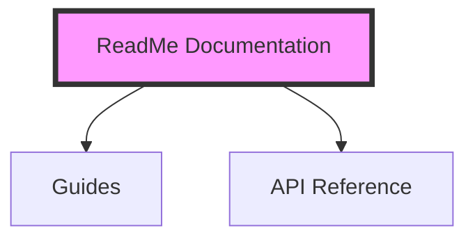

# ReadMe Component Reference

**A complete reference of components available on the ReadMe (readme.com) documentation platform**, combining official ReadMe documentation, the open-source ReadMe rendering engine source code, the ReadMe community component Marketplace, and a full inventory of component usage found in the local documentation corpus at `/home/javeed/Documents/CAPILLARY/INFO/docs.capillarytech.com`.

- **Compiled:** 2026-08-12
- **Local corpus analysed:** 1,376 Markdown files (815 Guides + 560 API Reference) + 379 rendered HTML files + `manifest.json`, scraped from `docs.capillarytech.com` on 2026-06-22
- **Local site platform (verified):** ReadMe "SuperHub" / **ReadMe Refactored** (MDX engine), deploy `5.773.1`, project `capillary-documentation`

---

## Table of contents

1. [How to read this document](#1-how-to-read-this-document)
2. [Platform background: RDMD → MDX → MDXish](#2-platform-background-rdmd--mdx--mdxish)
3. [Master component index](#3-master-component-index)
4. [Built-in components (full reference)](#4-built-in-components-full-reference)
   - [4.1 Callout](#41-callout)
   - [4.2 Image](#42-image)
   - [4.3 Table](#43-table)
   - [4.4 Anchor](#44-anchor)
   - [4.5 Glossary](#45-glossary)
   - [4.6 Embed](#46-embed)
   - [4.7 HTMLBlock](#47-htmlblock)
   - [4.8 Code (code blocks)](#48-code-code-blocks)
   - [4.9 CodeTabs](#49-codetabs)
   - [4.10 Tabs / Tab](#410-tabs--tab)
   - [4.11 Accordion](#411-accordion)
   - [4.12 Cards / Card](#412-cards--card)
   - [4.13 Columns / Column](#413-columns--column)
   - [4.14 Recipe / TutorialTile](#414-recipe--tutorialtile)
   - [4.15 PostmanRunButton](#415-postmanrunbutton)
   - [4.16 MCPIntro](#416-mcpintro)
   - [4.17 Variable (personalised user variables)](#417-variable-personalised-user-variables)
   - [4.18 Internal / infrastructure components](#418-internal--infrastructure-components)
5. [Markdown syntax that compiles into components](#5-markdown-syntax-that-compiles-into-components)
6. [Legacy "magic blocks"](#6-legacy-magic-blocks)
7. [Reusable Content blocks](#7-reusable-content-blocks)
8. [Custom components (author your own)](#8-custom-components-author-your-own)
9. [Marketplace / community components](#9-marketplace--community-components)
10. [Local corpus analysis — what Capillary actually uses](#10-local-corpus-analysis--what-capillary-actually-uses)
11. [Things in the local docs that are NOT ReadMe components](#11-things-in-the-local-docs-that-are-not-readme-components)
12. [Gotchas, limitations and migration artefacts](#12-gotchas-limitations-and-migration-artefacts)
13. [Quick-reference cheat sheet](#13-quick-reference-cheat-sheet)
14. [Sources](#14-sources)

---

## 1. How to read this document

Every component below carries a **verification badge** so you can tell verified fact from inference:

| Badge | Meaning |
| --- | --- |
| ✅ **Verified (source)** | Props/defaults read directly from the ReadMe rendering-engine source (`readmeio/markdown` on GitHub). This is the strongest evidence available. |
| ✅ **Verified (official docs)** | Documented on `docs.readme.com`. |
| ✅ **Verified (local corpus)** | Observed in real use in `docs.capillarytech.com` files, with occurrence counts. |
| 🟡 **Community / Marketplace** | Ships in ReadMe's public component Marketplace, **not** built in. Must be installed per-project via *Settings → Custom Components*. |
| 🟠 **Undocumented but real** | Present in the engine source but absent from the public docs. Safe to use, but may change without notice. |
| 🔴 **Custom / project-specific** | Not part of ReadMe at all — either project-authored, or a false positive (e.g. code sample text that merely looks like a tag). |
| ❓ **Unverified** | Could not be confirmed. Stated as uncertain, never guessed. |

> **Important scoping note.** ReadMe currently ships **two** component surfaces that are easy to conflate:
> 1. **Engine components** (`Callout`, `Image`, `Table`, `Anchor`, `Glossary`, `Embed`, `HTMLBlock`, `Code`, `CodeTabs`, `Recipe`, …) — always available, produced by both Markdown syntax and JSX. Most are **not** listed on the "Built-in Components" docs page.
> 2. **Editor slash-menu components** (`Tabs`, `Accordion`, `Cards`, `Columns`) — the four the official docs page advertises.
>
> This reference covers both, plus the Marketplace layer.

---

## 2. Platform background: RDMD → MDX → MDXish

✅ **Verified (official docs + source)**

- ReadMe pages are authored in **MDX** (Markdown eXtended), based on the **CommonMark** spec plus **GitHub-Flavored Markdown** and JSX.
- The renderer is the open-source package **`@readme/markdown`** (repo: [`readmeio/markdown`](https://github.com/readmeio/markdown)), described as *"ReadMe's MDX rendering engine and custom component collection."*
- Historically ReadMe used **RDMD** (ReadMe-Flavored Markdown) with JSON "magic blocks". Those are still parsed for backwards compatibility (see [§6](#6-legacy-magic-blocks)).
- The engine additionally implements a lenient dialect internally called **"MDXish"**, which tolerates syntax strict MDX would reject (raw HTML with string `style="…"`, unclosed tags, compact headings, etc.). Transforms such as `close-self-closing-html-tags`, `style-object-to-css`, `normalize-compact-headings` and `repair-unclosed-tags` exist specifically for this.

### MDX rules you must follow (✅ official docs)

```
❌ Invalid                    ✅ Valid
<br>                          <br />
                         
<hr>                          <hr />

<p>Content                    <p>Content</p>
<ul>                          <ul>
  <li>1                         <li>1</li>
  <li>2                         <li>2</li>
</ul>                         </ul>

class="my-class"              className="my-class"
style="margin-left: auto;"    style={{ marginLeft: 'auto' }}
```

- All JSX tags must be explicitly closed, including self-closing ones.
- Attributes are **camelCase**, except `data-*` and `aria-*`.
- Inline styles are objects (`style={{ … }}`) with camelCased properties. This does **not** apply to CSS written inside a `<style />` tag.
- Both JSX comments (`{/* … */}`) and HTML comments (`<!-- … -->`) are supported and are not rendered.

### Engine API surface (✅ source — `@readme/markdown`)

| Method | Purpose |
| --- | --- |
| `compile(string, opts)` | Compile MDX → JS module code |
| `run(string, opts)` | Execute compiled MDX → renderable components (⚠️ this `eval`s — trusted authors only) |
| `mdx(tree, opts)` | AST → MDX string |
| `mdast` / `hast` | Parse MDX → MDAST / HAST |
| `plain` | Strip all Markdown → plaintext (does not `eval`) |
| `tags` | List PascalCase component tag names used in a doc (does not `eval`) |

Relevant compile options: `lazyImages` (boolean), `safeMode` (boolean — extracts `<script>` from `HTMLBlock`s), `components` (`Record<string, string>`), `copyButtons` (boolean — adds copy buttons to code blocks). Run options add `terms` (glossary), `variables` (user variables), `imports`, `components`.

---

## 3. Master component index

| Component | Status | Slash menu? | Markdown shorthand? | Section |
| --- | --- | --- | --- | --- |
| `Callout` | ✅ Built-in (engine) | Yes | `> 📘 Title` | [4.1](#41-callout) |
| `Image` | ✅ Built-in (engine) | Yes | `` | [4.2](#42-image) |
| `Table` | ✅ Built-in (engine) | Yes | GFM pipe tables | [4.3](#43-table) |
| `Anchor` | ✅ Built-in (engine) | — | `[text](url)` | [4.4](#44-anchor) |
| `Glossary` | ✅ Built-in (engine) | Yes (`<` menu) | `<<glossary:term>>` | [4.5](#45-glossary) |
| `Embed` | ✅ Built-in (engine) | Yes | `[Title](url "@embed")` | [4.6](#46-embed) |
| `HTMLBlock` | ✅ Built-in (engine) | Yes | — | [4.7](#47-htmlblock) |
| `Code` | ✅ Built-in (engine) | Yes | ` ```lang Title ` | [4.8](#48-code-code-blocks) |
| `CodeTabs` | ✅ Built-in (engine) | Yes | consecutive code blocks | [4.9](#49-codetabs) |
| `Tabs` / `Tab` | ✅ Built-in (official) | Yes | — | [4.10](#410-tabs--tab) |
| `Accordion` | ✅ Built-in (official) | Yes | — | [4.11](#411-accordion) |
| `Cards` / `Card` | ✅ Built-in (official) | Yes | — | [4.12](#412-cards--card) |
| `Columns` / `Column` | ✅ Built-in (official) | Yes | — | [4.13](#413-columns--column) |
| `Recipe` | ✅ Built-in (engine) | Yes | `[block:recipe]` (legacy) | [4.14](#414-recipe--tutorialtile) |
| `TutorialTile` | 🟠 Deprecated alias of `Recipe` | — | `[block:tutorial-tile]` | [4.14](#414-recipe--tutorialtile) |
| `PostmanRunButton` | 🟠 In engine + Marketplace | — | — | [4.15](#415-postmanrunbutton) |
| `MCPIntro` | 🟠 Undocumented (engine) | — | — | [4.16](#416-mcpintro) |
| `Variable` | ✅ Built-in (engine) | Yes (`<` menu) | `<<name>>` / `{user.name}` | [4.17](#417-variable-personalised-user-variables) |
| `Icon`, `Heading`, `TableOfContents`, `TailwindRoot`, `TailwindStyle` | 🟠 Internal only | — | — | [4.18](#418-internal--infrastructure-components) |
| 24 Marketplace components | 🟡 Community | — | — | [§9](#9-marketplace--community-components) |

---

## 4. Built-in components (full reference)

### 4.1 Callout

✅ **Verified (source: `components/Callout/index.tsx` + `style.scss`)** · ✅ **Verified (official docs)** · ✅ **Verified (local corpus: 174 JSX + ~887 Markdown-style)**

**Purpose.** Highlight information that should stand out from body text without interrupting the reading flow — notes, tips, warnings, errors and success confirmations.

#### Attributes

| Attribute | Type | Required | Default | Allowed values | Notes |
| --- | --- | --- | --- | --- | --- |
| `theme` | `string` | No | `themes[icon]` → `'default'` | `default`, `info`, `warn` \| `warning`, `ok` \| `okay` \| `success`, `err` \| `error` | Aliases confirmed in `style.scss`. Resolution order: `props.theme` → emoji lookup → `'default'`. |
| `icon` | `string` | No | — | Any emoji, **or** a Font Awesome class string | E.g. `"📘"`, `"🔥"`, `"fa-duotone fa-solid fa-face-awesome"` |
| `empty` | `boolean` | No | `false` | `true` / `false` | Internal. Renders an empty heading line when the callout has a body but no title. |
| `attributes` | `object` | No | — | — | Internal; spread onto the rendered `<blockquote>`. |
| *(children)* | nodes | Yes | — | — | **First child = heading**, remaining children = body. |

#### Emoji → theme map (✅ source)

| Emoji | Resolved theme |
| --- | --- |
| 📘 (`U+1F4D8`), ℹ️ (`U+2139 FE0F`) | `info` |
| 🚧 (`U+1F6A7`), ⚠️ (`U+26A0 FE0F`), ⚠ (`U+26A0`) | `warn` |
| 👍 (`U+1F44D`), ✅ (`U+2705`) | `okay` |
| ❗️ (`U+2757 FE0F`), ❗ (`U+2757`), 🛑 (`U+1F6D1`), ⁉️ (`U+2049 FE0F`), ‼️ (`U+203C FE0F`) | `error` |
| Any other emoji | `default` (grey) |

Default icons per theme (used when a theme is set without an icon): `info: 📘`, `warn: 🚧`, `okay: 👍`, `error: ❗️`.

#### Syntax — JSX form

```jsx
<Callout icon="📘" theme="info">
  Optional heading line

  Body paragraph. **Markdown works here**, including lists, links, images and
  nested callouts.
</Callout>
```

#### Syntax — Markdown (blockquote) form ✅

```markdown
> 📘 Info title
>
> This is the info callout body.

> 👍 Success
>
> Your success message here.

> ❗
>
> Description only — no title.

> ❔ Title Only _with italics_
```

#### Advanced examples (✅ from the engine's own test fixtures)

```jsx
<Callout theme="error" icon="🔥">
### MDX Callout

---

With Markdown support.
</Callout>

<Callout theme="info" icon="fa-duotone fa-solid fa-face-awesome">
### MDX Callout with Left Image

<Image src="https://…/pizza.jpg" align="left" width="100" />

This text wraps around the left-aligned image inside the callout.
</Callout>

{/* Callouts nest, and each level keeps its own theme background */}
<Callout theme="default" icon="📘">
### Outer

<Callout theme="info" icon="📘">
### Inner Info keeps its blue background

<Callout theme="warn" icon="🚧">
### Innermost Warn keeps its yellow background
</Callout>

</Callout>

</Callout>
```

#### Rendered output

```html
<blockquote class="callout callout_info" theme="📘">
  <span class="callout-icon">📘</span>
  …heading…
  …body…
</blockquote>
```

#### Notes and limitations

- `theme` **wins over** `icon`. `<Callout icon="👍" theme="error">` renders red with a 👍 icon.
- An icon with **no** `theme` is fine — the theme is inferred from the emoji map.
- A `theme` with **no** `icon` renders with no icon at all (verified in fixtures: `<Callout theme="info">No Icon Info</Callout>`).
- Font Awesome icons work anywhere emoji do (`icon="fa-info-circle"`, `icon="fad fa-book"`). Bare `fa-…` names fall back to the `fa-duotone fa-solid` prefix.
- In the local corpus, callouts nest `<Anchor>` (11×) and `<Image>` (3×) successfully.

---

### 4.2 Image

✅ **Verified (source: `components/Image/index.tsx`, `types.d.ts`)** · ✅ **Verified (local corpus: 3,055 usages — the single most-used component)**

**Purpose.** Render an image with alignment, borders, framing, captions and a built-in click-to-zoom lightbox.

#### Attributes

| Attribute | Type | Required | Default | Allowed values | Notes |
| --- | --- | --- | --- | --- | --- |
| `src` | `string` | **Yes** | — | Any URL | ReadMe-hosted uploads live at `https://files.readme.io/…` |
| `alt` | `string` | No | `''` | — | Accessibility text. Also used as the lightbox `aria-label`. |
| `align` | `string` | No | `''` | `center`, `left`, `right` | `left`/`right` float and wrap text by default. |
| `border` | `boolean \| string` | No | `false` | `true`, `false`, `"true"`, `"false"` | Adds the `border` class. String forms exist because the MDXish parser passes JSX expressions through as strings. |
| `framed` | `boolean \| string` | No | `false` | `true`, `false`, `"true"`, `"false"` | Wraps the image in an `img-frame` container; forces the `` itself to centre. |
| `caption` | `string` | No | — | Markdown string | Rendered in a `<figcaption>`. Parsed as Markdown. |
| `width` | `number \| string` | No | `style.width ?? 'auto'` | `"600px"`, `"80%"`, `500`, … | Percentage widths on floated/framed images are hoisted onto the wrapper. |
| `height` | `number \| string` | No | `style.height ?? 'auto'` | — | |
| `title` | `string` | No | `''` | — | Native `title` tooltip. |
| `className` | `string` | No | `''` | any | `className="emoji"` is **special-cased**: renders a bare `` with no lightbox/figure wrapper. |
| `lazy` | `boolean` | No | `true` | `true` / `false` | `true` → `loading="lazy"`. |
| `style` | `object` | No | — | CSS-in-JS object | Supplies `width`/`height` fallbacks. |
| `wrap` | `boolean \| string` | No | *(undefined)* | `true`, `false`, `"false"` | Only meaningful with `align="left"`/`"right"`. `wrap={false}` stops text wrapping (adds `img-no-wrap`). |
| *(children)* | nodes | No | — | — | Alternative to `caption`; children win when both are present. |
| `sizing` | `string` | No | — | ❓ legacy | Present on the `ImageBlockAttrs` type and legacy image magic blocks. Related to the `width="smart"` values seen in the local corpus. |

#### Syntax

```jsx
{/* Minimal */}
<Image src="https://files.readme.io/abc-screenshot.png" />

{/* Fully specified */}
<Image
  src="https://files.readme.io/b8674d6-pizzabro.jpg"
  alt="A person eating pizza"
  align="center"
  width="60%"
  border={true}
  framed={true}
  caption="This is a caption"
/>

{/* Caption as children */}
<Image src="https://…/Blocks.png">
  Owlbert!
</Image>

{/* Left-aligned, no text wrapping */}
<Image src="https://…/diagram.png" align="left" width="100" wrap={false} />
```

#### Markdown shorthand ✅

A standalone image paragraph at the root of the document is automatically converted into an `Image` block:

```markdown

```

#### Behaviours worth knowing (✅ source)

- **Lightbox.** Non-emoji images are wrapped in a clickable `role="button"` span. `Enter`/`Space` opens, `Escape` or `Cmd+.` closes. The overlay renders through a React **portal into `document.body`** so it escapes CSS stacking contexts.
- **Figure promotion.** When `caption` or children are present, the output becomes a `<figure>` + `<figcaption>`.
- **Framed + captioned** images render as `<figure class="img-frame img-frame-{align}">`.
- **Centring override.** If `caption`, children, or `framed` are present, the `` gets `img-align-center` regardless of `align` — `align` then positions the outer wrapper.
- **`className="border"`** is the legacy RDMD marker for a border; the migration transform maps it to `border: true`.

#### Recommended usage for external image links

For images hosted outside ReadMe, keep it minimal:

```jsx
<Image src="https://files.readme.io/f1f2d3a-password_validate.jpg" alt="Flow chart illustrating the steps" />
```

---

### 4.3 Table

✅ **Verified (source: `components/Table/index.tsx`, `processor/transform/readme-components.ts`)** · ✅ **Verified (local corpus: 549 usages)**

**Purpose.** Render tabular data. Two syntaxes exist and both are first-class: **GFM pipe tables** for simple content, and the **`<Table>` JSX component** for cells that need block-level content.

#### Attributes

| Attribute | Type | Required | Default | Allowed values | Notes |
| --- | --- | --- | --- | --- | --- |
| `align` | `('left' \| 'center' \| 'right' \| null)[]` | No | array of `null`s, one per column | — | One entry per column. `null` = default alignment. |
| *(children)* | `thead` / `tbody` / `tr` / `th` / `td` | **Yes** | — | — | Standard HTML table structure. |

Cells (`<th>` / `<td>`) additionally accept `style={{ textAlign: "left" }}` (verified in engine fixtures).

#### Syntax — JSX form

```jsx
<Table align={["left","left"]}>
  <thead>
    <tr>
      <th>
        Request Type
      </th>

      <th>
        GET
      </th>
    </tr>
  </thead>

  <tbody>
    <tr>
      <td>
        Headers
      </td>

      <td>
        Content-Type: application/json\
        X-CAP-API-AUTH-ORG-ID: \{\{orgId}}\
        Authorization: \{\{basic auth}}
      </td>
    </tr>
  </tbody>
</Table>
```

#### Syntax — GFM form ✅

```markdown
| Left |  Center  | Right |
|:-----|:--------:|------:|
| L0   | **bold** | $1600 |
```

#### When does ReadMe use which?

✅ **Verified (source: `lib/constants.ts`).** The engine serialises a table as **JSX `<Table>`** rather than GFM whenever any cell contains **flow (block-level) content** that GFM cells cannot represent:

`blockquote`, `code`, `heading`, `html`, `list`, `table`, `thematicBreak`

Otherwise it serialises back to a GFM pipe table.

#### Notes and limitations

- Renders as `<div class="rdmd-table"><div class="rdmd-table-inner"><table>…</table></div></div>` — the wrapper provides horizontal scrolling.
- Inside cells, use a **trailing backslash** (`\`) for a hard line break, or `<br />`.
- Curly braces must be escaped inside cells (`\{\{orgId}}`) or MDX will try to evaluate them as an expression.
- Pipes inside cell content must be escaped (`\|`); the engine has a dedicated `escape-pipes-in-tables` transform.
- Local corpus confirms cells can contain `<Anchor>` (44×), `<br/>` (305×), `<ul>`, `<Glossary>` and `<code>`.

---

### 4.4 Anchor

✅ **Verified (source: `components/Anchor.tsx`, `types.d.ts`)** · ✅ **Verified (local corpus: 361 usages)**

**Purpose.** A link. Every Markdown link (`[text](url)`) becomes an `Anchor`; the JSX form is used when you need `target`, `title` or `download`.

#### Attributes

| Attribute | Type | Required | Default | Allowed values | Notes |
| --- | --- | --- | --- | --- | --- |
| `href` | `string` | No (but effectively yes) | `''` | URL or a ReadMe protocol (below) | |
| `target` | `string` | No | `''` | `_blank`, `_self`, `_parent`, `_top` | |
| `title` | `string` | No | `''` | — | Native tooltip. |
| `download` | `string` | No | — | filename | Passed through to the `<a>`. |
| `label` | `string` | No | — | — | 🟠 Present on the `Anchor` MDAST type and used **318×** in the local corpus, but the React component does **not** read it — it is spread onto the `<a>` element. Treat as metadata/accessibility hint. |
| *(children)* | nodes | **Yes** | — | — | Link text. |

#### ReadMe link protocols (✅ source: `getHref`)

| Written | Resolves to |
| --- | --- |
| `doc:page-slug` | `/docs/page-slug` — also adds `class="doc-link" data-sidebar="page-slug"` |
| `ref:endpoint-slug` | `/reference-link/endpoint-slug` |
| `changelog:slug` *(or legacy `blog:slug`)* | `/changelog/slug` |
| `page:slug` | `/page/slug` |

Hash fragments are preserved: `doc:my-page#section` → `/docs/my-page#section`.

#### Syntax

```jsx
<Anchor label="Super Admins" target="_blank" href="https://docs.capillarytech.com/docs/new-user-management-overview">Super Admins</Anchor>

{/* Markdown equivalents */}
[Super Admins](doc:new-user-management-overview)
[Activate Promotion](ref:put_api-gateway-v1-promotions-id-activate)
```

#### Notes

- The component **unwraps nested `<a>` elements** that GFM's autolinker may create when the link text itself looks like a URL — this prevents invalid nested anchors.
- In the local corpus, **100 % of `<Anchor>` uses set `target="_blank"`** (361/361), and 318 also set `label`. The pattern is consistently `label` == link text.

---

### 4.5 Glossary

✅ **Verified (source: `components/Glossary/index.tsx`)** · ✅ **Verified (local corpus: 57 usages)**

**Purpose.** Render a term with a hover tooltip carrying its definition, drawn from the project-level glossary (*Settings → Glossary*).

#### Attributes

| Attribute | Type | Required | Default | Notes |
| --- | --- | --- | --- | --- |
| `term` | `string` | No | — | Used only when there are no children. |
| *(children)* | `string` | No | — | The term text. Takes precedence over `term`. |
| `terms` | `GlossaryTerm[]` | — | from context | Injected by the renderer, not by authors. |

#### Syntax

```jsx
<Glossary>Block</Glossary>
<Glossary term="MLP" />
```

Markdown shorthand (✅ source: *Supported Syntax*):

```markdown
**<<glossary:exogenous>>** and **<<glossary:endogenous>>**
```

#### Notes

- Matching is **case-insensitive** against the project glossary.
- If the term is **not found**, the component fails soft and renders a plain `<span>` with the text — no error, no tooltip.
- Rendered as `<span class="GlossaryItem-trigger">` driven by Tippy.js, tooltip placed `bottom-start`.
- Local corpus top terms: `Block` (24×), `MLP` (3×), `URL key`, `Linked Table`, `IdP`, `deep link`, `CSV`, `attribute`.

---

### 4.6 Embed

✅ **Verified (source: `components/Embed/index.tsx`, `types.d.ts`)** · ✅ **Verified (local corpus: 9 usages)**

**Purpose.** Embed external media — videos, iframes, rich link previews (oEmbed/Embedly cards), PDFs, JSFiddles.

#### Attributes

| Attribute | Type | Required | Default | Allowed values | Notes |
| --- | --- | --- | --- | --- | --- |
| `url` | `string` | **Yes** | — | Any URL | The canonical source URL. |
| `title` | `string` | Yes (typed) | — | — | Card title / iframe `title`. The literal value `"@embed"` is treated as "no title". |
| `typeOfEmbed` | `string` | No | — | `iframe`, `youtube`, `jsfiddle`, `pdf`, `vimeo`, … | `youtube`, `jsfiddle` and `pdf` are **iframe-derivable**: if `html` is missing they still render as an iframe. |
| `iframe` | `boolean \| string` | No | derived from `typeOfEmbed` | `true`, `false`, `"true"`, `"false"` | `"false"` is an explicit opt-out that beats the derivation. |
| `html` | `string` | No | — | HTML, optionally URI-encoded | The oEmbed player markup. Auto-decoded if URI-encoded. The literal string `"false"` is treated as absent. |
| `image` | `string` | No | — | URL | Thumbnail for the link-card layout. |
| `favicon` | `string` | No | — | URL | 14×14 provider icon on the card. |
| `providerName` | `string` | No | falls back to `providerUrl` | — | |
| `providerUrl` | `string` | No | derived from `url`'s hostname | — | |
| `provider` | `string` | No | — | — | 🟠 On the MDAST type and used in the local corpus (3×), but the React component reads `providerName`/`providerUrl`. |
| `href` | `string` | No | — | — | 🟠 On the MDAST type; widely used in the local corpus (9/9) as a duplicate of `url`. Spread onto the element. |
| `lazy` | `boolean` | No | `true` | — | `loading="lazy"` on the thumbnail. |
| `width` | `string` | No | `100%` | CSS size or bare number | Bare numbers are converted to `px`. |
| `height` | `string` | No | `480px` | CSS size or bare number | Bare numbers are converted to `px`. |

#### Syntax

```jsx
{/* Video / iframe */}
<Embed
  typeOfEmbed="iframe"
  url="https://player.vimeo.com/video/1071296714?h=6bfcb643fa"
  href="https://player.vimeo.com/video/1071296714?h=6bfcb643fa"
  html="false"
  iframe="true"
  width="100%"
  height="370px"
/>

{/* YouTube with an oEmbed payload */}
<Embed
  url="http://www.youtube.com/watch?v=XVqVOMFpr-8"
  title="Games Demo"
  image="https://i.ytimg.com/vi/XVqVOMFpr-8/hqdefault.jpg"
  provider="youtube.com"
  typeOfEmbed="youtube"
  html="%3Ciframe%20class%3D%22embedly-embed%22%20…%3E%3C%2Fiframe%3E"
/>
```

Markdown shorthand (✅ source: *Supported Syntax*):

```markdown
[Embed Title](https://youtu.be/example "@embed")
```

#### Notes

- YouTube URLs are normalised to their `/embed/` form before being placed in an iframe.
- Rendering precedence: **iframe** (explicit or derived) → **raw `html`** → **link card**.
- iframe styling is fixed: `border: none; display: flex; margin: auto;` plus your `width`/`height`.
- If `title` is absent or `"@embed"`, the card falls back to a "**View**: `<url>`" body.

---

### 4.7 HTMLBlock

✅ **Verified (source: `components/HTMLBlock/index.tsx`)** · ✅ **Verified (official docs)** · ✅ **Verified (local corpus: 3 usages)**

**Purpose.** Inject a block of raw HTML (and optionally CSS/JS) that MDX would otherwise mangle.

#### Attributes

| Attribute | Type | Required | Default | Notes |
| --- | --- | --- | --- | --- |
| `html` | `string` | No | — | Used by the MDXish path (HAST props). Authors normally use children. |
| `runScripts` | `boolean \| string` | No | `false` | When true, `<script>` contents are extracted and `window.eval`'d after mount. |
| `safeMode` | `boolean \| string` | No | `false` | Renders the HTML **escaped inside `<pre><code>`** instead of injecting it. |
| *(children)* | template literal string | Yes | `''` | Must be a **JSX expression containing a template literal**. |

#### Syntax

```jsx
<HTMLBlock>{`
<style>
  .fa-square-x { color: var(--red); }
  .fa-circle-check { color: var(--green); }
</style>
`}</HTMLBlock>
```

```jsx
<HTMLBlock>{`
  <div style="position: relative; padding-bottom: 55%; height: 0;">
    <iframe src="https://capillary.clueso.io/embed/6ad96931" frameborder="0"
      allowfullscreen style="position:absolute; top:0; left:0; width:100%; height:100%;">
    </iframe>
  </div>
`}</HTMLBlock>
```

#### Notes and limitations

- The `{\`…\`}` template-literal wrapper is **mandatory** — plain HTML children are not injected as raw HTML.
- `<script>` tags are always **stripped** from the injected HTML; they only execute when `runScripts` is true, and then via `window.eval`.
- Output is `<div class="rdmd-html">` with `dangerouslySetInnerHTML`.
- Fails soft: if children aren't a string, the child nodes render directly instead of throwing.
- Inside an `HTMLBlock` you write **plain HTML**, not JSX — `class=` and `style="…"` strings are correct here.

---

### 4.8 Code (code blocks)

✅ **Verified (source: `components/Code/index.tsx`)** · ✅ **Verified (local corpus: ~2,400 fenced blocks)**

**Purpose.** Syntax-highlighted code, inline or block.

#### Attributes

| Attribute | Type | Required | Default | Notes |
| --- | --- | --- | --- | --- |
| `lang` | `string` | No | — | Language identifier. Absent ⇒ rendered inline. |
| `meta` | `string` | No | — | The **title** shown on the tab / block header. |
| `value` | `string` | No | children | The code text. |
| `copyButtons` | `boolean` | No | from context | Adds a copy-to-clipboard button. |
| `theme` | `string` | No | from context | `dark` / light. |

#### Syntax — Markdown fence with a title ✅

The infostring is `language` + a space + **free-text title**:

````markdown
```js English
console.log('Hello world!');
```

```json Sample response
{ "status": "success" }
```

```curl Sample request
curl --location 'https://eu.api.capillarytech.com/v1.1/customer/add'
```
````

A fence with **only** a title and no language also works (the title becomes the tab label):

````markdown
```Zed
Tab Number Zero
```
````

#### Notes

- Rendered as `<code class="rdmd-code lang-{language} theme-{theme}" data-lang="…">`.
- `mermaid` is special-cased — see [§5](#5-markdown-syntax-that-compiles-into-components).
- Highlighting is client-side only (CodeMirror is loaded lazily in the browser for SSR safety).
- Variables inside code blocks are tokenised (`tokenizeVariables: true`), so `<<apiKey>>` renders personalised values inside code.

---

### 4.9 CodeTabs

✅ **Verified (source: `components/CodeTabs/index.tsx`, *Supported Syntax*)** · ✅ **Verified (local corpus: many multi-language API examples)**

**Purpose.** Group several code blocks into a tabbed switcher.

**There is no `<CodeTabs>` tag to write.** It is produced automatically from **immediately consecutive code fences with no blank line between them**.

````markdown
```js Title One
console.log('Tab One');
```
```js Title Two
console.log('Tab Two');
```
````

Tab labels come from each block's `meta` (the fence title); with no title, the label is the uppercased language, or `Text` when there is no language.

#### Notes

- A **blank line** between fences breaks them into separate blocks — this is the documented way to opt out.
- Renders as `<div class="CodeTabs CodeTabs_initial theme-…">` with a `.CodeTabs-toolbar` of `<button>`s.
- A `CodeTabs` group containing exactly **one** `mermaid` block renders as a bare diagram with no tab chrome.

---

### 4.10 Tabs / Tab

✅ **Verified (official docs)** · ✅ **Verified (source: `components/Tabs/index.tsx`)** · ✅ **Verified (local corpus: 1 `Tabs`, 3 `Tab`)**

**Purpose.** *"Organize related content into easily navigable sections."* Ideal for platform-specific instructions (macOS/Windows/Linux, Cursor/Windsurf/Claude Desktop, etc.).

#### Attributes

**`<Tabs>`** — no documented props (children only).

**`<Tab>`**

| Attribute | Type | Required | Default | Notes |
| --- | --- | --- | --- | --- |
| `title` | `string` | **Yes** | — | The tab label. |
| `icon` | `string` | No | — | 🟡 Font Awesome class or emoji. Read by the `Tabs` component; documented in the Marketplace `Tabs` readme, not on the built-in docs page. |
| `iconColor` | `string` | No | — | 🟡 Same status as `icon`. |

#### Syntax

```jsx
<Tabs>
  <Tab title="First Tab">
    Welcome to the content that you can only see inside the first Tab.
  </Tab>

  <Tab title="Second Tab" icon="fa-star" iconColor="blue-500">
    Here's content that's only inside the second Tab.
  </Tab>

  <Tab title="Third Tab">
    Here's content that's only inside the third Tab.
  </Tab>
</Tabs>
```

#### Notes

- **All panels stay mounted**; inactive ones use the `hidden` attribute. This is deliberate so runtime Tailwind can scan inactive tabs' classes on first paint.
- The first tab is active by default (index 0).
- Rendered as `.TabGroup` → `.TabGroup-nav` → `.TabGroup-tab[_active]` → `.TabContent`.

---

### 4.11 Accordion

✅ **Verified (official docs)** · ✅ **Verified (source: `components/Accordion/index.tsx`)**

**Purpose.** *"Present information in collapsible sections."* Good for FAQs and progressive disclosure.

#### Attributes

| Attribute | Type | Required | Default | Notes |
| --- | --- | --- | --- | --- |
| `title` | `string` | **Yes** | — | The clickable heading. |
| `icon` | `string` | No | — | Font Awesome class (e.g. `fa-info-circle`) or emoji. |
| `iconColor` | `string` | No | — | CSS colour applied to Font Awesome icons only (no effect on emoji). |
| *(children)* | nodes | Yes | — | Panel content. Full Markdown supported. |

#### Syntax

```jsx
<Accordion title="My Accordion Title" icon="fa-info-circle" iconColor="purple">
  Lorem ipsum dolor sit amet, **consectetur adipiscing elit.** Ut enim
  ad minim veniam, quis nostrud exercitation ullamco.
</Accordion>
```

#### Notes

- Built on the native `<details>` / `<summary>` elements, so it works without JS and is keyboard-accessible.
- **Starts closed.** There is **no `defaultOpen`/`open` prop** in the built-in component (unlike some other doc platforms).
- No wrapping "AccordionGroup" component exists — stack `<Accordion>`s directly.
- Native `<details>` + `<summary>` also works as a plain-HTML alternative and is used in the local corpus (8 blocks across 3 pages).

---

### 4.12 Cards / Card

✅ **Verified (official docs)** · ✅ **Verified (source: `components/Cards/index.tsx`)** · 🔴 **Not used in the local corpus**

**Purpose.** *"Display content in a clean, grid-like format."* Navigation grids, feature showcases, link hubs.

#### `<Cards>` (renders as `CardsGrid`)

| Attribute | Type | Required | Default | Notes |
| --- | --- | --- | --- | --- |
| `columns` | `number \| string` | No | `'auto-fit'` | Sets the `--CardsGrid-columns` CSS variable. Marketplace docs describe the default as `2`. |
| `cardWidth` | `string` | No | `'200px'` | Sets `--CardsGrid-cardWidth`. 🟠 Undocumented publicly. |

#### `<Card>`

| Attribute | Type | Required | Default | Allowed values | Notes |
| --- | --- | --- | --- | --- | --- |
| `title` | `string` | No | — | — | Card heading. |
| `icon` | `string` | No | — | FA class or emoji | e.g. `fa-rocket`, `fa-code`, `fa-comments` |
| `iconColor` | `string` | No | — | CSS colour | FA icons only. |
| `href` | `string` | No | — | URL | Presence turns the card into a link and adds an arrow affordance. |
| `target` | `string` | No | `_self` | `_blank`, … | |
| `badge` | `string` | No | — | — | 🟠 Small pill rendered next to the title. Undocumented publicly. |
| `kind` | `string` | No | `'card'` | `card`, `tile` | 🟠 Undocumented publicly. Applies `Card_card` / `Card_tile`. |
| `LinkComponent` | `ElementType` | No | `'a'` | — | Internal — lets the host app supply a router-aware link. |
| *(children)* | nodes | No | — | — | Card body. |

#### Syntax

```jsx
<Cards columns={4}>
  <Card title="First Card" href="https://readme.com" icon="fa-home" target="_blank">
    Neque porro quisquam est qui dolorem ipsum quia
  </Card>
  <Card title="Second Card" icon="fa-user">
    *Lorem ipsum dolor sit amet, consectetur adipiscing elit*
  </Card>
  <Card title="Third Card" icon="fa-star">
    `Ut enim ad minim veniam, quis nostrud ullamco`
  </Card>
</Cards>
```

---

### 4.13 Columns / Column

✅ **Verified (official docs)** · ✅ **Verified (source: `components/Columns/index.tsx`)** · 🔴 **Not used in the local corpus**

**Purpose.** *"Creates a multi-column layout where content is displayed side-by-side rather than stacked vertically."*

#### `<Columns>`

| Attribute | Type | Required | Default | Allowed values | Notes |
| --- | --- | --- | --- | --- | --- |
| `layout` | `string` | No | `'auto'` | `'auto'`, `'fixed'`, `'1fr'` | `'fixed'` is normalised to `'1fr'` (equal widths). **Anything that isn't `fixed`/`1fr` becomes `auto`** (shrink/grow to content). |

Column count is derived automatically from the number of children — there is no `cols` prop.

#### `<Column>`

No props. Renders `<div class="Column">{children}</div>`.

#### Syntax

```jsx
<Columns layout="auto">
  <Column>
    Neque porro quisquam est qui dolorem ipsum quia
  </Column>

  <Column>
    _Lorem ipsum dolor sit amet, consectetur adipiscing elit_
  </Column>

  <Column>
    > Ut enim ad minim veniam, quis nostrud ullamco
  </Column>
</Columns>
```

#### Notes

- Implemented as CSS Grid: `gridTemplateColumns: repeat({childCount}, {layout})`.
- Unlike some platforms, `Cards` are **not** required to be nested inside `Columns` — `Cards` has its own grid.

---

### 4.14 Recipe / TutorialTile

✅ **Verified (source: `components/Recipe.tsx`, `types.d.ts`, `enums.ts`)** · ✅ **Verified (official docs — used on `building-custom-mdx-components`)**

**Purpose.** Embed a **Recipe** — ReadMe's step-by-step, line-annotated code walkthrough — as a tile inside a Guide or API Reference page. Clicking opens the Recipe in an interactive modal.

#### Attributes (from the `Recipe` MDAST type + observed usage)

| Attribute | Type | Required | Default | Notes |
| --- | --- | --- | --- | --- |
| `slug` | `string` | **Yes** | — | The Recipe's slug. |
| `title` | `string` | Yes (typed) | — | Tile label. |
| `id` | `string` | No | — | |
| `link` | `string` | No | — | |
| `emoji` | `string` | No | — | Tile emoji. |
| `backgroundColor` | `string` | No | — | Tile background colour. |

#### Syntax

```jsx
<Recipe slug="create-a-custom-component" title="Create a Custom Component" />
```

#### `TutorialTile` — 🟠 deprecated alias

```jsx
<TutorialTile />   {/* legacy; coerced to Recipe for backwards compatibility */}
<Recipe />         {/* the forward-looking form */}
```

The engine's own fixture states: *"Moving forward, we're actually going to use `Recipe`."* Both `[block:recipe]` and `[block:tutorial-tile]` magic blocks compile to a `Recipe` node.

#### Notes

- In `@readme/markdown` this renders as a **skeleton placeholder** — the real implementation lives in the ReadMe application, so local previews will not show the true tile.
- Recipes themselves are authored in the ReadMe dashboard (three panes: highlighted steps, code panel, response section), not in MDX.

---

### 4.15 PostmanRunButton

🟠 **Undocumented but real (source: `components/PostmanRunButton/index.tsx`)** · 🟡 **Also in the Marketplace**

**Purpose.** Render Postman's "Run in Postman" button so readers can fork your collection.

| Attribute | Type | Required | Default | Notes |
| --- | --- | --- | --- | --- |
| `collectionId` | `string` | **Yes** | `''` | e.g. `123456-abcd-efgh-ijkl` |
| `collectionUrl` | `string` | **Yes** | `''` | e.g. `entityId=…&entityType=collection&workspaceId=…` |
| `visibility` | `string` | No | `'public'` | |
| `action` | `string` | No | `'collection/fork'` | |

```jsx
<PostmanRunButton
  collectionId="123456-abcd-efgh-ijkl"
  collectionUrl="entityId=123456-abcd-efgh-ijkl&entityType=collection&workspaceId=abcdef-1234-5678"
/>
```

**Note:** it injects Postman's `https://run.pstmn.io/button.js` at runtime and cleans the script up on unmount.

---

### 4.16 MCPIntro

🟠 **Undocumented but real (source: `components/MCPIntro/index.tsx`)**

**Purpose.** Renders the auto-generated introduction block for a project's MCP (Model Context Protocol) server page.

- **Props:** none.
- In `@readme/markdown` it renders a **skeleton placeholder**; the real implementation is in the ReadMe app.
- There is a dedicated `validate-mcpintro` transform in the processor, which suggests placement rules are enforced. ❓ The exact rules are not publicly documented.

```jsx
<MCPIntro />
```

---

### 4.17 Variable (personalised user variables)

✅ **Verified (source: `types.d.ts`, *Supported Syntax*)** · ✅ **Verified (official docs — Personalized Docs)**

**Purpose.** Inject per-reader data (API keys, server variables, names, emails) supplied via ReadMe's JWT login and Personalized Docs Webhook.

#### Syntax

```markdown
Hi, my name is **<<name>>**!

Hi, my name is **{user.name}**!
```

Both forms are supported; the double-angle-bracket form is the legacy/canonical one, and the curly-brace form is the MDX expression alternative.

| Attribute | Type | Notes |
| --- | --- | --- |
| `name` | `string` | The variable key. Set by the syntax, not written by hand. |

#### Notes

- Variables also resolve **inside code blocks** (`tokenizeVariables: true`).
- Variables come from the `variables` run option, populated from the logged-in user payload.
- Logged-out readers see the variable's **default value** (e.g. `user@example.com`).
- Not to be confused with **glossary** shorthand, which shares the `<<…>>` delimiters but requires the `glossary:` prefix.

---

### 4.18 Internal / infrastructure components

🟠 **Exported by the engine, but not intended for authors.**

| Component | Purpose |
| --- | --- |
| `Icon` | Shared icon renderer used by `Callout`, `Card`, `Accordion`, `Tab`. Accepts `icon`, `iconColor`, `className`, `faClassName`. Recognises FA prefixes `fa, fab, fad, fal, far, fas, fast, fasl, fasr, fass, fat`; a bare `fa-…` name falls back to `fa-duotone fa-solid`. Anything else renders as an emoji `<span>`. **Not exported from `components/index.ts`** — you cannot write `<Icon />` in a page. |
| `Heading` | Renders `h1`–`h6` with an auto-generated anchor `id`, a `heading-anchor` waypoint and a linkable anchor icon. Produced by `#` syntax. |
| `TableOfContents` | Builds and scroll-highlights the on-page TOC from document headings. |
| `TailwindRoot` | Wraps content in the Tailwind prefix scope (`div` or `span` depending on `flow`). Supports custom components written with Tailwind classes. |
| `TailwindStyle` | Injects the scoped Tailwind stylesheet. |

**Font Awesome availability (✅ official docs):** ReadMe loads Font Awesome 7's **Regular** and **Duotone** libraries, so those icon families are available anywhere an `icon` prop is accepted.

---

## 5. Markdown syntax that compiles into components

✅ **Verified (source: `.claude/context/MDXish/Supported Syntax.md` in `readmeio/markdown`)**

| Feature | Syntax | Becomes |
| --- | --- | --- |
| Code tabs | Consecutive fences with **no** blank line between | `CodeTabs` |
| Callout | `> 📘 Title` + blank `>` + body | `Callout` |
| Embed | `[Title](https://youtu.be/x "@embed")` | `Embed` |
| Image | `` on its own line | `Image` |
| User variable | `<<name>>` or `{user.name}` | `Variable` |
| Glossary term | `<<glossary:exogenous>>` | `Glossary` |
| Custom component | `<MyComponent prop="value" />` | your component |
| Logical expression | `{(4 * 3) / 2} of 1, a half dozen of another.` | evaluated inline |
| Emoji shortcode | `:sparkles:` | gemoji |
| Table | GFM pipe table with `:---:` alignment | `Table` |
| Lists | `-` / `*` / `1.`, plus GFM checklists `- [x]` / `- [ ]` | lists |
| Headings | `# H1` … `###### H6` | `Heading` |
| Compact heading | `##Compact Heading without a space` | `Heading` |
| ATX-wrapped heading | `## Wrapped Heading ##` | `Heading` |
| Setext heading | text underlined with `=` (h1) or `-` (h2) | `Heading` |
| Mermaid diagram | ` ```mermaid ` fence | rendered diagram |

### Mermaid ✅ (official docs)

Insert via the `/` slash menu or a ` ```mermaid ` fence. Supported diagram types include flowcharts, sequence diagrams, state diagrams, user-journey diagrams and Gantt charts.

````markdown

````

Node shapes: `[Square]`, `(Round)`, `([Stadium])`, `[[Subroutine]]`, `[(Database)]`, `{Diamond}`.
Connections: `-->` solid arrow, `---` solid line, `-.->` dotted, `==>` thick, `-- text -->` labelled.
Directions: `TB`, `TD`, `BT`, `LR`, `RL`.

**Implementation note (✅ source):** diagrams are batched into a single `mermaid.run()` call across all `CodeTabs` instances, because Mermaid generates SVG IDs from `Date.now()` and would otherwise collide when several diagrams render in the same millisecond.

### Additional engine features

- Auto-generated heading anchors, with incremental IDs for duplicate headings.
- Table-of-contents generation from the document's headings.
- `doc:` / `ref:` / `changelog:` / `page:` internal-link protocols.
- Both JSX and HTML comments for non-rendered annotations.

---

## 6. Legacy "magic blocks"

🟠 **Legacy, still parsed for backwards compatibility.** ✅ **Verified (source: `lib/micromark/magic-block/syntax.ts`, `processor/transform/mdxish/magic-blocks/`)**

Older ReadMe content used JSON-in-fence blocks. They are still recognised and transpiled to modern components, but you should **not author new content with them**.

```
[block:api-header]
{
  "title": "Section Title"
}
[/block]
```

| Feature | Magic block name | Compiles to |
| --- | --- | --- |
| Heading | `[block:api-header]` | `Heading` |
| Callout | `[block:callout]` | `Callout` |
| Code block | `[block:code]` | `Code` / `CodeTabs` |
| Embed | `[block:embed]` | `Embed` |
| Custom HTML | `[block:html]` | `HTMLBlock` |
| Image | `[block:image]` | `Image` |
| Table | `[block:parameters]` (alias `[block:table]`) | `Table` |
| Tutorial tile | `[block:tutorial-tile]` (alias `[block:recipe]`) | `Recipe` |

Any recognised-but-unhandled block falls back to a generic `<div>` wrapper.

### Magic-block JSON shapes (✅ source: `magic-blocks/types.ts`)

| Block | Fields |
| --- | --- |
| `code` | `codes: [{ code, language, name? }]` |
| `api-header` | `title?`, `level?` |
| `image` | `images: [{ image: [url, ?, ?], align?, border?, caption?, sizing? }]` |
| `callout` | `type?` (string or `[string, string]`), `title?`, `body?`, `icon?` |
| `parameters` | `cols`, `rows`, `data: Record<string,string>`, `align?: string[]` |
| `embed` | `url`, `title?`, `provider?`, `html?` |
| `html` | `html` |
| `recipe` | `slug`, `title`, `id?`, `link?`, `emoji?`, `backgroundColor?` |

All blocks may additionally carry `sidebar?: boolean`.

> ✅ **Local corpus finding:** **zero** legacy magic blocks remain in `docs.capillarytech.com` — the project has been fully migrated to MDX.

---

## 7. Reusable Content blocks

✅ **Verified (official docs)** — *Pro and Enterprise plans only.*

**Purpose.** Author a Markdown block once in *Admin Settings → Reusable Content* and embed it across many pages; editing the block updates every instance.

**How to insert:** type `<` on a page (shows Reusable Content blocks, Custom Components, glossary terms and variables), or type `/` → **Reuse Content**.

| Behaviour | Detail |
| --- | --- |
| Supported content | All Markdown elements: text, images, code, callouts, … |
| Identification | Green border + a **REUSABLE** label in the editor; right label shows the usage count |
| Detach | Converts that one instance back to plain Markdown; other instances are unaffected |
| Delete | Only possible when the block is used on zero pages |
| Rename | Only possible while the block is unused |
| Nesting | ❌ You **cannot** nest a Reusable block inside another Reusable block |
| Versioning | Each project version has its own set; blocks do **not** sync across versions |
| Export/re-import | Exported `.md` files lose their Reusable Content identity on re-import |
| Plan downgrade | Blocks become view-only until you upgrade or detach them |

Internally these become a `reusable-content` MDAST node (`NodeTypes.reusableContent`) carrying a `tag`; the `reusableContent` transform can unwrap them when `wrap: false`.

---

## 8. Custom components (author your own)

✅ **Verified (official docs)**

Create and manage them in **Settings → Custom Components**, with a live preview. Once saved, insert them from the `<` menu on any page.

```jsx
export const ExampleComponent = props => {
  return (
    <div className="flex items-center h-full w-full">
      <div className="bg-gray-800 rounded-md p-6 m-4">
        {props.children}
      </div>
    </div>
  );
};

<ExampleComponent>
  Here's a very simple example component.
</ExampleComponent>
```

### Rules

1. The `export` keyword is **required** to define any variable or component in MDX.
2. `props.children` renders whatever sits between your component's tags.
3. The **preview/usage instance must come after all exports**, and MDX requires a **blank line before it** or you get an error.
4. **Tailwind CSS utility classes are available** for styling.
5. Avoid reserved JS keywords (`class`, `let`, `const`, `return`) as prop or variable names in ways that break parsing.
6. Reference the component anywhere afterwards as `<ExampleComponent />`.

---

## 9. Marketplace / community components

🟡 **Community — not built in.** Browse and install from **Settings → Custom Components → Marketplace**; source lives at [`readmeio/marketplace`](https://github.com/readmeio/marketplace). Each is ReadMe-reviewed, but you install it into your project as a Custom Component (and can edit it).

**24 components** are currently published:

| Component | Purpose | Key props |
| --- | --- | --- |
| `Accordion` | Enhanced collapsible section | `title`, `icon`, `iconColor` |
| `AdvancedTable` | Table with live filtering, column sorting, pagination and CSV export | `data` (array of objects) |
| `Banner` | Inline or header announcement bar | `isInline` (bool), `message`, `color`, `textColor`, `fontSize`, `fontWeight` |
| `Cards` / `Card` | Enhanced card grid | `Cards`: `columns` (number, default `2`); `Card`: `title`, `icon`, `iconColor`, `href`, `target` (default `_self`) |
| `Columns` / `Column` | Enhanced column layout | `layout`: `fixed` (equal widths) \| `auto` (content-sized) |
| `Compatibility` | Feature/plan/role compatibility matrix | `title`, `subtitle`, `plans` (object of `name → boolean`) |
| `ContentModal` | Button that opens an overlay modal | `label`, `title`, `content`, `size` (`sm` 480px / `md` 720px / `lg` 960px / `xl` 1200px, default `md`), `buttonColor` (default `#0B1440`) |
| `DownloadOasButton` | One-click OpenAPI JSON download | `url` (required) |
| `GitHubBadge` | GitHub Actions workflow status badge | `owner`, `repo`, `workflow` (all required), `branch` (default `main`) |
| `Grid` | Generic CSS-grid layout | `columns` (number, default `2`, min 2), `gap`, `gapX`, `gapY`, `padding`, `paddingX`, `paddingY`, `style` |
| `KeyPress` | Reveal content on a key combination | `keyCombo` (required, e.g. `Ctrl+Alt+a`, case-insensitive), `children`, `onPress` |
| `Latex` | Render LaTeX (fetches `react-latex-next` from a CDN at page load) | children as a template literal |
| `PostList` | Fetch and list posts from an API | `url` (default: JSONPlaceholder demo endpoint) |
| `PostmanRunButton` | "Run in Postman" fork button | `collectionId`, `collectionUrl` (both required) |
| `QuizGame` | Multiple-choice quiz | `question`, `options` (`[{ text, isCorrect }]`) |
| `SimpleStepper` / `SimpleStep` | Next/Back stepper | `SimpleStep`: `header` |
| `SnapSlider` | Scroll-snap image gallery | children (images) |
| `Spoiler` | Hide content behind a click-to-reveal overlay | `overlayColor` (default `'black'`), `fadeDuration` (ms, default `500`) |
| `StatusPage` | Live status from a public Atlassian Statuspage | `title`, `url` |
| `Steps` / `Step` | Numbered steps with connecting lines, per-step permalinks, TOC entries | `Steps`: `name` (default `"steps"`); `Step`: `number` (default `1`), `title`, `children` |
| `Tabs` / `Tab` | Enhanced tabs | `Tab`: `title`, `icon`, `iconColor` |
| `Terminal` | Faux terminal window; lines starting `$` are inputs (with copy buttons), others are output | children as a template literal |
| `ToggleList` / `ToggleListItem` | Expand/collapse list | `ToggleListItem`: `title`; both accept native `ul`/`li` props |
| `Windows` | Retro Windows-style window frame | `header` |

**Examples**

```jsx
<Banner isInline={true} message="Displayed inline!" color="#118cfd"
        textColor="#ffffff" fontSize="14px" fontWeight="bold" />

<Compatibility title="Feature Name" subtitle="Description"
               plans={{ Free: false, Business: true, Enterprise: true }} />

<Steps name="quickstart">
  <Step number={1} title="Create an API key">
    Sign up and generate a new API key.
  </Step>
  <Step number={2} title="Authenticate your request">
    Include your API key in the Authorization header.
  </Step>
</Steps>

<Terminal>{`
  $ npx run this is the input
  This is the response
`}</Terminal>

<Grid columns={2} gap="20px">
  <div>item one</div>
  <div>item two</div>
</Grid>
```

> ⚠️ **Naming collision warning.** `Accordion`, `Cards`, `Columns`, `Tabs` and `PostmanRunButton` exist in **both** the built-in set and the Marketplace, with **different prop sets** (notably Marketplace `Cards` uses `columns` as a plain number, and Marketplace `Columns` documents `fixed`/`auto` explicitly). Installing the Marketplace version overrides the built-in one for your project. Confirm which version your project has before relying on a prop.

---

## 10. Local corpus analysis — what Capillary actually uses

**Corpus:** `/home/javeed/Documents/CAPILLARY/INFO/docs.capillarytech.com`
1,376 Markdown files (815 Guides, 560 API Reference) · 379 rendered HTML files · scraped 2026-06-22.
All counts below **exclude matches inside fenced code blocks** unless noted.

### 10.1 Component inventory

| Component | Occurrences | Verdict |
| --- | --- | --- |
| `Image` | **3,055** | Standard ReadMe built-in |
| `Table` | **549** | Standard ReadMe built-in |
| `Anchor` | **361** | Standard ReadMe built-in |
| `Callout` (JSX form) | **174** | Standard ReadMe built-in |
| `Glossary` | **57** | Standard ReadMe built-in |
| `Embed` | **9** | Standard ReadMe built-in |
| `Tab` | **3** | Standard ReadMe built-in |
| `HTMLBlock` | **3** | Standard ReadMe built-in |
| `Tabs` | **1** | Standard ReadMe built-in |
| Callout (Markdown `>` form) | **~887** | 📘 611 · 👍 151 · 🚧 59 · ❗️ 54 · ⚠️ 12 |
| `<details>` / `<summary>` | 8 blocks | Raw HTML, not a ReadMe component |
| Markdown images `` | 295 | Compile to `Image` |

**Not present anywhere in the corpus:** `Cards`/`Card`, `Columns`/`Column`, `Accordion`, `CodeTabs` (explicit tag), `Recipe`, `TutorialTile`, `MCPIntro`, `PostmanRunButton`, `Variable`/`<<…>>`, legacy `[block:…]` magic blocks, any Marketplace component, and any project-authored Custom Component.

### 10.2 `Image` — attribute frequency and observed values

| Attribute | Count | Observed values |
| --- | --- | --- |
| `src` | 3,060 | almost always `https://files.readme.io/…` |
| `border` | 2,921 | `{true}` 2,719 · `{false}` 202 |
| `align` | 2,781 | `"center"` 2,769 · `"left"` 12 |
| `className` | 2,468 | `"border"` (100 %) |
| `width` | 1,620 | see below |
| `alt` | 241 | free text |
| `caption` | 94 | free text |
| `title` | 35 | usually the original filename |
| `framed` | 1 | `{true}` |
| `height` | 0 | never used |

**`width` values (top):** `"80% "` 298 · `"smart"` 275 · `"70% "` 175 · `"75% "` 140 · `"80%"` 138 · `"60% "` 90 · `"65% "` 74 · `"50% "` 67 · `"40% "` 49 · `"85% "` 41 · `"600px"` 34 · `"55% "` 24 · `"90% "` 19 · `"30% "` 18 · `"100% "` 17

Two notable patterns:

- 🟠 **`width="smart"`** (275×) — not a CSS length. This is a legacy RDMD image-block `sizing` value carried through migration. ❓ Its exact rendered effect is unverified; the modern `Image` component passes `width` straight to the ``, so `width="smart"` is very likely **ignored by the browser** (falling back to natural size).
- 🟠 **Trailing spaces inside percentage widths** (`width="80% "`) — appears in ~1,050 usages. Harmless but sloppy; strip them.

**The canonical Capillary image pattern:**

```jsx
<Image align="center" border={true} width="80% " src="https://files.readme.io/<hash>-image.png" className="border" />
```

Note this sets **both** `border={true}` and `className="border"` — the `className` is the legacy RDMD marker and is now redundant.

### 10.3 `Callout` — attribute frequency and observed values

| Attribute | Count |
| --- | --- |
| `icon` | 174 (100 %) |
| `theme` | 160 (92 %) |

**Icons:** 📘 113 · ❗️ 33 · 🚧 15 · 👍 10 · ⚠️ 3
**Themes:** `info` 111 · `error` 20 · `warn` 14 · `okay` 10 · **`warning` 5**

**icon → theme pairings observed:**

| Pairing | Count | Assessment |
| --- | --- | --- |
| 📘 + `info` | 111 | ✅ canonical |
| ❗️ + `error` | 20 | ✅ canonical |
| 🚧 + `warn` | 14 | ✅ canonical |
| ❗️ + *(no theme)* | 13 | ✅ fine — emoji infers `error` |
| 👍 + `okay` | 10 | ✅ canonical |
| ⚠️ + `warning` | 3 | ✅ valid — `warning` is a styled alias of `warn` |
| 📘 + `warning` | 2 | ⚠️ **inconsistent** — blue book icon on an orange warning callout |
| 🚧 + *(no theme)* | 1 | ✅ fine — emoji infers `warn` |

`theme="warning"` appears in `Guides/create-a-reward.md`, `Guides/test-journey.md`, `Guides/editing-or-deleting-a-cart-promotion.md`, `Guides/core-concepts-1.md`. It **is** valid (the stylesheet defines `&_warn, &_warning`), but `warn` is the canonical spelling.

### 10.4 `Anchor` — attribute frequency

| Attribute | Count |
| --- | --- |
| `href` | 361 (100 %) |
| `target` | 361 (100 %) — **always `_blank`** |
| `label` | 318 (88 %) — always duplicates the link text |

Capillary uses **absolute `https://docs.capillarytech.com/docs/…` URLs**, never the `doc:` / `ref:` protocol shorthands. Some hrefs use a `#/` fragment convention (`…/action-building-block#/`) and some point at API reference slugs (`…/reference/put_api-gateway-v1-promotions-id-activate`).

### 10.5 `Table` — `align` array shapes observed

| `align` value | Count |
| --- | --- |
| `["left","left","left"]` | 210 |
| `["left","left"]` | 165 |
| `["left"]` | 59 |
| *(omitted)* | 50 |
| `["left","left","left","left"]` | 48 |
| `[null,"left",null]` | 6 |
| `[null,null,null,"left"]` | 3 |
| `["left","left","left","left","left"]` | 3 |
| `[null,null,"left",null]` | 2 |
| `[null,null,"left"]` | 2 |
| `["left","left","left","left","left","left"]` | 1 |

✅ Confirms `null` is a legal per-column value meaning "no explicit alignment".

**Content nested inside `<Table>`:** `<br/>` 305 · `<Anchor>` 44 · `<ul>` 2 · `<Glossary>` 2 · `<code>` 2.
**Content nested inside `<Callout>`:** `<Anchor>` 11 · `<Image>` 3.

### 10.6 `Embed` — attribute frequency

| Attribute | Count |
| --- | --- |
| `url` | 9 |
| `typeOfEmbed` | 9 — `"iframe"` 8, `"youtube"` 1 |
| `href` | 9 (duplicates `url`) |
| `width` | 8 — `"100%"` / `"701px"` |
| `iframe` | 8 — `"true"` |
| `height` | 8 — `"300px"` / `"370px"` / `"400px"` |
| `title` | 3 |
| `provider` | 3 |
| `html` | 3 — including one large URI-encoded Embedly payload, and `"false"` |
| `image` | 1 |

Providers used: **Vimeo** (`player.vimeo.com`), **Clueso** (`capillary.clueso.io`), **YouTube**.

🟠 Note the corpus uses `provider="youtube.com"` while the React component reads `providerName` / `providerUrl`. Also note `html="false"` — the component explicitly treats the literal string `"false"` as "no HTML", so this idiom is intentional and safe.

### 10.7 Code blocks

**Languages (top):** `json` 1,642 · `curl` 266 · `Text` 119 · `typescript` 73 · `swift` 58 · `dart` 51 · `kotlin` 46 · `bash` 39 · `java` 32 · `js` 25 · `javascript` 23 · `text` 21 · `xml` 20 · `html` 11 · `shell` 8 · `liquid` 6 · `groovy` 6 · `mdx` 3 · `yaml` 2 · `sql` 2 · `python` 2 · `plaintext` 2 · `http` 2

**Fence titles (`meta`) — top values:**

| Infostring | Count |
| --- | --- |
| `curl Sample request` | 84 |
| `json Sample response` | 72 |
| `json Non webhook payload` | 71 |
| `json Webhook payload` | 54 |
| `json 200 OK` | 20 |
| `curl Sample response` | 11 |
| `Text 200 OK` | 10 |
| `json Sample request` | 9 |
| `json Endpoint Example` | 9 |

🟠 **Custom convention worth noting:** Capillary uses fence titles as **status-code / scenario labels** so that consecutive fences become a `CodeTabs` switcher — e.g. `json Reward issued partially`, `json Invalid payment mode`, `json Scope: ISSUE_REWARD`, `json Pending`, `json Failed`. This is a legitimate and effective use of the built-in CodeTabs behaviour, and it is how the API Reference pages present multiple response scenarios.

⚠️ `curl` is not a standard syntax-highlighter language identifier (`bash` or `shell` is conventional). ❓ Whether ReadMe highlights `curl` is unverified; the canonicalisation step may map it or fall through to plaintext.

### 10.8 Structural conventions

- **Headings:** pages start body content at **`#` (H1)** and use H1 for major sections, rather than reserving H1 for the page title. This differs from the common convention of starting at H2.
- **Every file** begins with a scraper-injected blockquote pointing at `https://docs.capillarytech.com/llms.txt` — an artefact of the export, not authored content.
- **No YAML frontmatter** in the scraped `.md` files (ReadMe stores page metadata separately; frontmatter such as `title`/`category`/`hidden` does exist in ReadMe's own repo fixtures).
- **Line breaks:** `<br />` 1,958 · `<br/>` 305 · `<br>` ~15 unescaped + ~75 escaped as `\<br>`.
- **Escapes in use:** `\{\{…}}` (54) to protect Handlebars-style placeholders from MDX expression parsing; `\<` (157) to escape literal angle brackets; `\|` (29) inside table cells.
- **Inline JSX styles:** `<span style={{color: "#1155cc", fontSize: "11pt"}}>` — correct MDX object form, used sparingly (~22 occurrences).

---

## 11. Things in the local docs that are NOT ReadMe components

🔴 Several PascalCase-looking tags appear in the corpus but are **not components**. Documented here so future tooling doesn't misclassify them.

### 11.1 Placeholder text that looks like a tag

These appear **outside** code fences, in prose or table cells, and are (or should be) escaped:

`<String>` (9) · `<Base64…>` (3) · `<X…>` (3) · `<Selection>` (2) · `<HydraNotification>` (2) · `<YOUR_ACCOUNT_ID>`, `<YOUR_BASE_URL>`, `<YOUR_END_POINT>`, `<YOUR_SSL_KEY>`, `<YOUR_SSL_PUBLIC_KEY>` · `<Map>`, `<List>`, `<No…>`, `<Incentive…>`, `<Capillary…>`, `<Alternate Currency Name>`, `<For…>`

⚠️ **These are an MDX hazard.** An unescaped `<String>` in prose will be parsed as an unknown JSX component and can break the page. The corpus mostly escapes them (`\<`, 157 occurrences), but not always. Use backticks or `\<` consistently.

### 11.2 Code-sample identifiers (inside fences — harmless)

`<CapTooltip>`, `<CapImage>`, `<FormattedMessage>` — React components from **Capillary's Member Care UI**, shown as customisation examples in `Guides/customizing-the-member-care-ui.md`. Not ReadMe components.

`<HydraNotification>`, `<HydraNotificationPayload>`, `<HydraNotificationCTA>`, `<LoyaltyLogDto>`, `<LoyaltyBillLineitemsDto>` — Dart/Java generic type parameters in SDK reference code.

`<ENTITY_ID>`, `<CUSTOMER_ID>`, `<PROGRAM_ID>`, `<ORG_ID>`, `<PROMOTION_ID>`, `<BADGE_NAME>`, `<YOUR_AUTH_TOKEN>`, `<YOUR_GITHUB_USERNAME>`, … — API/CLI placeholders in code samples.

`<style name="…">`, `<item name="…">`, `<receiver>`, `<intent-filter>` — Android XML in SDK setup guides.

### 11.3 Raw HTML layout blocks

🟠 **`API Reference/api-reference-guide.md`** contains a hand-written **raw HTML `<table>` with inline string styles**, used as a stat/KPI strip:

```html
<table>
  <tr>
    <td align="center" style="padding:16px 24px; border:1px solid #e0e0e0; border-radius:8px;">
      <div style="font-size:2em; font-weight:bold; color:#1a73e8;">40</div>
      <div>API Sections</div>
    </td>
    …
  </tr>
</table>
```

This is **not** valid strict MDX (`style` must be an object, `align` on `<td>` is deprecated HTML). It survives because ReadMe's lenient MDXish parser has a `style-object-to-css` transform. ❓ Whether it renders identically across ReadMe versions is unverified. The portable alternative is to wrap it in `<HTMLBlock>{\`…\`}</HTMLBlock>`, or rebuild it with `<Cards>`.

`Guides/view-or-access-report.md` does the right thing — the same kind of raw HTML is correctly wrapped in `<HTMLBlock>`.

### 11.4 Rendered-HTML false positives

Class names like `Accordion…`, `AccordionPanel…`, `AccordionToggle…` in `_html/API Reference/*.html` belong to ReadMe's **API response-schema picker UI chrome**, not to markdown `<Accordion>` usage. Similarly `Card_` matches in `_html/Guides/loyalty-promotions-qualifying-conditions.html` are the string `GiftCard_1234` inside table content.

---

## 12. Gotchas, limitations and migration artefacts

| # | Issue | Detail | Fix |
| --- | --- | --- | --- |
| 1 | Escaped `\<br>` renders as literal text | ~75 occurrences across 14 files, mostly inside GFM table cells. Migration artefact — the original `<br>` was escaped rather than closed. | Replace with `<br />`, or a trailing `\` for a hard break. |
| 2 | Unclosed `<br>` | ~15 occurrences. Invalid MDX per ReadMe's own rules. | Use `<br />`. |
| 3 | Redundant `className="border"` | 2,468 `Image`s set both `border={true}` and `className="border"`. | Drop the `className`; `border` is the modern prop. |
| 4 | `width="80% "` trailing spaces | ~1,050 `Image`s. | Trim. |
| 5 | `width="smart"` | 275 `Image`s. Legacy `sizing` value; not a CSS length. | Replace with a real width or remove. |
| 6 | 📘 icon with `theme="warning"` | 2 callouts show a blue "info" book on an orange warning background. | Use 🚧 with `warn`. |
| 7 | `theme="warning"` vs `warn` | Both work (stylesheet aliases), but mixing spellings is inconsistent. | Standardise on `warn`, `okay`, `error`, `info`, `default`. |
| 8 | Unescaped angle-bracket placeholders in prose | `<String>`, `<YOUR_ACCOUNT_ID>` etc. parse as unknown JSX components. | Wrap in backticks, or escape as `\<`. |
| 9 | Raw HTML with string `style="…"` outside `HTMLBlock` | Works only via the lenient MDXish parser. | Wrap in `<HTMLBlock>` or convert to components. |
| 10 | `Embed provider=` vs `providerName=`/`providerUrl=` | The component reads the latter pair. | Prefer `providerName` + `providerUrl`. |
| 11 | `curl` as a fence language | Non-standard identifier. | Use `bash` or `shell`. |
| 12 | H1 used for in-page sections | Pages open at `#` and use H1 throughout. | Reserve H1 for the page title; start body content at H2. |
| 13 | Accordion cannot start open | No `defaultOpen`/`open` prop in the built-in `Accordion`. | Use raw `<details open>`, or a custom/Marketplace component. |
| 14 | `Columns` layout values are lenient | Anything other than `fixed`/`1fr` silently becomes `auto`. | Pass exactly `"auto"` or `"fixed"`. |
| 15 | Curly braces are MDX expressions | `{{orgId}}` in a table cell will be evaluated. | Escape as `\{\{orgId}}` or use inline code. |
| 16 | `run()` evaluates MDX | The engine `eval`s compiled MDX — untrusted content is a security risk. | Only render content from trusted authors. |
| 17 | Marketplace/built-in name collisions | `Accordion`, `Cards`, `Columns`, `Tabs`, `PostmanRunButton` exist in both, with different props. | Confirm which version your project has installed. |
| 18 | Reusable Content cannot nest | Documented limitation. | Flatten the content. |

---

## 13. Quick-reference cheat sheet

```jsx
{/* ── Callout ─────────────────────────────────────────── */}
<Callout icon="📘" theme="info">Heading

Body text.
</Callout>
> 📘 Heading
>
> Body text.

{/* ── Image ───────────────────────────────────────────── */}
<Image src="…" alt="…" align="center" width="80%" border={true}
       framed={true} caption="…" wrap={false} lazy={true} />


{/* ── Table ───────────────────────────────────────────── */}
<Table align={["left","center",null]}>
  <thead><tr><th>A</th><th>B</th><th>C</th></tr></thead>
  <tbody><tr><td>1</td><td>2</td><td>3</td></tr></tbody>
</Table>
| Left | Center | Right |
|:-----|:------:|------:|

{/* ── Anchor ──────────────────────────────────────────── */}
<Anchor href="doc:page-slug" target="_blank" title="…">Text</Anchor>
[Text](ref:endpoint-slug)

{/* ── Glossary ────────────────────────────────────────── */}
<Glossary>Term</Glossary>   ·   <<glossary:term>>

{/* ── Embed ───────────────────────────────────────────── */}
<Embed url="…" title="…" typeOfEmbed="iframe" iframe="true"
       width="100%" height="370px" />
[Title](https://youtu.be/x "@embed")

{/* ── HTMLBlock ───────────────────────────────────────── */}
<HTMLBlock>{`<div>raw html</div>`}</HTMLBlock>

{/* ── Tabs ────────────────────────────────────────────── */}
<Tabs>
  <Tab title="macOS" icon="fa-apple">…</Tab>
  <Tab title="Windows">…</Tab>
</Tabs>

{/* ── Accordion ───────────────────────────────────────── */}
<Accordion title="Question?" icon="fa-info-circle" iconColor="purple">
  Answer.
</Accordion>

{/* ── Cards ───────────────────────────────────────────── */}
<Cards columns={3}>
  <Card title="Fast Setup" icon="fa-rocket" href="/quickstart" target="_blank">
    Get started in minutes.
  </Card>
</Cards>

{/* ── Columns ─────────────────────────────────────────── */}
<Columns layout="fixed">
  <Column>Left</Column>
  <Column>Right</Column>
</Columns>

{/* ── Recipe ──────────────────────────────────────────── */}
<Recipe slug="my-recipe" title="My Recipe" />

{/* ── Variables ───────────────────────────────────────── */}
Hi <<name>>!   ·   Hi {user.name}!
```

````markdown
Code block with a title:
```json Sample response
{ "ok": true }
```

CodeTabs (no blank line between fences):
```js JavaScript
fetch('/api');
```
```python Python
requests.get('/api')
```

Mermaid:

````

---

## 14. Sources

### Official ReadMe documentation
- [Built-in Components](https://docs.readme.com/main/docs/built-in-components) — Tabs, Accordion, Cards, Columns
- [MDX](https://docs.readme.com/main/docs/mdx) — MDX vs Markdown rules, JSX authoring
- [Custom Components](https://docs.readme.com/main/docs/building-custom-mdx-components) — authoring, Marketplace
- [Reusable Content](https://docs.readme.com/main/docs/reusable-content)
- [Creating Mermaid Diagrams](https://docs.readme.com/main/docs/creating-mermaid-diagrams)
- [Recipes](https://docs.readme.com/main/docs/recipes) · [Creating a Recipe](https://docs.readme.com/main/docs/creating-recipes)
- [Custom Icons](https://docs.readme.com/main/docs/custom-icons) — Font Awesome 7 Regular + Duotone
- [Personalized API Docs Overview](https://docs.readme.com/main/docs/personalized-docs) — user variables
- [Landing Page](https://docs.readme.com/main/docs/landing-page) · [Custom Pages](https://docs.readme.com/main/docs/custom-page)
- [Documentation index (`llms.txt`)](https://docs.readme.com/main/llms.txt)

### Source code (strongest evidence)
- [`readmeio/markdown`](https://github.com/readmeio/markdown) — ReadMe's MDX rendering engine
  - `components/` — `Accordion`, `Anchor`, `Callout`, `Cards`, `Code`, `CodeTabs`, `Columns`, `Embed`, `Glossary`, `HTMLBlock`, `Heading`, `Icon`, `Image`, `MCPIntro`, `PostmanRunButton`, `Recipe`, `Table`, `TableOfContents`, `Tabs`, `TailwindRoot`, `TailwindStyle`
  - `types.d.ts`, `enums.ts`, `lib/constants.ts`
  - `.claude/context/MDXish/Supported Syntax.md` — the authoritative syntax list
  - `processor/transform/readme-components.ts`, `processor/transform/mdxish/magic-blocks/types.ts`
  - `__tests__/fixtures/` — `callout-tests.md`, `code-block-tests.md`, `image-tests.mdx`, `tutorial-tile.mdx`
- [`readmeio/marketplace`](https://github.com/readmeio/marketplace) — 24 community components with per-component `readme.md` prop tables

### Blog / marketing
- [Interactive API Documentation: How to Use Custom Components in ReadMe](https://readme.com/blog/component-marketplace)
- [MDX Cheat Sheet and Quick Reference Guide](https://readme.com/resources/mdx-cheat-sheet)

### Local corpus
- `/home/javeed/Documents/CAPILLARY/INFO/docs.capillarytech.com/` — `Guides/` (815 `.md`), `API Reference/` (560 `.md`), `_html/` (379 `.html`), `manifest.json`
